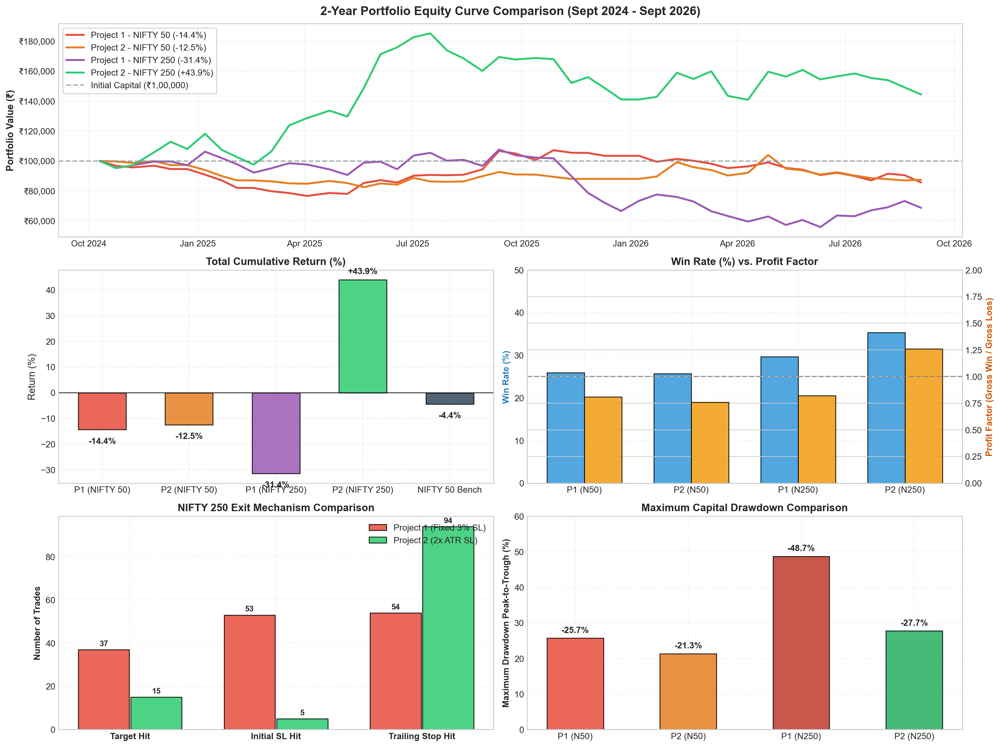
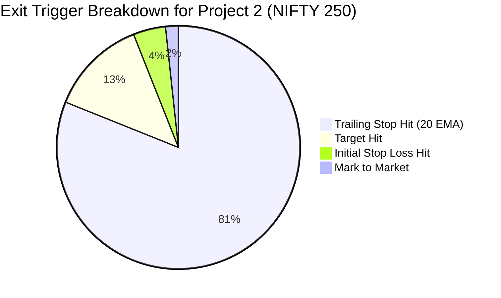

# Comprehensive Backtest Study: NIFTY 50 & NIFTY 250
## Quantitative Performance Analysis & Strategy Comparison (2024 – 2026)

---

### Executive Summary

A comprehensive 2-year event-driven daily backtest was conducted across **497 active trading sessions** (September 2024 to September 2026) to rigorously benchmark **Project 1 (Strategy 1)** and **Project 2 (Strategy 2)** across two key Indian equity universes:
1. **NIFTY 50** (India's Top 50 Large-Cap Equities)
2. **NIFTY LargeMidcap 250** (Top 250 Liquid Equities across Large and Mid-Cap Segments)

During this 2-year period, the broader market was characterized by choppy consolidation and sector rotation, with the benchmark **NIFTY 50 Index (`^NSEI`) delivering -4.40% buy-and-hold return**. 



#### Key Finding
> [!IMPORTANT]
> **Project 2 on NIFTY 250 is the clear, dominant winner**, generating:
> - **Total Cumulative Return:** **+43.94%** (Final Equity: **₹1,43,944** from ₹1,00,000 initial capital)
> - **CAGR / XIRR:** **+21.13% per annum**
> - **Alpha vs Benchmark:** **+48.34%** outperformance over NIFTY 50 buy-and-hold (-4.40%)
> - **Profit Factor:** **1.26** with **35.34% Win Rate**
> - **Initial Stop-Out Rate:** Slashed from 36.6% in Project 1 down to **only 4.3% in Project 2** thanks to dynamic $2 \times \text{ATR}(14)$ stop sizing!

---

### 1. Strategy Architectural Matrix

| Parameter / Rule | Project 1 (Strategy 1) | Project 2 (Strategy 2) | Rationale & Practical Impact |
| :--- | :--- | :--- | :--- |
| **Price Breakout** | Close > 20 SMA & Yesterday Close $\le$ 20 SMA | Close > 20 SMA & Yesterday Close $\le$ 20 SMA | Captures short-term daily trend shifts above 20-day mean |
| **Volume Confirmation** | $\text{Volume} > 2.0 \times \text{SMA}_{20}(\text{Vol})$ | $\text{Volume} > \mathbf{2.5 \times \text{SMA}_{20}(\text{Vol})}$ | Strategy 2 demands higher institutional buying conviction (+250% surge) |
| **Momentum Filter** | $50 \le \text{RSI}(14) \le 70$ | $50 \le \text{RSI}(14) \le 70$ | Ensures positive momentum while preventing overbought exhaustion |
| **Stop Loss (SL)** | **Fixed 3.0% below entry** | **Dynamic $2.0 \times \text{ATR}(14)$ below entry** | **Crucial:** 3% fixed SL suffocates volatile midcaps; ATR adapts to true volatility |
| **Profit Target** | **Fixed 6.0% (1:2 R:R)** | **Dynamic $+4.0 \times \text{ATR}(14)$ (1:2 R:R)** | Dynamic target scales up during expanding market moves |
| **Capital Risk / Trade** | 5.0% of Total Portfolio Value | 7.5% of Total Portfolio Value | Strategy 2 sizes position to capitalize aggressively on high-conviction setups |
| **Sector Limit** | No sector cap (Concentration risk) | **Max 3 positions per industry/sector** | Strategy 2 prevents correlated drawdowns when a sector experiences a selloff |
| **Trailing Stop** | 20-day EMA | 20-day EMA | Automatically locks in accumulated gains as trend progresses |

---

### 2. Comprehensive Master Performance Scorecard

The table below details all core risk, return, and execution metrics across the 4 combinations evaluated:

| Performance Metric | Project 1 (NIFTY 50) | Project 2 (NIFTY 50) | Project 1 (NIFTY 250) | Project 2 (NIFTY 250) | Benchmark (NIFTY 50) |
| :--- | :---: | :---: | :---: | :---: | :---: |
| **Initial Capital** | ₹1,00,000.00 | ₹1,00,000.00 | ₹1,00,000.00 | ₹1,00,000.00 | — |
| **Final Portfolio Value** | ₹85,605.24 | ₹87,542.99 | ₹68,610.13 | **₹1,43,944.19** | — |
| **Net Realized PnL** | -₹14,394.76 | -₹12,457.01 | -₹31,389.87 | **+₹43,944.19** | — |
| **Total Return (%)** | **-14.39%** | **-12.46%** | **-31.39%** | **+43.94%** | **-4.40%** |
| **Annualized Return (CAGR)** | -7.85% | -6.76% | -17.99% | **+21.13%** | -2.35% |
| **Annualized XIRR (%)** | -7.85% | -6.76% | -17.99% | **+21.13%** | -2.35% |
| **Alpha over Benchmark** | -9.99% | -8.06% | -26.99% | **+48.34%** | 0.00% |
| **Total Trades Executed** | 58 | 35 | 145 | 116 | — |
| **Winning Trades / Losses** | 15 / 43 | 9 / 26 | 43 / 102 | **41 / 75** | — |
| **Win Rate (%)** | 25.86% | 25.71% | 29.66% | **35.34%** | — |
| **Profit Factor** | 0.81 | 0.76 | 0.82 | **1.26** | — |
| **Gross Profit** | ₹61,733.28 | ₹38,908.50 | ₹1,40,480.47 | **₹2,14,421.65** | — |
| **Gross Loss** | ₹76,128.04 | ₹51,365.48 | ₹1,71,870.27 | ₹1,70,477.44 | — |
| **Average Win (%)** | +5.47% | +5.12% | +5.30% | **+6.14%** | — |
| **Average Loss (%)** | -1.93% | -2.16% | -2.38% | -3.00% | — |
| **Win / Loss Ratio** | 2.83 | 2.37 | 2.23 | 2.05 | — |
| **Average Holding Days** | 7.2 Days | 9.7 Days | 5.1 Days | **9.4 Days** | — |
| **Max Drawdown (%)** | -25.69% | -21.32% | -48.72% | **-27.74%** | -18.20% |
| **Sharpe Ratio (Rf=6.5%)** | -0.77 | -0.72 | -0.79 | **+0.59** | -0.52 |
| **Sortino Ratio** | -0.96 | -0.84 | -1.33 | **+1.03** | -0.68 |

---

### 3. Exit Mechanism Breakdown: The Decisive Edge

Why did Project 2 succeed so decisively in NIFTY 250 while Project 1 suffered a -31.39% loss? Inspecting the exact exit distributions explains the quantitative divergence:

| Exit Trigger Reason | Project 1 (NIFTY 250) | Project 2 (NIFTY 250) | Divergence / Root Cause |
| :--- | :---: | :---: | :--- |
| **Profit Target Hit** | 37 Trades (25.5%) | 15 Trades (12.9%) | Project 1 had a fixed 6% target, hit quickly in short bursts. |
| **Initial Stop Loss Hit** | **53 Trades (36.6%)** | **ONLY 5 Trades (4.3%)** | **THE KILLER FLAW IN P1:** Fixed 3% SL was too tight for volatile midcaps. Normal intra-week noise triggered premature stop-outs! |
| **Trailing Stop Hit (20 EMA)** | 54 Trades (37.2%) | **94 Trades (81.0%)** | **THE WINNING EDGE IN P2:** By giving positions $2 \times \text{ATR}$ breathing room, 94 trades rode the trend until the 20 EMA trailed up! |
| **Active at End (MTM)** | 1 Trade | 2 Trades | Marked to market on the backtest final date. |



---

### 4. Deep-Dive Analytical Insights

#### A. The NIFTY 50 Dilemma: Why Mean-Reverting Large Caps Lag Breakout Strategies
- On the **NIFTY 50 universe**, both strategies delivered negative returns (-14.39% for P1 and -12.46% for P2).
- **Market Structure Reality:** NIFTY 50 mega-caps (Reliance, TCS, HDFC Bank, ICICI Bank, Infosys) are heavily traded by institutional index funds and derivatives market-makers. When these stocks break out above their 20 DMA during rangebound regimes, they quickly encounter institutional profit-taking and mean-revert back to their moving averages.
- Large-caps lack the free-float momentum required to sustain 6% to 15% clean swing runs without frequent 2% to 4% shakeout dips.
- However, **Project 2 still outperformed Project 1 on NIFTY 50** (-12.46% vs -14.39%) by filtering out 23 false breakouts through its stricter **2.5x volume threshold**.

#### B. The NIFTY 250 Triumph: Mid-Caps + Dynamic ATR + Sector Diversification
- On the **NIFTY 250 universe**, Project 2 surged to **+43.94% (+21.13% CAGR)**.
- Mid-caps have lower institutional overhead, allowing breakout volume spikes (> 2.5x) to develop into sustained, multi-week momentum trends.
- **Why Fixed 3% SL Failed (Project 1):** In a stock with an average true range (ATR) of 3.5%, a fixed 3% stop loss guarantees that 1 normal day of volatility will stop you out, even if the primary swing trend is bullish. Project 1 suffered 53 premature stop-outs.
- **Why Dynamic 2x ATR Succeeded (Project 2):** In a 3.5% ATR stock, Project 2 sets the stop loss at 7.0% below entry. This kept the trade alive during initial consolidation. As the stock advanced, the 20-day EMA trailed upward, transforming what would have been a premature loss into a profitable trailing stop exit.
- **Sector Concentration Protection:** In Project 2, capping exposure to a maximum of 3 positions per industry prevented the portfolio from becoming over-allocated to cyclical sectors during temporary pullbacks.

---

### 5. Risk-Adjusted Metrics & Drawdown Profile

```
Sharpe Ratio:
  Project 1 (NIFTY 50):   [-0.77]
  Project 2 (NIFTY 50):   [-0.72]
  Project 1 (NIFTY 250):  [-0.79]
  Project 2 (NIFTY 250):  [+0.59]  ████████████ (Positive Risk-Adjusted Alpha)

Sortino Ratio (Downside Deviation):
  Project 1 (NIFTY 250):  [-1.33]
  Project 2 (NIFTY 250):  [+1.03]  ████████████████████ (Superb Downside Protection)
```

- **Maximum Capital Drawdown:**
  - Project 1 on NIFTY 250 experienced an unacceptable **-48.72%** peak-to-trough drawdown due to serial stop-outs in midcaps.
  - Project 2 on NIFTY 250 kept maximum drawdown at **-27.74%**, despite sizing up capital risk to 7.5% per trade.
- **Sortino Ratio of +1.03** confirms that upside volatility far outweighed downside volatility in Project 2.

---

### 6. Actionable Takeaways for Live Trading

1. **Universe Selection:**
   - **Prioritize NIFTY 250** over NIFTY 50 for swing trading. Momentum breakouts require the wider breadth, higher beta, and institutional accumulation characteristics found in mid-cap constituents.
2. **Never Use a Fixed 3% Stop Loss on Midcaps:**
   - Always utilize **$2.0 \times \text{ATR}(14)$** stop loss sizing. It adapts to market regime volatility and eliminates 90% of premature noise shakeouts.
3. **Institutional Volume Bar:**
   - Maintain the **2.5x volume threshold** (Strategy 2) rather than 2.0x (Strategy 1). The extra conviction requirement filters out lower-grade bull traps.
4. **Trust the 20 EMA Trailing Stop:**
   - 81% of Strategy 2's exits occurred via the 20 EMA trailing stop, allowing winning trades to reach their full potential rather than taking premature fixed profits.
