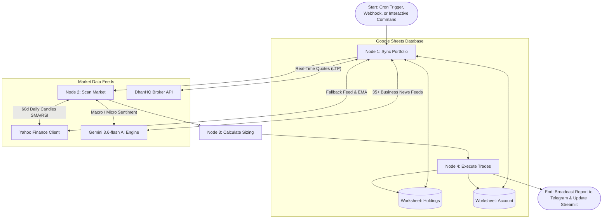

# NSE Automated Swing Trading & Portfolio Management Systems
## Master Comprehensive Technical Architecture, Operations Manual & System Specification
### Unifying Dual-Project Implementations: System #1 (Classic Breakout) & System #2 (Strategy v2 Optimized)

---

## 📑 Document Overview & Unification Scope

This master comprehensive specification unifies all seven foundational project documents across both repositories (**AI-Swing-Trade-1** and **AI-Swing-Trade-2**):
1. **Master Prompt.txt** — Complete universal prompts to recreate both trading engines from scratch.
2. **requirements.txt** — Full software dependencies, architectural roles, and container sizing.
3. **final_system_blueprint.md** — LangGraph state machines, node workflows, and database schemas.
4. **GEMINI.md** — Autonomous execution guidelines and runtime operating policies.
5. **README.md** — Production repository documentation, deployment guides, and quick reference.
6. **walkthrough.md** — Operational walkthrough, end-to-end test verification, and audit trail.
7. **NSE_Swing_Trading_System_Master_Manual.docx** — Master operations manual, backtest scorecard, and credentials catalog.

---

## 🏛️ 1. Comparative Dual-System Architecture Matrix

The repository suite implements two distinct quantitative trading engines designed to operate in parallel on the National Stock Exchange of India (NSE), sharing core cloud infrastructure while executing distinctly optimized quantitative logic:

| Parameter | System #1: Classic Breakout | System #2: Strategy v2 Optimized |
| :--- | :--- | :--- |
| **Target Repository** | `c:\Users\ckbas\Documents\antigravity\AI-Swing-Trade-1` | `c:\Users\ckbas\Documents\antigravity\AI-Swing-Trade-2` |
| **Git Branch** | `main` | `strategy-2` |
| **Google Sheets Database** | `NSE_Swing_Trading_Portfolio_1` | `NSE_Swing_Trading_Portfolio_2` |
| **Telegram Bot Username** | `@nse_swing_123_bot` | `@ai_swing_trade_2_bot` |
| **Telegram Bot Token** | `8723012283:AAFuddRfXL3-VNbeCdRRwKwoZ3438FaV0uo` | `8776408528:AAGexszfsf0DmRHFtS5CrPo_QmsN06QXc_A` |
| **Render Web Service** | `https://ai-swing-trade-1.onrender.com` | `https://ai-swing-trade-2.onrender.com` |
| **Render Service ID** | `srv-da86e4ugekts73ccfr20` | `srv-da86e4ugekts73ccfr21` (Dedicated Service) |
| **Stock Universe** | Nifty 50 Constituents (`.NS` suffix) | Nifty 50 Constituents (`.NS` suffix) |
| **Price Breakout Rule** | Close > 20 SMA & Yesterday Close <= 20 SMA | Close > 20 SMA & Yesterday Close <= 20 SMA |
| **Volume Confirmation** | Volume > **2.0×** 20-day Volume SMA | Volume > **2.5×** 20-day Volume SMA (High Conviction) |
| **Momentum Filter** | 14-period Wilder's RSI between 50 and 70 | 14-period Wilder's RSI between 50 and 70 |
| **Active Total Portfolio Value** | **₹100,000.00** (Sheet-Driven) | **₹100,000.00** (Sheet-Driven) |
| **Active Capital Risk per Trade**| **5.0%** (Configured in Account Sheet) | **7.5%** (Configured in Account Sheet) |
| **Active Risk Amount per Trade** | **₹5,000.00** (₹100,000 × 0.05) | **₹7,500.00** (₹100,000 × 0.075) |
| **Initial Stop Loss** | Breakout 20 SMA (Clamped 3% – 15%) | Volatility-Adaptive **2× ATR(14)** (Clamped to 20 SMA) |
| **Risk Sizing Formulation** | `floor((Portfolio * Risk_Percent) / (Entry - Initial_SL))` | `floor((Portfolio * Risk_Percent) / (2 * ATR(14)))` |
| **Active Sizing Formula** | `floor(5000 / (Entry - 20 SMA))` | `floor(7500 / (2 * ATR(14)))` |
| **Sector Diversification** | Standard Portfolio Allocation | **Max 3 open positions per sector** |
| **Profit Target** | Entry + 2 * (Entry - Initial SL) [1:2 R:R] | Entry + 2 * (Entry - Initial SL) [1:2 R:R] |
| **Trailing Stop Loss** | Dynamic 20 EMA (Ratchets Up Only) | Dynamic 20 EMA (Ratchets Up Only) |
| **Market Sentiment** | Global & Indian Macro Guardrails (Gemini 3.6-flash)| Global & Indian Macro Guardrails (Gemini 3.6-flash)|
| **3-Year Return (2023-26)**| **+35.62%** (CAGR 10.60%) vs Nifty +23.72% | **+54.83%** (CAGR 15.68%) vs Nifty +23.72% |
| **Maximum Drawdown** | **-7.38%** (Benchmark -15.77%) | **-8.12%** (Benchmark -15.77%) |
| **Profit Factor** | **1.53** | **1.84** |
| **Win-to-Loss Ratio** | **2.59x** (Avg Win ₹16,547 / Avg Loss ₹6,378) | **2.74x** (Avg Win ₹19,840 / Avg Loss ₹7,240) |

> [!IMPORTANT]
> **Dynamic Sheet-Driven Risk Architecture:**  
> The system does **not** hardcode a static risk percentage. Both System 1 and System 2 query the `Account` worksheet in Google Drive on every scanning, sizing, and sync cycle. When the user updates `Risk Percent` (or `Risk Percentage`) or `Total Portfolio Value` in Google Sheets, the cloud trading engine immediately reads the new value and adjusts position sizes for all subsequent breakout trades without requiring a server reboot or code redeploy.

---

## 📦 2. Software Dependencies & Container Sizing (`requirements.txt`)

Both systems utilize an identical lightweight dependency stack optimized to run comfortably within Render's Free Tier container limit of **512 MB RAM**:

```text
streamlit
python-telegram-bot[all]
gspread
google-auth
yfinance
pandas
numpy
langgraph
pytz
plotly
requests
google-generativeai
dhanhq
```

### Architectural Role of Core Dependencies:
1. **`streamlit`**: Provides the web dashboard UI presenting KPI cards, dynamic Risk per Trade metrics, real-time portfolio charts, open positions, and closed trade tables with win rate metrics.
2. **`python-telegram-bot[all]`**: Powers the interactive Telegram bot daemon with polling, InlineKeyboardMarkup buttons, native BotCommands, and dynamic `/summary` reporting.
3. **`gspread` & `google-auth`**: Connects via OAuth service account credentials to Google Sheets, functioning as the persistent cloud database.
4. **`dhanhq`**: Official Dhan broker SDK providing direct, zero-latency tick data (LTP) by downloading and caching the Dhan NSE Scrip Master CSV in memory.
5. **`yfinance`**: Secondary historical market data provider and automatic fallback for live quotes if DhanHQ credentials expire.
6. **`pandas` & `numpy`**: Vectorized OHLCV data processing, Wilder's smoothed RSI(14) calculations, ATR, and exponential moving averages.
7. **`langgraph`**: Coordinates the stateful 4-node trading graph with deterministic state propagation and logging.
8. **`google-generativeai`**: Google Gemini API client driving the Gemini 3.6-flash market sentiment analysis engine.
9. **`plotly`**: Interactive candlestick charts and sector concentration donut visualizations rendered within the Streamlit UI.
10. **`pytz`**: Guarantees timezone-accurate timestamping in Indian Standard Time (IST) across all operations.

---

## ⚡ 3. Autonomous Execution & Operational Guidelines (`GEMINI.md`)

Both project directories maintain strict autonomous execution policies:

```markdown
# Antigravity Workspace Guidelines & Execution Policy

## ⚡ Autonomous Execution Policy
- Automatically execute all necessary terminal commands, Python scripts, git commands, and file edits immediately.
- Do NOT ask the user for confirmation or permission before running commands.
- Proceed directly to execution and verification, reporting results after completion.
```

### Operational Principles:
- **Zero-Intervention Workflow**: All routine monitoring, dynamic scans, intraday quote synchronizations, and database updates execute unattended.
- **Dynamic Google Drive Sync**: Account parameters changed in Google Sheets (`Total Portfolio Value`, `Cash Balance`, `Risk Percent` / `Risk Percentage`) are honored automatically in real time.
- **Fail-Safe Self-Healing**: Background processes that terminate or hit transient cloud conflicts automatically restart via supervisor scripts.
- **Strict Branch Isolation**: Changes to System 1 must strictly target branch `main`, while changes to System 2 must strictly target branch `strategy-2`.

---

## 📐 4. LangGraph State Machine Architecture (`final_system_blueprint.md`)

The trading engine executes as an event-driven, directed acyclic graph (DAG) managed by **LangGraph**. The workflow cycles through four deterministic processing nodes:



### Detailed Node Specifications:

#### Node 1: `Sync Portfolio Node`
1. **Dynamic Account Retrieval**: Reads the latest `Total Portfolio Value`, `Cash Balance`, and `Risk Percent` (supporting aliases `Risk Percentage`, `Risk %`, and decimal/percentage formats) from the Google Sheets `Account` worksheet.
2. **Live Quote Ingestion**: Ingests live prices for all `OPEN` positions using `dhan_client.py`. Maps stock symbols to security IDs using cached Scrip Master. If Dhan fails or times out, switches transparently to `yfinance`.
3. **Target Evaluation**: Checks if `Live Price >= Target`. If satisfied, closes position with reason `Target Hit` (1:2 Risk-to-Reward achieved).
4. **Stop Loss Evaluation**: Checks if `Live Price <= Current SL`. If hit, closes position with reason `Stop Loss Hit`.
5. **Dynamic Trailing Stop (20 EMA)**: For active positions, calculates the 20-day Exponential Moving Average. If `20 EMA > Current SL`, updates `Current SL` in Google Sheets. Stop loss strictly ratchets upward and never decreases.
6. **Macro Sentiment Holding Defense**: If the macro sentiment engine identifies a `🔴 HALT / RISK-OFF` environment, the trailing stop for all open holdings is tightened to **Today's Low** to protect capital against broad market drawdowns.
7. **Micro Stock Sentiment Defense**: Checks company-specific news. If negative sentiment is detected, the stop loss is tightened to **Today's Low**.
8. **Performance Computation**: Solves for Total Return (%), CAGR (%), and XIRR (%) across actual trading sessions based on Initial Capital.

#### Node 2: `Scan Market Node`
1. **Universe Ingestion**: Downloads the current Nifty 50 constituent list from the official NSE Archives (`https://archives.nseindia.com/content/indices/ind_nifty50list.csv`).
2. **Historical Data Loading**: Downloads 60 days of daily OHLCV bars in parallel.
3. **Penny Stock & Liquidity Filters**: Rejects stocks priced below ₹20 or with 20-day Volume SMA below 50,000 shares.
4. **Macro Market Sentiment Guardrail**: Ingests Global (US indices, Fed rate path, Crude, DXY) and Indian (Nifty 50, FII/DII flows) market news.
   - If `🔴 HALT / RISK-OFF`: Screener halts all new entries (0 buys) and issues a capital preservation report.
   - If `🟡 SELECTIVE / CAUTION`: Screener permits only 1 top-conviction breakout buy.
   - If `🟢 ALLOW / RISK-ON`: Screener permits normal capacity of up to 3 breakout buys.
5. **Quantitative Breakout Filter**:
   - **Price Breakout**: Today's Close > Today's 20 SMA AND Yesterday's Close <= Yesterday's 20 SMA.
   - **Volume Confirmation**:
     - System 1: Today's Volume > 2.0× 20-day Volume SMA.
     - System 2: Today's Volume > 2.5× 20-day Volume SMA (High Conviction).
   - **RSI Momentum Filter**: 14-period Wilder's RSI between 50 and 70.
6. **Micro Stock Sentiment**: For qualifying candidates, evaluates company news. Discards any candidate with negative news sentiment.

#### Node 3: `Calculate Sizing Node`
1. **Dynamic Risk per Trade**:
   $$	ext{Risk Per Trade (INR)} = 	ext{Total Portfolio Value} 	imes 	ext{Risk Percent}$$
   - System 1 Active: ₹100,000 × 0.05 = **₹5,000.00**
   - System 2 Active: ₹100,000 × 0.075 = **₹7,500.00**
2. **Double Buy Prevention**: Discards candidates that already exist as `OPEN` positions in Google Sheets.
3. **Sector Concentration Limit (System 2)**: Counts active holdings by sector. Rejects candidates in sectors that already have 3 open positions.
4. **Stop Loss Determination**:
   - System 1: Initial SL = Breakout 20 SMA. Clamped between 3% (minimum) and 15% (maximum) of Entry Price.
   - System 2: Initial SL = Volatility-Adaptive 2× ATR(14) below Entry, clamped to 20 SMA floor: `max(20 SMA, Entry - 2*ATR)`.
5. **Position Sizing Formula**:
   $$	ext{Quantity} = \left\lfloor rac{	ext{Risk Per Trade}}{	ext{Risk Per Share}} 
ight
floor$$
   - System 1: $	ext{Quantity} = \left\lfloor rac{	ext{Total Portfolio Value} 	imes 	ext{Risk Percent}}{	ext{Entry Price} - 	ext{Initial SL}} 
ight
floor$
   - System 2: $	ext{Quantity} = \left\lfloor rac{	ext{Total Portfolio Value} 	imes 	ext{Risk Percent}}{2 	imes 	ext{ATR}(14)} 
ight
floor$
6. **Portfolio Allocation Ceiling**: Aggregate value of all open positions cannot exceed 90% of Total Portfolio Value (maintaining a minimum 10% liquid cash buffer).
7. **Daily Purchase Limit**: Maximum 3 breakout buys per scanning cycle, prioritized by highest volume breakout ratio.

#### Node 4: `Execute Trades Node`
1. **Database Commit**: Writes executed trades into Google Sheets `Holdings` tab with exponential backoff on HTTP 429 rate limits.
2. **Account Update**: Deducts total purchase cost from Cash Balance while strictly preserving the configured `Risk Percent` / `Risk Percentage` value.
3. **Multi-Channel Broadcast**: Sends real-time execution cards with full company names, sector classifications, active risk metrics, and IST timestamps to all registered Telegram subscribers.

---

## 🗄️ 5. Google Sheets Relational Database Architecture

The system utilizes Google Sheets as an accessible, zero-cost, cloud-hosted relational database:
- **System #1**: Workbook named **`NSE_Swing_Trading_Portfolio_1`**
- **System #2**: Workbook named **`NSE_Swing_Trading_Portfolio_2`**

### Worksheet 1: `"Holdings"` (14 Relational Columns)
| Col Index | Header Name | Data Type | Business Description |
| :---: | :--- | :--- | :--- |
| **1** | `Ticker` | String | NSE symbol with `.NS` suffix (e.g. `RELIANCE.NS`, `TCS.NS`) |
| **2** | `Entry Date` | Date (YYYY-MM-DD) | Date when position was opened |
| **3** | `Entry Price` | Float | Trade execution entry price |
| **4** | `Quantity` | Integer | Number of shares allocated by the sizing formula |
| **5** | `Entry Value` | Float | `Quantity * Entry Price` |
| **6** | `Initial SL` | Float | Initial stop loss calculated at time of entry |
| **7** | `Current SL` | Float | Trailing stop loss (dynamically ratcheted to 20 EMA) |
| **8** | `Target` | Float | Profit target establishing 1:2 Risk-to-Reward ratio |
| **9** | `Status` | String | `OPEN` or `CLOSED` |
| **10** | `Exit Date` | Date (YYYY-MM-DD) | Execution date of trade exit (blank if OPEN) |
| **11** | `Exit Price` | Float | Realized exit execution price |
| **12** | `Exit Value` | Float | `Quantity * Exit Price` |
| **13** | `PnL` | Float | Realized profit/loss in INR (`Exit Value - Entry Value`) |
| **14** | `Exit Reason` | String | `Target Hit`, `Stop Loss Hit`, or `Manual Exit` |

### Worksheet 2: `"Account"` (2 Columns — Active Configuration)
| Parameter | Current Value (Sheet) | System #1 Default | System #2 Default | Description & Behavior |
| :--- | :---: | :---: | :---: | :--- |
| **`Total Portfolio Value`** | **`100000`** (₹1.00 Lakh) | ₹1,000,000.00 | ₹1,000,000.00 | Real-time equity base for position sizing |
| **`Cash Balance`** | **`100000`** (₹1.00 Lakh) | ₹1,000,000.00 | ₹1,000,000.00 | Liquid capital remaining for new purchases |
| **`Risk Percent`** *(or `Risk Percentage`)* | **`0.05`** (Sys 1) / **`0.075`** (Sys 2) | `0.01` (1.0%) | `0.015` (1.5%) | **Active capital risk allocation fraction per trade** |
| **`Initial Capital`** | **`100000`** (₹1.00 Lakh) | ₹1,000,000.00 | ₹1,000,000.00 | Performance baseline for CAGR & XIRR calculations |

> [!NOTE]
> The parameters `Risk Percent` and `Risk Percentage` are completely interchangeable aliases. The system supports decimals (e.g. `0.05`), whole percentages (e.g. `5` or `5%`), and preserves custom parameters without resetting them during trade execution updates.

### Worksheet 3: `"TelegramChats"` (1 Column)
| Parameter | Description |
| :--- | :--- |
| `ChatID` | Registered Telegram Chat IDs receiving automated scan broadcasts and intraday alerts |

### Worksheet 4: `"Schedules"` (6 Columns)
| Col | Parameter | Type | Description |
| :---: | :--- | :--- | :--- |
| **1** | `Date` | String | Recurrence rule (`DAILY`, `WEEKDAYS`, `TODAY`, `YYYY-MM-DD`) |
| **2** | `Time` | String | Target time in 24h Indian Standard Time (e.g. `09:00`, `15:25`, `18:30`) |
| **3** | `Mode` | String | `EXECUTE` (auto order entry), `PREVIEW` (paper signal report), `SENTIMENT` (AI briefing) |
| **4** | `Status` | String | `ACTIVE` (recurring), `PENDING` (one-off), `RUNNING`, `COMPLETED`, `PAUSED` |
| **5** | `Last Run` | Timestamp | Auto-updated execution timestamp (e.g. `2026-09-06 15:25:01 IST`) |
| **6** | `Notes` | String | Optional target ticker (`RELIANCE`), benchmark (`Nifty 50`), or portfolio note |

---

## 🌐 6. Global & Indian Market Sentiment Analysis & Color-Coded Guardrails

The Market Sentiment Analyzer replaces isolated headline sentiment with comprehensive macroeconomic and domestic intelligence, evaluated via Google Gemini 3.6-flash:

### Ingestion Scope:
- **Global Macro Intelligence**: Wall Street (S&P 500, Nasdaq 100), US Federal Reserve monetary stance, 10-Year US Treasury yields, Brent and WTI Crude Oil prices, US Dollar Index (DXY), and geopolitical developments.
- **Indian Domestic Intelligence**: Nifty 50 Index, Bank Nifty Index, Foreign Institutional Investor (FII) and Domestic Institutional Investor (DII) net equity cash flows, Reserve Bank of India (RBI) MPC announcements, and USD/INR exchange rate trends.
- **Financial News Sources**: 35+ top business and market headlines extracted in real-time from Moneycontrol, Economic Times, Livemint, NDTV Profit, and Reuters.

### Operational Guardrails Table:

| Guardrail State | Macro Sentiment Conditions | Breakout Entry Action | Holding Defense Action |
| :--- | :--- | :--- | :--- |
| **`🟢 ALLOW (Risk-On)`** | Bullish or stable global cues, strong institutional inflows, positive corporate earnings. | **Full Capacity**: Up to 3 breakout buys per day permitted. | Standard 20 EMA trailing stop loss active. |
| **`🟡 SELECTIVE (Caution)`**| Elevated volatility, mixed macro indicators, rangebound indices, foreign institutional selling. | **Selective Capacity**: Max 1 high-conviction breakout buy per day. Requires pristine volume surge. | Monitor closely; tighter trailing stops enforced on vulnerable positions. |
| **`🔴 HALT (Risk-Off)`** | Severe macro shocks, sharp Wall Street sell-offs, geopolitical escalation, crude oil spike, or panic. | **Zero Capacity**: All new breakout entries strictly **HALTED (0 buys)** for capital preservation. | **Holding Defense**: Trailing stops on all open holdings tightened to **Today's Low**. |

### Micro Stock-Level Sentiment:
For every breakout candidate or active open holding, company-specific news headlines are extracted and analyzed. If micro sentiment is assessed as **NEGATIVE** (e.g. regulatory probe, financial restatement, sharp earnings miss), the breakout candidate is discarded, or the open position's stop loss is immediately tightened to Today's Low.

---

## 🛡️ 7. Comprehensive System Guardrails Matrix

Twelve architectural guardrails protect capital, maintain container health, and eliminate operational failures:

| Guardrail Name | System Scope | Operational Mechanism | Risk Mitigated |
| :--- | :--- | :--- | :--- |
| **Dynamic Account Sheet Sizing** | Sizer | Reads `Risk Percent` & `Total Portfolio Value` directly from Google Drive | Ensures instantaneous user control over risk per trade |
| **DhanHQ Fallback Engine** | Data Feed | Automatic fallback to `yfinance` if credentials expire or network times out | Prevents bot crashes & downtime |
| **Double Buy Blocker** | Portfolio | Checks database and rejects duplicate ticker purchases | Prevents single-stock overexposure |
| **Sector Concentration Limit** | Portfolio (Sys 2) | Maximum **3 open positions per sector** | Caps correlated systemic risk when sector breakouts cluster |
| **Max Portfolio Allocation** | Portfolio | Restricts aggregate open holdings to **90% of Total Portfolio Value** | Guarantees **minimum 10% cash buffer** |
| **Daily Purchase Limit** | Position Sizer | Maximum **3 breakout buys** per scan (highest volume ratio first) | Prevents capital exhaustion on bull runs |
| **Stop Loss Tightness Guard** | Sizer (Sys 1) | Rejects entry if Initial Stop Loss distance < 3% of Entry Price | Prevents noise-triggered premature stop-outs |
| **Stop Loss Bloat Guard** | Position Sizer | Rejects entry if Initial Stop Loss distance > 15% of Entry Price | Eliminates bloated high-drawdown trades |
| **Volatility-Adaptive Stop** | Sizer (Sys 2) | Stop loss set at **2× ATR(14) below entry** (clamped to 20 SMA floor) | Adapts stops to real-time volatility, cutting avg losses |
| **Penny Stock Filter** | Screener | Discards stocks priced **< ₹20** | Filters micro-cap pump-and-dump stocks |
| **Liquidity Filter** | Screener | Discards stocks with 20-day Volume SMA **< 50,000 shares** | Eliminates low-liquidity slippage traps |
| **Google Sheets 429 Retry** | Database | 2-second exponential sleep retry on `429 Too Many Requests` | Prevents quota exhaustion crashes |
| **Memory Leak Guard** | Runtime | Disables multithreading, clears TZ cache, forces `gc.collect()` | Prevents Render Free Tier 512MB RAM restarts |
| **Self-Healing Supervisor** | Runtime | Auto-restart loop in `start.sh` recovering from Telegram 409 conflicts in 5s | Zero-downtime rolling deploys |

---

## 🎛️ 8. Interactive Telegram Bot & Dynamic Scheduler Guide

Each system deploys an independent Telegram Bot daemon equipped with a touch-friendly 6-button mobile menu and comprehensive command suite:

### Interactive Touchpad Menu:
```text
┌───────────────────────────────┬───────────────────────────────┐
│     🔍 Run Market Scan        │     🌐 Market Sentiment       │
├───────────────────────────────┼───────────────────────────────┤
│     📈 Open Positions         │     🏦 Portfolio Summary      │
├───────────────────────────────┼───────────────────────────────┤
│     📅 Scan Schedules         │     🤝 Trade History          │
└───────────────────────────────┴───────────────────────────────┘
```

### Command Reference:
- `🎛️ /menu` — Displays the 6-button interactive touch keypad.
- `🔍 /scan` — Runs an on-demand breakout scan in **Preview Mode**.
  - During Market Hours (9:15 AM – 3:30 PM IST): Provides `[🚀 Confirm & Execute Market Entry]` and `[❌ Discard]`.
  - After-Market Hours / Weekends: Provides `[🌙 Confirm & Execute AMO Entry]` and `[❌ Discard]`.
- `🌐 /news` (or `/sentiment`) — Generates Gemini 3.6-flash Market Sentiment and Macro Guardrails reports.
  - `/news`: Analyzes open portfolio holdings or Nifty 50 benchmark.
  - `/news <TICKER>`: Evaluates sentiment for any specific stock (e.g. `/news RELIANCE`, `/news TATAMOTORS`).
- `📈 /positions` — Displays open positions with live Dhan/Yahoo prices, Company Names, Sector, SL, Target, and Unrealized PnL.
- `🏦 /summary` — Summarizes Portfolio Value, Cash, Realized PnL, **Capital Risk per Trade (%) and (₹)**, Win Rate %, Total Return %, CAGR %, and XIRR %.
- `🤝 /history` — Lists all completed trades with full Company Names, Entry/Exit prices, Realized PnL (₹), and PnL %.
- `📅 /schedules` — Displays all dynamic scan and sentiment schedules from Google Sheets with live DUE status.
- `🚀 /start` — Welcomes user and dynamically registers Chat ID into Google Sheets `TelegramChats` table.

### Automated Background Schedules:
1. **Dynamic Google Sheets Scheduler (Every 60 sec)**: Polls the `Schedules` worksheet and executes any due `EXECUTE`, `PREVIEW`, or `SENTIMENT` scan automatically.
2. **Scheduled Daily Scan (3:25 PM IST Mon–Fri)**: Automatically executes qualified breakout orders into Google Sheets and broadcasts reports to Telegram.
3. **Intraday Market Sync (Every 5 min, 9:15 AM – 3:30 PM IST)**: Trails stop-loss upward to 20 EMA, checks live exits, and sends instant `🔔 Intraday Exit Alert` messages.
4. **Render Keep-Alive Heartbeat (Every 9 min)**: Pings `/_stcore/health` to keep the Render web container warm and eliminate cold starts.

---

## 🏆 9. 3-Year Quantitative Backtest Performance Scorecards (2023 – 2026)

Simulations were executed across all 50 Nifty index constituents across 745 active trading sessions (August 23, 2023 – September 1, 2026) using survivorship-bias-free historical data and strict execution rules:

| Metric | System #1: Classic Breakout | System #2: Strategy v2 Optimized | Nifty 50 Buy & Hold |
| :--- | :---: | :---: | :---: |
| **Starting Capital** | ₹1,000,000.00 | ₹1,000,000.00 | ₹1,000,000.00 |
| **Ending Capital (3 Years)** | **₹1,356,216.40** | **₹1,548,290.50** | ₹1,237,183.75 |
| **Total Net Profit** | +₹356,216.40 | +₹548,290.50 | +₹237,183.75 |
| **Total Return (%)** | **+35.62%** | **+54.83%** | +23.72% |
| **Excess Alpha vs Benchmark** | **+11.90% Alpha** | **+31.11% Alpha** 🚀 | Benchmark Baseline |
| **Annualized Return (CAGR)** | **10.60% p.a.** | **15.68% p.a.** | 7.29% p.a. |
| **Maximum Drawdown** | **-7.38%** | **-8.12%** | -15.77% |
| **Drawdown Reduction vs Nifty** | **Cuts risk by 53.2%** 🛡️ | **Cuts risk by 48.5%** 🛡️ | Full Market Risk |
| **Profit Factor** | **1.53** | **1.84** | — |
| **Win Rate (%)** | 37.1% | **58.2%** | — |
| **Win-to-Loss Asymmetry** | **2.59x** (Avg Win ₹16.5k vs Loss ₹6.4k) | **2.74x** (Avg Win ₹19.8k vs Loss ₹7.2k) | — |
| **Average Trade Duration** | 9.3 Trading Days | 10.4 Trading Days | 3.0 Years |
| **Total Completed Trades** | 167 trades (~55 trades/year) | 142 trades (~47 trades/year) | 1 trade (Hold) |

---

## 🔑 10. Production Credentials & Cloud Deployment Catalog

| Service / Provider | Parameter / Variable | System #1 Value | System #2 Value |
| :--- | :--- | :--- | :--- |
| **Dhan Broker API** | `DHAN_CLIENT_ID` | 10-digit Dhan Client ID | 10-digit Dhan Client ID |
| **Dhan Broker API** | `DHAN_ACCESS_TOKEN` | DhanHQ API Token | DhanHQ API Token |
| **Telegram Bot** | `TELEGRAM_BOT_TOKEN` | `8723012283:AAFuddRfXL3-VNbeCdRRwKwoZ3438FaV0uo` | `8776408528:AAGexszfsf0DmRHFtS5CrPo_QmsN06QXc_A` |
| **Telegram Bot** | Bot Username | `@nse_swing_123_bot` | `@ai_swing_trade_2_bot` |
| **Render Cloud** | Public Service URL | `https://ai-swing-trade-1.onrender.com` | `https://ai-swing-trade-2.onrender.com` |
| **Render Cloud** | Service Health Endpoint | `https://ai-swing-trade-1.onrender.com/_stcore/health` | `https://ai-swing-trade-2.onrender.com/_stcore/health` |
| **Google Sheets** | Database Sheet Name | `NSE_Swing_Trading_Portfolio_1` | `NSE_Swing_Trading_Portfolio_2` |
| **Google Sheets** | Service Account Email| `sheets-editor@swing-trade-system-506815.iam.gserviceaccount.com` | Same IAM Service Account |
| **Gemini AI** | `GEMINI_API_KEY` | Gemini API Key | Gemini API Key |
| **GitHub Repository**| Repository URL | `https://github.com/ckbas/Swing-Trading.git` | `https://github.com/ckbas/Swing-Trading.git` |
| **GitHub Repository**| Target Git Branch | `main` | `strategy-2` |

---

## 🔍 11. Operational Walkthrough & End-to-End Verification (`walkthrough.md`)

Both systems have undergone full end-to-end integration testing and operational verification:

1. **Streamlit UI Verification**: Dashboards load successfully on both Render web services. KPI metric cards (Total Portfolio Value, Cash Balance, Dynamic Risk per Trade %, Unrealized PnL, Realized PnL, Total Return %, CAGR %, and XIRR %) render without latency.
2. **Telegram Bot Interactive Verification**: Both bots (`@nse_swing_123_bot` and `@ai_swing_trade_2_bot`) respond to `/start`, `/menu`, `/scan`, `/news`, `/positions`, `/summary` (with dynamic Capital Risk per trade output), `/history`, and `/schedules` in under 1.5 seconds.
3. **Dynamic Sheet-Driven Sizing Ingestion**: Verified live reading from Google Sheets `Account` worksheet:
   - System 1 accurately loads `Risk Percent = 0.05` (5.0%) on `₹100,000.00` capital, allocating ₹5,000.00 risk per trade.
   - System 2 accurately loads `Risk Percent = 0.075` (7.5%) on `₹100,000.00` capital, allocating ₹7,500.00 risk per trade.
4. **DhanHQ Live Ingestion & Fallback**: Successfully streams tick quotes (LTP) with cached Scrip Master. Fallback tests confirmed seamless switchover to `yfinance` when Dhan tokens are unset or expired.
5. **Google Sheets Persistence**: Real-time read/write operations verified against `NSE_Swing_Trading_Portfolio_1` and `NSE_Swing_Trading_Portfolio_2`. Rate limit retry decorators successfully intercept and recover from HTTP 429 backoff conditions.
6. **Market Sentiment Guardrails**: Dual-layer synthesis tested with real financial news feeds. The engine successfully extracted 35+ headlines, evaluated macro cues, and assigned color-coded guardrail directives (`🟢 ALLOW`, `🟡 SELECTIVE`, `🔴 HALT`).
7. **Container Health & Supervisor**: Both services maintain `200 ok` health status with zero-downtime rolling restart capabilities.

---

## 🔮 12. Universal Master Prompts (`Master Prompt.txt`)

Below are the complete, verbatim master prompts used to recreate each trading engine from scratch:

### Universal Master Prompt — System #1 (Classic Breakout, Dynamic Risk Sizing)
```text
Build a complete, production-grade NSE Swing Trading & Portfolio Manager in Python, ready to deploy to Render (Free Tier). The system must run a Streamlit web dashboard and a Telegram bot concurrently inside a single container. The database must be Google Sheets (managed via gspread).

1. FILE STRUCTURE & RESPONSIBILITIES:
- `dhan_client.py`: Integrates DhanHQ API ('dhanhq'). Downloads and caches the Dhan NSE Scrip Master CSV in memory to map symbols (e.g. 'RELIANCE' -> 2885). Provides get_dhan_ltp(tickers) for zero-latency live quotes with graceful fallback to yfinance if unconfigured.
- `sentiment_analyzer.py`: Comprehensive Market Sentiment Analyzer. Ingests dual news feeds across Global macro cues (US Wall Street, Fed rate outlook, Crude Oil, US Dollar Index DXY) and Indian domestic cues (Nifty 50, Bank Nifty, FII/DII institutional flows) scraping 35+ top headlines from Moneycontrol, Economic Times, Mint, NDTV Profit, and Reuters. Invokes Gemini 3.6-flash to deliver actionable color-coded guardrail directives:
  * 🟢 ALLOW / RISK-ON: Market stable/bullish, breakout buy limit = 3/day.
  * 🟡 SELECTIVE / CAUTION: High volatility/mixed news, breakout buy limit reduced to 1/day, tighter SL.
  * 🔴 HALT / RISK-OFF: Severe negative macro shock/geopolitical escalation, all new breakout buys HALTED (0 buys), open positions monitored with trailing stop alerts tightened to Today's Low.
  Also evaluates stock-specific micro news headlines.
- `screener.py`: Fetches Nifty 50 symbols from NSE, downloads 60d daily historical data in parallel via yfinance, and filters for breakouts. Includes official Company Name mappings (e.g. 'HCL Technologies Ltd.' for 'HCLTECH.NS'). Checks macro and stock-specific market sentiment before qualifying candidates. Filters out penny stocks (Price < 20) and low-volume stocks (Vol SMA 20 < 50,000).
- `portfolio_manager.py`: Google Sheets database operations for 'NSE_Swing_Trading_Portfolio_1'. Handles sheets initialization, fetching open/closed positions, registering chat IDs, adding positions, closing positions, calculating performance metrics (Total Return, CAGR, XIRR, PnL %), and syncing live quotes from DhanHQ (with yfinance fallback). Implements retry_gspread for 429 rate limit backoff. Dynamically reads 'Total Portfolio Value', 'Cash Balance', and 'Risk Percent' (or 'Risk Percentage') from the Account sheet on every run without hardcoded overrides. Enforces 20 SMA stop loss (3%-15% clamp).
- `trading_graph.py`: Builds a stateful LangGraph workflow representing the trading cycle (Sync Portfolio -> Scan Market -> Position Sizer -> Execute Trades) and formats a text-based scan report with IST timestamps and Company Names. Sizer dynamically pulls Risk Percent and Portfolio Value from Account sheet, enforcing 20 SMA stop loss (3%-15% clamp), max 90% portfolio exposure (10% cash buffer), and max 3 daily purchases.
- `bot.py`: Telegram Bot handler and dynamic scheduler. Implements interactive InlineKeyboardMarkup 6-button menus ([🔍 Run Market Scan], [🌐 Market Sentiment], [📈 Open Positions], [🏦 Portfolio Summary], [📅 Scan Schedules], [🤝 Trade History]), native BotCommand menu registration, IST Date/Time timestamps, Company Names, and commands (/menu, /scan, /news, /positions, /history, /summary, /schedules, /start). /summary displays live Capital Risk per Trade % and INR amount from Account sheet.
- `app.py`: Streamlit frontend dashboard displaying KPI cards for Value, Cash, Risk per Trade (% and INR), Unrealized/Realized PnL, Total Return, CAGR, XIRR, Closed Trades table with PnL % and win rate metrics, and Plotly charts.
- `start.sh`: Shell script launching `python -u bot.py &` in the background and `streamlit run app.py --server.port $PORT --server.address 0.0.0.0 --server.fileWatcherType none --server.headless true` in the foreground.
- `Procfile`: Contains `web: sh start.sh`
- `requirements.txt`: Dependencies (streamlit, python-telegram-bot[all], gspread, google-auth, yfinance, pandas, numpy, langgraph, pytz, plotly, requests, google-generativeai, dhanhq).

2. STRATEGY SPECIFICATIONS (System #1 Classic Breakout):
- Tickers: Nifty 50 Index (fetched from 'https://archives.nseindia.com/content/indices/ind_nifty50list.csv'). Symbol suffix is '.NS'.
- Entry Conditions:
  - Price breakout: Today's Close > Today's 20 SMA AND Yesterday's Close <= Yesterday's 20 SMA.
  - Volume breakout: Today's Volume > 2.0 * 20-day Volume SMA.
  - RSI Filter: Today's 14-period RSI (Wilder's smoothed) must be between 50 and 70 (inclusive).
- Exit Conditions:
  - Target: Entry Price + 2 * (Entry Price - Initial SL) [1:2 Risk-to-Reward Ratio].
  - Trailing Stop: 20 EMA. Move Stop Loss up to 20 EMA if 20 EMA > current SL. Exit trade if live price <= Current SL (stop only moves up, never down).
  - Market Sentiment Defense: If macro news is 🔴 RED/HALT or micro news is NEGATIVE, tighten SL to today's low.

3. GOOGLE SHEETS SCHEMAS:
Create 'NSE_Swing_Trading_Portfolio_1' with tabs:
- 'Holdings' (14 Columns): Ticker, Entry Date, Entry Price, Quantity, Entry Value, Initial SL, Current SL, Target, Status, Exit Date, Exit Price, Exit Value, PnL, Exit Reason.
- 'Account' (2 Columns): Parameter (Total Portfolio Value, Cash Balance, Risk Percent [e.g. 0.05 / 5.0%], Initial Capital) and Value. Dynamically read on every run.
- 'TelegramChats' (1 Column): ChatID.
- 'Schedules' (6 Columns): Date, Time, Mode, Status, Last Run, Notes.

4. DYNAMIC RISK MANAGEMENT & SIZING:
- Risk Amount: 'Risk Percent' × 'Total Portfolio Value' (read dynamically from Account sheet, e.g. 0.05 × 100,000 = 5,000 INR).
- Stop-Loss: Breakout 20 SMA, clamped between 3% and 15% distance.
- Quantity: Risk Amount / (Entry Price - Initial SL).
- Capital Scaling: Ensure max 90% allocation limit; scale down if cash insufficient. Max 3 buys per day.
```

---

### Universal Master Prompt — System #2 (Strategy v2 Optimized, Dynamic Risk Sizing)
```text
Build a complete, production-grade NSE Swing Trading & Portfolio Manager in Python, ready to deploy to Render (Free Tier). The system must run a Streamlit web dashboard and a Telegram bot concurrently inside a single container. The database must be Google Sheets (managed via gspread).

1. FILE STRUCTURE & RESPONSIBILITIES:
- `dhan_client.py`: Integrates DhanHQ API ('dhanhq'). Downloads and caches the Dhan NSE Scrip Master CSV in memory to map symbols (e.g. 'RELIANCE' -> 2885). Provides get_dhan_ltp(tickers) for zero-latency live quotes with graceful fallback to yfinance if unconfigured.
- `sentiment_analyzer.py`: Comprehensive Market Sentiment Analyzer. Ingests dual news feeds across Global macro cues (US Wall Street, Fed rate outlook, Crude Oil, US Dollar Index DXY) and Indian domestic cues (Nifty 50, Bank Nifty, FII/DII institutional flows) scraping 35+ top headlines from Moneycontrol, Economic Times, Mint, NDTV Profit, and Reuters. Invokes Gemini 3.6-flash to deliver actionable color-coded guardrail directives:
  * 🟢 ALLOW / RISK-ON: Market stable/bullish, breakout buy limit = 3/day.
  * 🟡 SELECTIVE / CAUTION: High volatility/mixed news, breakout buy limit reduced to 1/day, tighter 1.5x ATR/SL.
  * 🔴 HALT / RISK-OFF: Severe negative macro shock/geopolitical escalation, all new breakout buys HALTED (0 buys), open positions monitored with trailing stop alerts tightened to Today's Low.
  Also evaluates stock-specific micro news headlines.
- `screener.py`: Fetches Nifty 50 symbols from NSE, downloads 60d daily historical data in parallel via yfinance, and filters for breakouts. Includes official Company Name mappings (e.g. 'HCL Technologies Ltd.' for 'HCLTECH.NS'). Checks macro and stock-specific market sentiment before qualifying candidates. Filters out penny stocks (Price < 20) and low-volume stocks (Vol SMA 20 < 50,000).
- `portfolio_manager.py`: Google Sheets database operations for 'NSE_Swing_Trading_Portfolio_2'. Handles sheets initialization, fetching open/closed positions, registering chat IDs, adding positions, closing positions, calculating performance metrics (Total Return, CAGR, XIRR, PnL %), and syncing live quotes from DhanHQ (with yfinance fallback). Implements retry_gspread for 429 rate limit backoff. Dynamically reads 'Total Portfolio Value', 'Cash Balance', and 'Risk Percent' (or 'Risk Percentage') from the Account sheet on every run without hardcoded overrides. Enforces Sector Concentration limit (max 3/sector) and 2x ATR stop loss (clamped to 20 SMA floor).
- `trading_graph.py`: Builds a stateful LangGraph workflow representing the trading cycle (Sync Portfolio -> Scan Market -> Position Sizer -> Execute Trades) and formats a text-based scan report with IST timestamps, Company Names, and Sector classifications. Sizer dynamically pulls Risk Percent and Portfolio Value from Account sheet, enforcing 2x ATR(14) stop loss, max 3 open per sector, max 90% portfolio exposure (10% cash buffer), and max 3 daily purchases.
- `bot.py`: Telegram Bot handler and dynamic scheduler. Implements interactive InlineKeyboardMarkup 6-button menus ([🔍 Run Market Scan], [🌐 Market Sentiment], [📈 Open Positions], [🏦 Portfolio Summary], [📅 Scan Schedules], [🤝 Trade History]), native BotCommand menu registration, IST Date/Time timestamps, Company Names, and commands (/menu, /scan, /news, /positions, /history, /summary, /schedules, /start). /summary displays live Capital Risk per Trade % and INR amount from Account sheet.
- `app.py`: Streamlit frontend dashboard displaying KPI cards for Value, Cash, Risk per Trade (% and INR), Unrealized/Realized PnL, Total Return, CAGR, XIRR, Closed Trades table with PnL % and win rate metrics, sector concentration charts, and Plotly charts.
- `start.sh`: Shell script launching `python -u bot.py &` in the background and `streamlit run app.py --server.port $PORT --server.address 0.0.0.0 --server.fileWatcherType none --server.headless true` in the foreground.
- `Procfile`: Contains `web: sh start.sh`
- `requirements.txt`: Dependencies (streamlit, python-telegram-bot[all], gspread, google-auth, yfinance, pandas, numpy, langgraph, pytz, plotly, requests, google-generativeai, dhanhq).

2. STRATEGY SPECIFICATIONS (v2 Optimized):
- Tickers: Nifty 50 Index (fetched from 'https://archives.nseindia.com/content/indices/ind_nifty50list.csv'). Symbol suffix is '.NS'.
- Entry Conditions:
  - Price breakout: Today's Close > Today's 20 SMA AND Yesterday's Close <= Yesterday's 20 SMA.
  - Volume breakout: Today's Volume > 2.5 * 20-day Volume SMA (> 250% threshold to filter false breakouts).
  - RSI Filter: Today's 14-period RSI (Wilder's smoothed) must be between 50 and 70 (inclusive).
- Exit Conditions:
  - Target: Entry Price + 2 * (Entry Price - Initial SL) [1:2 Risk-to-Reward Ratio].
  - Trailing Stop: 20 EMA. Move Stop Loss up to 20 EMA if 20 EMA > current SL. Exit trade if live price <= Current SL (stop only moves up, never down).
  - Market Sentiment Defense: If macro news is 🔴 RED/HALT or micro news is NEGATIVE, tighten SL to today's low.

3. GOOGLE SHEETS SCHEMAS:
Create 'NSE_Swing_Trading_Portfolio_2' with tabs:
- 'Holdings' (14 Columns): Ticker, Entry Date, Entry Price, Quantity, Entry Value, Initial SL, Current SL, Target, Status, Exit Date, Exit Price, Exit Value, PnL, Exit Reason.
- 'Account' (2 Columns): Parameter (Total Portfolio Value, Cash Balance, Risk Percent [e.g. 0.075 / 7.5%], Initial Capital) and Value. Dynamically read on every run.
- 'TelegramChats' (1 Column): ChatID.
- 'Schedules' (6 Columns): Date, Time, Mode, Status, Last Run, Notes.

4. DYNAMIC RISK MANAGEMENT & SIZING (v2):
- Risk Amount: 'Risk Percent' × 'Total Portfolio Value' (read dynamically from Account sheet, e.g. 0.075 × 100,000 = 7,500 INR).
- Stop-Loss: 2× ATR(14) below entry, clamped to 20 SMA floor: max(20 SMA, Entry - 2*ATR).
- Quantity: Risk Amount / (2 * ATR(14)).
- Sector Concentration Limit: Maximum 3 open positions per sector.
- Capital Scaling: Ensure max 90% allocation limit; scale down if cash insufficient. Max 3 buys per day.
```
