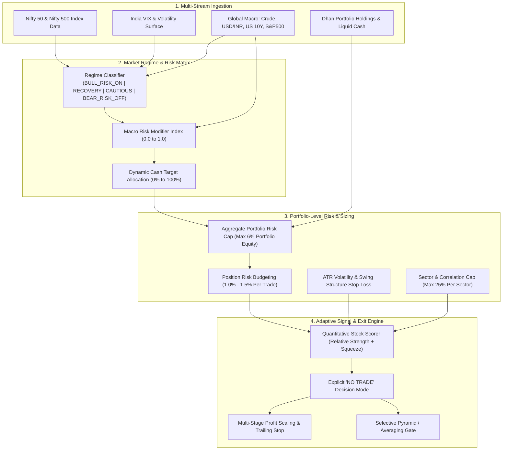

# 🚀 MDP V2 — Master Architectural Evaluation & Implementation Plan

> **Transforming Manage-Dhan-Portfolio from a Stock-Signal & Capital-Recycling system into an Autonomous, Regime-Adaptive, Risk-Budgeted AI Swing Trading System.**

---

## Executive Summary & Architectural Philosophy

The objective of **MDP V2** is to elevate the system from evaluating stocks in isolation to managing an **adaptive, portfolio-aware, regime-guided trading strategy**. 

### Primary Strategic Priority Order:
$$\text{Capital Preservation} \longrightarrow \text{Drawdown Control} \longrightarrow \text{Risk-Adjusted Return (Sharpe/Sortino)} \longrightarrow \text{Trend Participation} \longrightarrow \text{Profit Maximization}$$

---

## 🔍 1. Comprehensive Audit of Existing System (MDP V1)

### What Works Well & Will Be Preserved (100% Kept)
1. **DhanHQ API & Resilience (`dhan_client.py`)**:
   - 12-hour background token auto-renewal loop with 30-minute retries.
   - TOTP auto-authentication failsafe (`pyotp`, `DHAN_USER_PIN`, `DHAN_TOTP_SECRET`).
   - Offline fallback resilience using `cached_holdings.json` and `cached_settings.json`.
2. **Google Sheets Synchronization (`portfolio_manager.py`)**:
   - `gspread` integration with exponential backoff for rate limits.
   - Automated sync to spreadsheet `NSE_Dhan_Portfolio_Manager`.
3. **Streamlit & Telegram Interfaces (`app.py` & `bot.py`)**:
   - Dual-process supervisor (`start.sh`).
   - Interactive command handling (`/portfolio`, `/rebalance`, `/recycle`, `/analyze`, `/status`) and Telegram 4,096 character line-by-line chunking.
4. **1:1 Dhan Web UI Modal Mapping**:
   - Formatting order parameters (`Quantity`, `Limit Price`, `Target`, `Stoploss`, `SL Trail Jump`, `Add Trigger Price`) directly to Dhan Web tabs (`Limit`, `⚡ SUPER`, `⚡ TRAIL`).

---

### Key Deficiencies in MDP V1 Identified for Replacement/Enhancement

| Module / Area | MDP V1 Behavior | MDP V2 Enhanced Architecture |
| :--- | :--- | :--- |
| **Market Regime** | Primitive 3-state (VIX & Nifty 50-SMA) | **4-Regime Composite Matrix** (Nifty trend, 20-EMA/50-SMA/200-SMA, Nifty 500 Breadth, India VIX, Crude Oil, USD/INR, US 10Y Yields) |
| **Capital Deployment** | 100% forced reinvestment of freed cash | **Dynamic Cash Buffer (0% - 100%)** depending on Market Regime & Portfolio Risk. Cash is an active position! |
| **Portfolio Risk** | None (evaluates stocks independently) | **Portfolio-Level Risk Budgeting**: Aggregate Volatility-at-Risk (VaR), Sector Exposure Caps (25%), Correlation Matrix, Max Open Risk (1.5% per trade) |
| **Stop-Loss & Sizing** | Static -7% loss & fixed capital sizing | **ATR Volatility & Swing Structure Stop**: Position sizing determined by $Sizing = \frac{\text{Portfolio Risk Budget}}{\text{ATR Stop Distance}}$ |
| **Profit Taking** | Naive fixed exit when RSI $\ge 70$ | **Adaptive Multi-Stage Exit**: Scale 50% profits at $2 \times \text{ATR}$, trail remaining 50% via Chande-Keltner / 20-EMA trailing stop |
| **Averaging / Adding** | Averages on RSI pullback ($\le 46$) | **Selective Pyramid Engine**: Requires Price > 200-SMA, positive Relative Strength vs Nifty, structural pullback, and Bullish/Recovery regime |
| **Stock Selection** | Basic 20-EMA / RSI lookup | **Multi-Factor Quantitative Ranking**: Relative Strength (RS vs Nifty), Volume Breakout Ratio, Trend Intensity, Volatility Compression (Squeeze) |
| **Momentum Entry** | Chases price breakout blindly | **Institutional Momentum Filter**: Checks consolidation tightness, Volume-Weighted Average Price (VWAP), and limits entry if price > 12% above 20-EMA |
| **No-Trade Decision** | Always generates trade recommendations | **Explicit `NO TRADE` State**: Halts new entries when regime is Bearish, cash target is full, or risk budget is exhausted |

---

## 🏛️ 2. Core Architectural Design of MDP V2 (The 16 Pillars)



---

## 📐 Detailed Module Blueprint & Mathematical Models

### Pillar 1 & 11 & 12: Market Regime & Global Macro Classifier (`market_regime_engine.py`)

The market regime is classified into 4 distinct environments based on a composite multi-factor score:

$$\text{Regime Score} = w_1 S_{\text{trend}} + w_2 S_{\text{breadth}} + w_3 S_{\text{vix}} + w_4 S_{\text{macro}}$$

Where:
1. **Market Trend ($S_{\text{trend}}$)**:
   - Nifty 50 vs 20-EMA, 50-SMA, 200-SMA alignment (+1.0 to -1.0).
2. **Market Breadth ($S_{\text{breadth}}$)**:
   - Percentage of Nifty 500 constituents trading above 50-SMA ($\% > 50\text{-SMA}$) and 200-SMA ($\% > 200\text{-SMA}$).
3. **Volatility Structure ($S_{\text{vix}}$)**:
   - India VIX level & 20-day trend.
     - VIX $< 14$ and falling: Bullish / Stable (+1.0)
     - VIX $14 - 18$: Normal / Moderate (0.0)
     - VIX $> 18$ or spiking $+15\%$ in 5 days: High Volatility / Risk-Off (-1.0)
4. **Global Macro Risk Modifier ($S_{\text{macro}}$)**:
   - Brent Crude Oil ($> \$85 \implies -0.5$), USD/INR ($> 84 \implies -0.5$), US 10-Year Treasury Yield ($> 4.5\% \implies -0.5$).

#### Regime Classification Matrix:

| Regime | Composite Score | Target Equity Allocation | Target Cash Allocation | Max Risk Per Trade |
| :--- | :--- | :--- | :--- | :--- |
| **BULL / RISK-ON** | Score $\ge +0.5$ | 80% – 100% | 0% – 20% | 1.5% of Portfolio Equity |
| **RECOVERY / IMPROVING** | $+0.1 \le \text{Score} < +0.5$ | 60% – 80% | 20% – 40% | 1.0% of Portfolio Equity |
| **CAUTIOUS / WEAKENING** | $-0.4 \le \text{Score} < +0.1$ | 30% – 50% | 50% – 70% | 0.5% of Portfolio Equity |
| **BEAR / RISK-OFF** | Score $< -0.4$ | 0% – 20% | 80% – 100% | 0.0% (NO NEW TRADES) |

---

### Pillar 2: Dynamic Capital Deployment & Cash Position (`capital_deployment_engine.py`)
- **No Forced Reinvestment**: Selling a position **does not** automatically trigger a buy.
- **Cash as an Active Asset Class**: Capital is held in Cash (or Liquid ETFs like `LIQUIDCASE` / `LIQUIDBEES`) when the Market Regime is **Cautious** or **Bear**.
- Capital deployment is gated by:
  $$\text{Allowed New Capital} = \min\left(\text{Available Cash}, \text{Target Equity Limit} - \text{Current Equity Exposure}\right)$$

---

### Pillar 3 & 4: Risk-Budgeted Position Sizing & ATR Stops (`risk_manager.py`)

#### 1. Volatility-Aware Stop-Loss Calculation:
Instead of a fixed -7% drop, the stop-loss is calculated dynamically using **Average True Range (ATR-14)** and Recent Swing Support:

$$\text{Stop Loss (SL)} = \min\left(\text{Entry Price} - 2.0 \times \text{ATR}_{14}, \text{Recent Swing Low (20-day)}\right)$$

$$\text{Risk Per Share (RPS)} = \text{Entry Price} - \text{SL}$$

#### 2. Risk-Budgeted Position Sizing:
$$\text{Max Risk Capital (\text{₹})} = \text{Total Portfolio Value} \times \text{Allowed Risk \% (1.0\% to 1.5\%)}$$

$$\text{Target Position Quantity} = \left\lfloor \frac{\text{Max Risk Capital (\text{₹})}}{\text{RPS}} \right\rfloor$$

$$\text{Position Value Cap} = \min\left(\text{Target Position Quantity} \times \text{Entry Price}, 0.15 \times \text{Total Portfolio Value}\right)$$

This ensures high-volatility stocks get smaller position sizes, keeping overall portfolio risk constant across all trades!

---

### Pillar 5: Adaptive Multi-Stage Profit Management (`exit_manager.py`)

To capture massive multi-month trends while protecting gains:
1. **Stage 1 (Partial Profit Take)**:
   - When price reaches $+2.0 \times \text{ATR}_{14}$ gain ($\text{R:R} \ge 2:1$), sell **50% of the position** to lock in profits.
   - Instantly move the stop-loss of the remaining 50% to **Break-even (Entry Price)**.
2. **Stage 2 (Trend Trailing Stop)**:
   - For the remaining 50%, trail the stop-loss dynamically using **Chande Keltner Channel** / **20-EMA** / **Highest High - $2.5 \times \text{ATR}$**.
   - Do NOT exit on overbought RSI alone if price is making fresh 20-day highs above 20-EMA!

---

### Pillar 6: Selective Averaging / Pyramid Engine (`pyramid_manager.py`)

Averaging down into losing stocks is strictly prohibited! **Pyramiding (Adding)** is only permitted under strict trend quality rules:
1. Position is currently in **PROFIT** ($\text{P&L \%} \ge +3\%$).
2. Stock is trading above 20-EMA and 200-SMA.
3. Relative Strength vs Nifty 50 ($RS_{21} > 0$) is positive.
4. Market Regime is **BULL_RISK_ON** or **RECOVERY**.
5. Max total position size after addition does not exceed 15% of portfolio value.

---

### Pillar 7 & 8: Quantitative Stock Scorer & Anti-Chasing Filter (`stock_selector.py`)

#### Composite Stock Score (0 to 100):
$$\text{Stock Score} = 0.30 \cdot \text{RS}_{\text{Nifty}} + 0.25 \cdot \text{Trend}_{\text{SMA}} + 0.20 \cdot \text{Volume}_{\text{Ratio}} + 0.15 \cdot \text{Squeeze}_{\text{Keltner}} + 0.10 \cdot \text{Sector}_{\text{Rank}}$$

#### Anti-Chasing Filter (Overextension Gate):
Reject new long entries if:
$$\text{Extension Ratio} = \frac{\text{LTP} - \text{EMA}_{20}}{\text{EMA}_{20}} > 0.10 \quad (10\% \text{ extended above 20-EMA})$$

This prevents buying at temporary price peaks after parabolic moves!

---

### Pillar 9 & 10: Sector Cap & Refined ETF Framework (`portfolio_diversifier.py`)
- **Sector Exposure Limit**: Maximum **25%** of total portfolio value allowed in any single sector (e.g. Banking, Defence, Railways, IT).
- **Thematic Correlation Limit**: Max 3 stocks from the same macro theme.
- **Refined ETF Categorization**:
  - **Core Market ETFs**: `SETFNIF50`, `JUNIORBEES` (Broad market equity).
  - **Defensive / Safe-Haven ETFs**: `GOLDBEES`, `SILVERBEES`, `LIQUIDCASE` (True risk-off hedges).
  - **Tactical Sector ETFs**: `BANKBEES`, `ITBEES`, `PHARMABEES` (Subject to 25% sector cap).

---

### Pillar 13 & 14: Explicit "NO TRADE" Decision & Adaptive Engine (`strategy_orchestrator.py`)

The system returns an explicit **`NO TRADE`** decision under any of the following conditions:
1. Market Regime is **BEAR / RISK-OFF** ($Score < -0.4$).
2. Portfolio aggregate risk capacity ($\ge 6.0\%$ of equity at risk) is fully exhausted.
3. No stock setup achieves a minimum Quantitative Composite Score of **70 / 100**.
4. Cash allocation target (e.g., 60% cash requirement) limits additional buying.

---

### Pillar 16: Quantitative Backtest & Validation Engine (`backtest_validation_engine.py`)

To validate MDP V2 against MDP V1 without overfitting:
- **Historical Data**: 5-Year daily historical dataset of Nifty 500 stocks, Nifty 50 Index, India VIX, Brent Crude, USD/INR.
- **Validation Metrics**:
  - Compound Annual Growth Rate (CAGR %)
  - Maximum Drawdown (Max DD %)
  - Sharpe Ratio & Sortino Ratio
  - Calmar Ratio ($\frac{\text{CAGR}}{\text{Max DD}}$)
  - Win Rate & Profit Factor
  - Average Cash Allocation %
- Out-of-Sample / Walk-Forward evaluation (Training: 2021-2023, Test: 2024-2026).

---

## 🛠️ 3. Proposed Project Directory Structure

```
Manage-Dhan-Portfolio/
├── app.py                            # Streamlit Web Dashboard UI (Updated with Regime & Risk Gauges)
├── bot.py                            # Telegram Bot Daemon Service (Updated with MDP V2 Commands)
├── dhan_client.py                    # DhanHQ API Integration & Auto-Renewal (PRESERVED)
├── portfolio_manager.py              # Google Sheets Sync & Paper Trade Logger (PRESERVED)
│
├── mdp_v2/                           # 🌟 NEW MDP V2 Core Architecture Engine
│   ├── __init__.py
│   ├── market_regime_engine.py       # Pillar 1, 11, 12: 4-Regime & Macro Classifier
│   ├── capital_deployment_engine.py  # Pillar 2: Dynamic Cash & Allocation Manager
│   ├── risk_manager.py               # Pillar 3, 4: ATR Volatility Stop & Portfolio VaR Sizing
│   ├── exit_manager.py               # Pillar 5: Adaptive Multi-Stage Profit & Trailing Stop
│   ├── pyramid_manager.py            # Pillar 6: Selective Averaging / Pyramid Confirmation Gate
│   ├── stock_selector.py             # Pillar 7, 8: Quantitative Scorer & Anti-Chasing Filter
│   ├── portfolio_diversifier.py      # Pillar 9, 10: Sector Caps & Refined ETF Categorization
│   └── strategy_orchestrator.py     # Pillar 13, 14: Unified MDP V2 Master Controller & NO_TRADE Gating
│
├── backtest_validation_engine.py     # Pillar 16: Empirical Backtesting & Performance Comparison Engine
├── portfolio_analyzer.py             # Wrapper bridging MDP V1 interfaces with MDP V2 Engine
├── verify_portfolio.py               # Updated Integration Verification Test Suite
├── README.md                         # Updated Documentation
└── MDP_V2_IMPLEMENTATION_PLAN.md    # Master Architecture Artifact Plan
```

---

## 🗓️ 4. Phased Step-by-Step Implementation Roadmap

| Phase | Milestone | Core Components | Expected Deliverable |
| :--- | :--- | :--- | :--- |
| **Phase 1** | **Market Regime & Macro Engine** | `market_regime_engine.py` | Composite Regime score, Nifty 500 Breadth, India VIX, Macro Risk Index |
| **Phase 2** | **Risk Budgeting & ATR Sizing** | `risk_manager.py` & `portfolio_diversifier.py` | Volatility-aware ATR stops, Portfolio VaR limits, 25% Sector cap |
| **Phase 3** | **Stock Scorer & Exit Engine** | `stock_selector.py`, `exit_manager.py`, `pyramid_manager.py` | Multi-factor RS scoring, Anti-chasing filter, 2-stage profit scaling |
| **Phase 4** | **Master Orchestrator & NO_TRADE** | `strategy_orchestrator.py` & `capital_deployment_engine.py` | Dynamic cash buffer, explicit `NO TRADE` logic, unified MDP V2 API |
| **Phase 5** | **Backtesting & Validation Suite**| `backtest_validation_engine.py` | Historical simulation comparing MDP V1 vs MDP V2 (CAGR, Max DD, Sharpe) |
| **Phase 6** | **UI, Telegram & Verification** | `app.py`, `bot.py`, `verify_portfolio.py`, `README.md` | Streamlit Regime Gauges, Telegram commands, 100% passed test suite |

---

## 🔍 Summary

This implementation plan preserves all working authentication, Google Sheets, Streamlit, and Telegram infrastructure while introducing an institutional-grade, regime-adaptive, risk-budgeted core engine.
