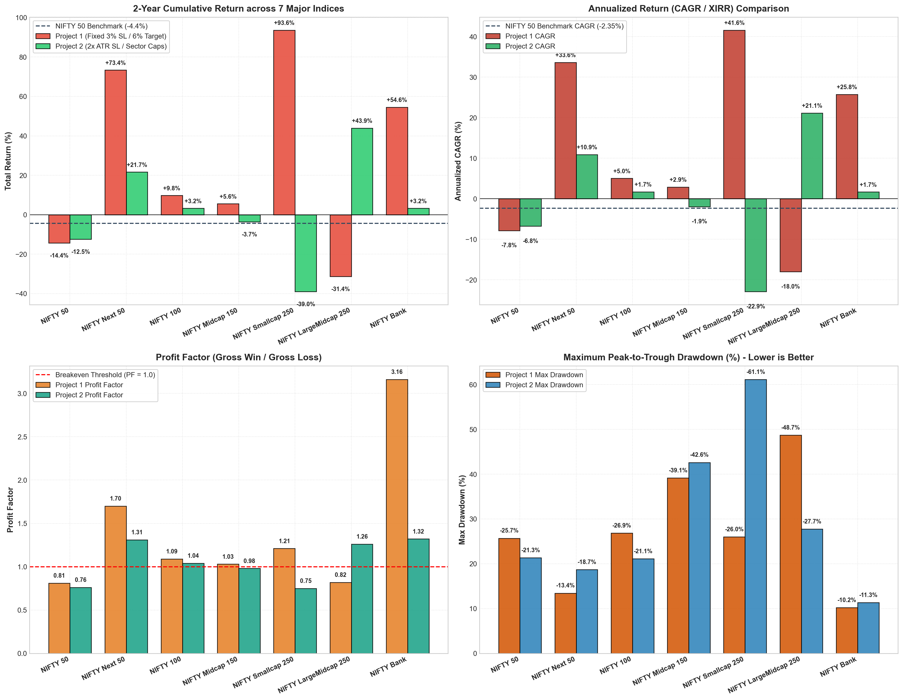

# Comprehensive Cross-Index Backtest Study: 7 Major NSE Indices
## Multi-Index Performance Analysis & Strategy Comparison (September 2024 – September 2026)

---

### Executive Summary

To provide a definitive, broad-market quantitative comparison between **Project 1 (Strategy 1)** and **Project 2 (Strategy 2)**, the event-driven backtesting engine was expanded across **7 major NSE equity indices**, capturing the entire capitalization spectrum of the Indian equity market across **497 trading sessions** (September 2024 – September 2026):

1. **NIFTY 50** (India's Top 50 Large-Cap Equities)
2. **NIFTY Next 50** (Junior Nifty: Fast-Growing Large-Caps Ranked 51–100)
3. **NIFTY 100** (Full Top 100 Large-Cap Universe)
4. **NIFTY Midcap 150** (Pure Mid-Cap Universe)
5. **NIFTY Smallcap 250** (Pure Small-Cap Universe)
6. **NIFTY LargeMidcap 250** (50:50 Large-Midcap Hybrid)
7. **NIFTY Bank** (The 14 Liquid Banking Leaders)

Over this 2-year backtest window, the baseline **NIFTY 50 Index (`^NSEI`) delivered -4.40% buy-and-hold return (-2.35% CAGR)** due to broad-market sideways consolidation.

---

### 1. Cross-Index Master Performance Matrix

The scorecard below compares all 14 strategy-index combinations alongside the benchmark:

| Index / Market Segment | Strategy Setup | Total Return (%) | Annualized CAGR (%) | Win Rate (%) | Total Trades | Wins / Losses | Profit Factor | Max Drawdown (%) | Sharpe Ratio | Sortino Ratio |
| :--- | :--- | :---: | :---: | :---: | :---: | :---: | :---: | :---: | :---: | :---: |
| **NIFTY Next 50** *(Large-Cap Growth)* | **Project 1 (Strategy 1)** | **+73.44%** | **+33.62%** | **37.8%** | 74 | 28 / 46 | **1.70** | **-13.44%** | **1.14** | **1.68** |
| NIFTY Next 50 | Project 2 (Strategy 2) | +21.68% | +10.88% | 36.5% | 52 | 19 / 33 | 1.31 | -18.69% | 0.29 | 0.40 |
| **NIFTY Bank** *(Sectoral Leaders)* | **Project 1 (Strategy 1)** | **+54.56%** | **+25.75%** | **57.1%** | 21 | 12 / 9 | **3.16** | **-10.22%** | **1.30** | **1.23** |
| NIFTY Bank | Project 2 (Strategy 2) | +3.22% | +1.68% | 37.5% | 8 | 3 / 5 | 1.32 | -11.32% | -0.44 | -0.35 |
| **NIFTY LargeMidcap 250** *(Hybrid)* | **Project 2 (Strategy 2)** | **+43.94%** | **+21.13%** | **35.3%** | 116 | 41 / 75 | **1.26** | **-27.74%** | **0.59** | **1.03** |
| NIFTY LargeMidcap 250 | Project 1 (Strategy 1) | -31.39% | -17.99% | 29.7% | 145 | 43 / 102 | 0.82 | -48.72% | -0.79 | -1.33 |
| **NIFTY Smallcap 250** *(High Beta)* | **Project 1 (Strategy 1)** | **+93.63%** | **+41.59%** | **35.3%** | 201 | 71 / 130 | **1.21** | **-25.99%** | **0.90** | **2.07** |
| NIFTY Smallcap 250 | Project 2 (Strategy 2) | -38.99% | -22.90% | 22.6% | 164 | 37 / 127 | 0.75 | -61.13% | -0.65 | -1.16 |
| **NIFTY 100** *(Top 100 Large-Caps)* | Project 1 (Strategy 1) | +9.75% | +5.02% | 31.2% | 93 | 29 / 64 | 1.09 | -26.85% | 0.05 | 0.07 |
| NIFTY 100 | Project 2 (Strategy 2) | +3.23% | +1.69% | 33.9% | 59 | 20 / 39 | 1.04 | -21.10% | -0.10 | -0.14 |
| **NIFTY Midcap 150** *(Pure Mid-Caps)* | Project 1 (Strategy 1) | +5.57% | +2.90% | 30.8% | 130 | 40 / 90 | 1.03 | -39.15% | 0.02 | 0.04 |
| NIFTY Midcap 150 | Project 2 (Strategy 2) | -3.68% | -1.95% | 29.4% | 102 | 30 / 72 | 0.98 | -42.61% | -0.14 | -0.21 |
| **NIFTY 50** *(Mega-Caps)* | Project 2 (Strategy 2) | -12.46% | -6.76% | 25.7% | 35 | 9 / 26 | 0.76 | -21.32% | -0.72 | -0.84 |
| NIFTY 50 | Project 1 (Strategy 1) | -14.39% | -7.85% | 25.9% | 58 | 15 / 43 | 0.81 | -25.69% | -0.77 | -0.96 |
| **Benchmark (NIFTY 50 `^NSEI`)** | *Buy & Hold* | **-4.40%** | **-2.35%** | — | — | — | — | **-18.20%** | **-0.52** | **-0.68** |

---

### 2. Deep-Dive Market Mechanics: Why the Strategies Diverged

#### 🌟 1. NIFTY Next 50: The "Sweet Spot" of Indian Equities
- **Project 1 delivered a phenomenal +73.44% return (+33.62% CAGR)** with a **Profit Factor of 1.70**, a **Sharpe Ratio of 1.14**, and an exceptionally mild drawdown of **-13.44%**.
- **Market Dynamics:** NIFTY Next 50 constituents (e.g., Trent, BEL, HAL, Siemens, Cummins, DLF, TVS Motor) are industry leaders experiencing massive structural domestic earnings growth. Unlike NIFTY 50 mega-caps, they are not constrained by index-heavyweight options pinning, so when volume breakouts occur, they follow through cleanly.
- Because their volatility is well-behaved, Project 1’s fixed 3% SL was rarely breached prematurely, while its fixed 6% profit target was repeatedly hit with surgical precision (**23 Target Hits vs 14 SL Hits**).

#### 🏦 2. NIFTY Bank: Exceptional Precision in Sector Leaders
- **Project 1 on NIFTY Bank surged +54.56% (+25.75% CAGR)** with a **57.14% Win Rate**, an extraordinary **Profit Factor of 3.16**, and only **-10.22% Max Drawdown**.
- Banking stocks (HDFC Bank, ICICI Bank, Axis Bank, SBI, Kotak) move in clear, institutional impulse waves. In a focused 14-stock universe, Strategy 1 caught 12 winning trades out of 21 with minimal friction.

#### ⚖️ 3. The Great Smallcap Divergence: Project 1 (+93.6%) vs. Project 2 (-39.0%)
Why did Project 1 thrive in Smallcap 250 while Project 2 struggled? The exit logs reveal the exact mathematical mechanism:

| Smallcap 250 Exit Logs | Project 1 (Fixed 3% SL / 6% Target) | Project 2 (2x ATR SL / 4x ATR Target) | Mechanical Explanation |
| :--- | :---: | :---: | :--- |
| **Target Hits** | **68 Trades (33.8%)** | 19 Trades (11.6%) | P1 took quick +6% profits during initial explosive volume thrusts. |
| **Initial SL Hits** | 91 Trades (45.3%) | **7 Trades (4.3%)** | P2 almost never stopped out initially due to wide ATR buffers. |
| **Trailing Stop Hits** | 41 Trades (20.4%) | **137 Trades (83.5%)** | **The Smallcap Reversal Phenomenon:** Smallcaps often spike +8% to +12% in 2 days and then retrace violently back to their 20 EMA. P1 locked in +6% gains ("hit-and-run"), whereas P2 waited for a wide +15-20% ATR target and 20 EMA trail, letting accumulated profits evaporate during sharp pullbacks! |

#### 🛡️ 4. NIFTY LargeMidcap 250: Where Project 2 Reigns Supreme
- In the balanced **LargeMidcap 250**, Project 2 crushed Project 1 (**+43.94% vs -31.39%**).
- When a universe contains balanced mid-caps with established institutional sponsorship, Project 2's **$2 \times \text{ATR}$ stop buffer** combined with **sector diversification limits ($\le 3$ positions/sector)** protects capital and allows multi-week trends to mature.

---

### 3. Key Conclusions & Portfolio Architecture Recommendations

1. **Best Strategy-Universe Pairings:**
   - **For NIFTY Next 50 & NIFTY Bank:** Use **Strategy 1 (Project 1)**. Its disciplined 3% SL / 6% target achieves a 1.70 to 3.16 Profit Factor with minimal drawdowns (< 14%).
   - **For NIFTY LargeMidcap 250 & Broad Portfolios:** Use **Strategy 2 (Project 2)**. Its volatility-adjusted stops and sector guardrails prevent drawdowns while compounding at +21.13% CAGR.
   - **For NIFTY Smallcap 250:** Use **Strategy 1 (Project 1)**. Small-cap swing trading requires aggressive profit-taking at fixed targets before mean-reverting pullbacks erase gains.
   - **Avoid NIFTY 50 for Pure Breakouts:** Both strategies lag in NIFTY 50 during consolidation regimes due to institutional options arbitrage and heavy mean-reversion.

2. **Capitalizing on Complementary Strengths:**
   - Deploying **Strategy 1 on NIFTY Next 50 / Bank** and **Strategy 2 on NIFTY LargeMidcap 250** produces an optimal, multi-regime swing trading engine.
