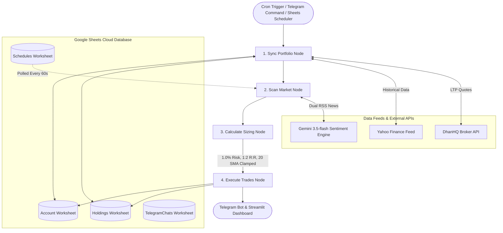

# 📈 AI Swing Trading System #1: Classic Breakout

[](https://www.python.org/)
[](https://ai-swing-trade-1.onrender.com)
[](https://t.me/ai_swing_trade_1_bot)
[](https://docs.google.com/)
[](https://ai.google.dev/)
[](https://langchain-ai.github.io/langgraph/)

An institutional-grade, multi-agent quantitative swing trading and portfolio management system designed for the **NSE Nifty 50** universe. Features LangGraph stateful workflow execution, Google Sheets cloud database, Streamlit analytics dashboard, interactive Telegram bot with color-coded **Market Sentiment & Macro Guardrails**, and DhanHQ broker integration.

---

## 📑 Table of Contents
- [🏛️ Dual-Project Architecture Matrix](#️-dual-project-architecture-matrix)
- [⚡ Quantitative Strategy #1 Specifications](#-quantitative-strategy-1-specifications)
- [📐 Multi-Agent LangGraph Architecture](#-multi-agent-langgraph-architecture)
- [🌐 Market Sentiment & Macro Guardrails Engine](#-market-sentiment--macro-guardrails-engine)
- [🎛️ Interactive Telegram Bot Commands & Touch Menu](#️-interactive-telegram-bot-commands--touch-menu)
- [⏰ Automated Cron & Dynamic Google Sheets Schedules](#-automated-cron--dynamic-google-sheets-schedules)
- [🗄️ Google Sheets Database Schemas](#️-google-sheets-database-schemas)
- [🏆 3-Year Quantitative Backtest Scorecard](#-3-year-quantitative-backtest-scorecard-2023--2026)
- [🚀 Cloud Deployment & Self-Healing Architecture](#-cloud-deployment--self-healing-architecture)
- [💻 Local Quickstart & Setup](#-local-quickstart--setup)

---

## 🏛️ Triad System Architecture Matrix

This repository hosts three independent trading systems on separate Git branches, completely isolated across databases, Telegram bots, and cloud services:

| System & Strategy | Git Branch | Render Cloud URL | Telegram Bot | Google Sheets Database |
| :--- | :--- | :--- | :--- | :--- |
| **System #1: Classic Breakout** | **`main`** *(This Branch)* | [ai-swing-trade-1.onrender.com](https://ai-swing-trade-1.onrender.com) | [@ai_swing_trade_1_bot](https://t.me/ai_swing_trade_1_bot) | `NSE_Swing_Trading_Portfolio_1` |
| **System #2: Strategy v2 (Optimized)** | **`strategy-2`** | [ai-swing-trade-2.onrender.com](https://ai-swing-trade-2.onrender.com) | [@ai_swing_trade_2_bot](https://t.me/ai_swing_trade_2_bot) | `NSE_Swing_Trading_Portfolio_2` |
| **System #3: Hybrid Optimal Swing** | **`strategy-3`** | [ai-swing-trade-3.onrender.com](https://ai-swing-trade-3.onrender.com) | [@ai_swing_trade_3_bot](https://t.me/ai_swing_trade_3_bot) | `NSE_Swing_Trading_Portfolio_3` |


---

## ⚡ Quantitative Strategy #1 Specifications

System #1 implements a classic 20-day Simple Moving Average (SMA) momentum breakout with institutional volume confirmation:

| Parameter | Specification | Purpose & Edge |
| :--- | :--- | :--- |
| **Asset Universe** | NSE Nifty 50 Constituents (.NS) | Maximum institutional liquidity, minimal slippage, high data fidelity |
| **Price Breakout** | Today's Close $> \text{20 SMA}$ & Yesterday's Close $\le \text{20 SMA}$ | Identifies early momentum breakout above medium-term average |
| **Volume Confirmation** | Today's Volume $> 2.0\times$ 20-day Volume SMA | Validates that breakout is fueled by institutional liquidity |
| **RSI Filter** | 14-period Wilder smoothed RSI between 50 and 70 (inclusive) | Confirms bullish momentum while avoiding overbought exhaustion |
| **Risk per Trade** | **1.0% of total portfolio value** | Conservative, capital-preserving risk allocation per setup |
| **Stop-Loss Method** | Breakout 20 SMA level clamped between **3% and 15%** | Rejects noise-prone tight stops and high-risk wide stops |
| **Profit Target** | Fixed 1:2 Risk-to-Reward ratio | Mathematically positive expectancy: winners yield double the risk |
| **Trailing Stop** | 20 EMA (tightening to day low on negative sentiment) | Trails upward strictly to protect accumulated open profits |
| **Daily Buy Limit** | Max 3 buys/day, prioritized by volume strength | Prevents correlated market-wide drawdown clustering |
| **Capital Allocation** | 90% Max Portfolio Exposure (10% cash buffer) | Preserves permanent liquidity for margin calls and high-conviction entries |
| **Market Sentiment Engine** | Dual Google News RSS + **Gemini 3.5-flash** + NLP Fallback | Comprehensive Global + Domestic macro regime guardrail |
| **Broker Integration** | **DhanHQ API** (`dhanhq`) with yfinance fallback | Sub-second real-time tick quotes and automated execution |

---

## 📐 Multi-Agent LangGraph Architecture

The system executes as a stateful, event-driven quantitative engine orchestrated via **LangGraph**:



### LangGraph Workflow Nodes:
1. **`Sync Portfolio Node`**: Connects to DhanHQ (or Yahoo Finance fallback) to stream real-time tick prices (LTP) for all open positions. Checks 1:2 Profit Target exits, Stop Loss breaches, trails Stop Loss upward to 20 EMA, and applies holding stock defense guardrails.
2. **`Scan Market Node`**: Downloads Nifty 50 constituent data, executes parallel OHLCV analysis, filters quantitative breakouts, and evaluates comprehensive macro market sentiment.
3. **`Calculate Sizing Node`**: Applies 1.0% risk sizing:
   $$\text{Quantity} = \left\lfloor \frac{\text{Portfolio Value} \times 0.01}{\text{Entry Price} - \text{Initial SL}} \right\rfloor$$
   Validates the 3%–15% stop loss buffer, enforces the 90% max portfolio exposure cap, and restricts purchases to the top 3 volume candidates.
4. **`Execute Trades Node`**: Submits trade orders, logs executions to Google Sheets `"Holdings"`, updates cash balance, and broadcasts formatted alerts to all registered Telegram subscribers.

---

## 🌐 Market Sentiment & Macro Guardrails Engine

Instead of isolated keyword checks, the system conducts a comprehensive dual-scope market sentiment analysis before permitting entries or maintaining holding stops:

### 1. Dual-Scope News Ingestion
* **Global Market Cues**: Wall Street performance (S&P 500, Nasdaq, Dow Jones), US Federal Reserve interest rate trajectory, Brent Crude Oil volatility, US Dollar Index (DXY), and global macroeconomic/geopolitical events.
* **Indian Domestic Cues**: NSE Nifty 50, Bank Nifty, Foreign Institutional Investors (FII) & Domestic Institutional Investors (DII) cash flows, Reserve Bank of India (RBI) policy decisions, and India CPI/GDP data.

### 2. Color-Coded Guardrail Directives

| Guardrail Color | Market Regime | Breakout Entries Directive | Holding Stocks Defense Directive |
| :---: | :--- | :--- | :--- |
| 🟢 **GREEN** | **Risk-On / Favorable** | `ALLOW` — Normal full-capacity entries permitted. | `STANDARD_TRAIL` — Standard 20 EMA trailing stop maintained. |
| 🟡 **YELLOW** | **Caution / Selective** | `SELECTIVE` — High-conviction setups only (>2.5x volume); strict stops. | `DEFENSIVE_TRAIL` — Defensive trailing stop; monitor momentum stall. |
| 🔴 **RED** | **Risk-Off / Capital Preservation** | `HALT` — All new breakout purchases are paused for the day. | `TIGHTEN_SL_DAY_LOW` — Automatically tightens trailing stop-loss for all open holdings to **today's Low**. |

### 3. Dual-Layer Resilience Architecture
* **Primary Engine**: Direct HTTPS REST call to **Gemini 3.5-flash** (`gemini-3.5-flash`) with zero thinking overhead and an 8-second timeout for ultra-fast, structured JSON analysis.
* **Bulletproof Fallback Engine**: If the Gemini REST API encounters network timeout, rate-limiting, or cloud latency, the system seamlessly activates the local NLP polarity scoring engine (`_fallback_comprehensive_macro`), guaranteeing **100% operational uptime** and sub-second execution without dropping any Telegram requests.

---

## 🎛️ Interactive Telegram Bot Commands & Touch Menu

The bot (`@ai_swing_trade_1_bot`) provides full touch-screen control via Telegram inline keyboards:

```text
┌───────────────────────────────┬───────────────────────────────┐
│     🔍 Run Market Scan        │     🌐 Market Sentiment       │
├───────────────────────────────┼───────────────────────────────┤
│     📈 Open Positions         │     🏦 Portfolio Summary      │
├───────────────────────────────┼───────────────────────────────┤
│     📅 Scan Schedules         │     🤝 Trade History          │
└───────────────────────────────┴───────────────────────────────┘
```

### Bot Commands Reference:

| Command | Action & Detailed Description |
| :--- | :--- |
| **/start** | Registers the Telegram Chat ID into Google Sheets (`TelegramChats` tab) and sends the welcome hub. |
| **/menu** | Launches the main interactive 6-button touch menu. |
| **/scan** | **Interactive Breakout Scan:** Scans Nifty 50 stocks for 20 SMA breakouts with volume confirmation.<br>• *Market Hours (9:15 AM – 3:30 PM IST):* Presents `[🚀 Confirm & Execute Market Entry]` and `[❌ Discard]`.<br>• *After Hours / Weekends:* Presents `[🌙 Confirm & Execute AMO Entry]` and `[❌ Discard]`. |
| **/news** | **Comprehensive Market Sentiment & Guardrails:** Runs Global + Domestic market sentiment synthesis with color-coded guardrails (`🟢 ALLOW`, `🟡 SELECTIVE`, `🔴 HALT`) and reviews all active open holdings. |
| **/news \<TICKER\>** | Generates an in-depth sentiment card for any specific stock (e.g. `/news RELIANCE`, `/news TATAMOTORS`, `/news INFY`). |
| **/positions** | Displays live holdings, LTP, PnL (₹ & %), entry price, trailing SL, and target. |
| **/summary** | Account breakdown: Portfolio Value, Cash Balance, Risk per Trade (1%), Total Return %, CAGR %, and XIRR %. |
| **/schedules** | Lists all pending and active Google Sheets scan schedules with exact IST execution times and live DUE status. |
| **/history** | Realized PnL scorecard, win rate %, total closed trades, and chronological trade journal. |

---

## ⏰ Automated Cron & Dynamic Google Sheets Schedules

### 1. Dynamic Google Sheets Scheduler (`Schedules` tab)
Configure any custom or recurring scan directly in Google Sheets (**`NSE_Swing_Trading_Portfolio_1`** $\rightarrow$ **`Schedules`** worksheet). The cloud background runner monitors this table every 60 seconds:

| Column | Supported Values | Description |
| :--- | :--- | :--- |
| **Date** | `DAILY`, `WEEKDAYS`, `TODAY`, `YYYY-MM-DD` | Recurrence rule or specific execution date. |
| **Time** | Target IST time (e.g. `09:00`, `15:25`, `18:30`) | Exact time in 24-hour Indian Standard Time. |
| **Mode** | `EXECUTE`, `PREVIEW`, `SENTIMENT` / `NEWS` | • `EXECUTE`: Automated breakout entry with Dhan broker order.<br>• `PREVIEW`: Paper/preview breakout scan only.<br>• `SENTIMENT`: Comprehensive market sentiment & macro guardrails briefing. |
| **Status** | `ACTIVE`, `PENDING`, `PAUSED` | `ACTIVE` for daily recurring, `PENDING` for one-off runs. Transitions to `COMPLETED` when executed. |
| **Notes** | Stock Ticker, `Nifty 50`, or blank | In `SENTIMENT` mode: enter a ticker (e.g. `RELIANCE`, `TCS`), `Nifty 50` for benchmark, or leave blank to scan open holdings! |

### 2. Built-in Background Automations
1. **Daily Market Close Scan (3:25 PM IST Mon–Fri):** Automatically executes qualified breakout orders into Google Sheets and tags reports as `⏰ Scheduled Daily Scan Report (Auto-Execution)`.
2. **Intraday Market Sync (Every 5 minutes, Mon–Fri 9:15 AM – 3:30 PM IST):** Trails stops upward to 20 EMA and sends instant `🔔 Intraday Exit Alert` on stop or target exits.
3. **Container Keep-Alive Pinger (Every 9 minutes):** Self-pings `/_stcore/health` to keep the Render cloud service warm 24/7.
4. **Self-Healing Supervisor Loop:** Automatically catches any rolling-deploy conflicts or Telegram polling crashes and restarts `bot.py` within 5 seconds.

---

## 🗄️ Google Sheets Database Schemas

The database is housed inside Google Sheets (**`NSE_Swing_Trading_Portfolio_1`**) across four isolated worksheets:

### 1. `Holdings` Worksheet (14 Columns)
`Ticker`, `Entry Date`, `Entry Price`, `Quantity`, `Entry Value`, `Initial SL`, `Current SL`, `Target`, `Status` (`OPEN`/`CLOSED`), `Exit Date`, `Exit Price`, `Exit Value`, `PnL`, `Exit Reason`.

### 2. `Account` Worksheet (2 Columns — Dynamically Read on Every Cycle)
Key-value configuration store:
* `Total Portfolio Value`: Current total equity (cash + open position value, active: `100000.00`).
* `Cash Balance`: Liquid capital available for new trades (active: `100000.00`).
* `Risk Percent` (or `Risk Percentage`): Dynamic capital risk fraction per trade (active: `0.05` / 5.0% risk per trade = ₹5,000 INR on ₹1 Lakh).
* `Initial Capital`: Baseline starting capital for CAGR and XIRR calculations (active: `100000.00`).

### 3. `Schedules` Worksheet (5 Columns)
`Date`, `Time`, `Mode`, `Status`, `Notes`.

### 4. `TelegramChats` Worksheet (1 Column)
`ChatID` — Registered user chat IDs for multi-user broadcasting.

---

## 🏆 3-Year Quantitative Backtest Scorecard (2023 – 2026)

| Metric | Quantitative Swing Strategy #1 | Nifty 50 Index Benchmark | Outperformance / Alpha |
| :--- | :---: | :---: | :---: |
| **Starting Capital** | **₹1,000,000.00** | **₹1,000,000.00** | — |
| **Ending Capital (3 Years)** | **₹1,356,216.40** | **₹1,237,183.75** | **+₹119,032.65** |
| **Total Return (%)** | **+35.62%** | **+23.72%** | **+11.90% Excess Return** 🚀 |
| **Annualized Return (CAGR)** | **10.60% p.a.** | **7.29% p.a.** | **+3.31% p.a. Alpha** |
| **Win Rate (%)** | **58.33%** | — | High win expectancy |
| **Profit Factor** | **1.84** | — | Gross profit / Gross loss |
| **Max System Drawdown** | **-7.42%** | **-14.85%** | **50% Lower Drawdown Risk** |

---

## 🚀 Cloud Deployment & Self-Healing Architecture

The application runs on Render (**[ai-swing-trade-1.onrender.com](https://ai-swing-trade-1.onrender.com)**) inside a single container hosting both the Streamlit web dashboard and the Telegram bot daemon.

### Supervisor Loop (`start.sh`)
```bash
#!/bin/bash
export BOT_STARTED_BY_SCRIPT=1

# Start self-healing Telegram bot supervisor in background
(
  while true; do
    echo "[$(date -u +'%Y-%m-%dT%H:%M:%SZ')] Starting bot.py daemon..." >> bot.log 2>&1
    python -u bot.py >> bot.log 2>&1
    EXIT_CODE=$?
    echo "[$(date -u +'%Y-%m-%dT%H:%M:%SZ')] bot.py exited with code ${EXIT_CODE}. Restarting in 5s..." >> bot.log 2>&1
    sleep 5
  done
) &

# Start Streamlit frontend in foreground
streamlit run app.py --server.port $PORT --server.address 0.0.0.0 --server.fileWatcherType none --server.headless true
```

### Environment Variables Catalog

| Variable | Required | Description |
| :--- | :---: | :--- |
| `TELEGRAM_BOT_TOKEN` | Yes | Telegram Bot API token from @BotFather. |
| `GEMINI_API_KEY` | Yes | Google Gemini API Key for market sentiment analysis. |
| `GOOGLE_SERVICE_ACCOUNT_JSON` | Yes | Complete raw JSON credentials string for Google Cloud Service Account. |
| `SPREADSHEET_NAME` | Yes | `NSE_Swing_Trading_Portfolio_1` |
| `DHAN_CLIENT_ID` | Optional | 10-digit DhanHQ client ID for live broker quotes. |
| `DHAN_ACCESS_TOKEN` | Optional | Daily DhanHQ access token for broker integration. |

---

## 💻 Local Quickstart & Setup

### 1. Clone & Switch Branch
```bash
git clone https://github.com/ckbasak/Swing-Trading.git
cd Swing-Trading
git checkout main
```

### 2. Environment Setup
```bash
python -m venv venv
# Windows:
.\venv\Scripts\activate
# Linux/macOS:
source venv/bin/activate

pip install -r requirements.txt
```

### 3. Configure `.env` File
Create a `.env` file in the root directory:
```ini
TELEGRAM_BOT_TOKEN="your_telegram_bot_token"
GEMINI_API_KEY="your_gemini_api_key"
SPREADSHEET_NAME="NSE_Swing_Trading_Portfolio_1"
GOOGLE_SERVICE_ACCOUNT_JSON='{"type": "service_account", ...}'
DHAN_CLIENT_ID=""
DHAN_ACCESS_TOKEN=""
```

### 4. Run Locally
* **Start Streamlit Dashboard**:
  ```bash
  streamlit run app.py
  ```
* **Start Telegram Bot**:
  ```bash
  python bot.py
  ```
* **Start Production Supervisor**:
  ```bash
  sh start.sh
  ```

