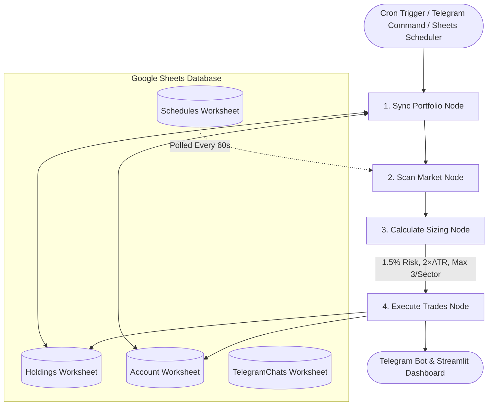

# 📈 AI Swing Trading System #2: Strategy v2 (Optimized)

[](https://www.python.org/)
[](https://ai-swing-trade-2.onrender.com)
[](https://t.me/ai_swing_trade_2_bot)
[](https://docs.google.com/)
[](https://ai.google.dev/)
[](https://langchain-ai.github.io/langgraph/)

An institutional-grade, multi-agent quantitative swing trading and portfolio management system optimized for the **NSE Nifty 50** universe. Features volatility-adaptive stop sizing (2× ATR), sector concentration caps, LangGraph stateful orchestration, Google Sheets cloud database, Streamlit dashboard, and interactive Telegram bot with Gemini 3.6-flash sentiment analysis.

---

## 📑 Table of Contents
- [⚡ Strategy v2 (Optimized) Specifications](#-strategy-v2-optimized-upgrades--specifications)
- [📐 Multi-Agent Architecture](#-multi-agent-architecture)
- [🎛️ Telegram Bot Commands](#️-telegram-bot-commands-ai_swing_trade_2_bot)
- [⏰ Automated Dynamic Schedules](#-automated-cron--dynamic-google-sheets-schedules)
- [🚀 Deployment & Environment Variables](#-deployment--environment-variables)
- [💻 Local Quickstart](#-local-quickstart)

---

## 📐 Multi-Agent Architecture



## ⚡ Strategy v2 (Optimized) Upgrades & Specifications

| Parameter | Specification | Purpose & Edge |
| :--- | :--- | :--- |
| **Asset Universe** | NSE Nifty 50 Constituents (.NS) | Institutional liquidity and minimal execution slippage |
| **Price Breakout** | Today's Close $> \text{20 SMA}$ & Yesterday $\le \text{20 SMA}$ | Early capture of upward momentum breakout |
| **Volume Confirmation** | **$> 2.5\times$ (250%)** of 20-day Volume SMA | Cuts false breakout noise; captures institutional volume accumulation |
| **RSI Filter** | 14-period Wilder smoothed RSI between 50 and 70 | Filters out overbought entries |
| **Stop-Loss Method** | **$2 \times \text{ATR}(14)$ below entry** (no fixed clamp) | Volatility-adaptive stop tailored to each stock's price behavior |
| **Profit Target** | Fixed 1:2 Risk-to-Reward ratio | Mathematical expectancy where winners are double the risk |
| **Risk per Trade** | **1.5% of total portfolio value** | Sizing up on high-conviction, lower-frequency setups |
| **Sector Limits** | **Max 3 open positions per sector** | Caps systemic correlated exposure when sector breakouts cluster |
| **Trailing Stop** | 20 EMA (tightening to day low on negative news) | Protects accumulated open gains; moves strictly upward |
| **Daily Buy Limit** | Max 3 buys/day, prioritized by volume strength | Protects against market-wide drawdown clustering |
| **Capital Allocation** | 90% Max Exposure (10% cash buffer) | Preserves liquidity buffer |
| **AI News Engine** | Google News RSS + **Gemini 3.6-flash** | Macro regime filter + micro stock catalyst assessment |
| **Database** | Google Sheets (NSE_Swing_Trading_Portfolio_2) | Completely isolated Holdings, Account, TelegramChats |

---

## 🎛️ Telegram Bot Commands (@ai_swing_trade_2_bot)

| Command | Action / Description |
| :--- | :--- |
| **/start** | Registers chat ID with Google Sheets and displays the interactive touch menu. |
| **/menu** | Displays the main button menu ([🔍 Run Market Scan], [📰 AI News Sentiment], [📈 Open Positions], [🏦 Portfolio Summary], [📅 Scan Schedules], [🤝 Trade History]). |
| **/scan** | **Preview Mode:** Scans Strategy v2 candidates without altering Google Sheets.<br>• *Market Hours (9:15 AM – 3:30 PM IST):* [🚀 Confirm & Execute Market Entry]<br>• *After Hours / Weekends:* [🌙 Confirm & Execute AMO Entry] |
| **/news** | **AI News Sentiment:** Analyzes news sentiment across active open holdings in Strategy #2 portfolio (or Nifty 50 benchmark if no open positions). |
| **/news <TICKER>** | In-depth news sentiment for any specific stock (e.g. `/news RELIANCE`, `/news TATAMOTORS`, `/news Nifty 50`). |
| **/positions** | Displays live holdings, Sector, LTP, PnL (₹ & %), trailing SL (2×ATR), and target. |
| **/summary** | Account breakdown: Portfolio Value, Cash, 1.5% Risk per trade, and Open PnL. |
| **/schedules** | Lists all pending and active Google Sheets scan schedules with exact IST times and live DUE status. |
| **/history** | Realized PnL scorecard, win rate %, and trade history with sectors. |

---

## ⏰ Automated Cron & Dynamic Google Sheets Schedules

### 1. Dynamic Google Sheets Scheduler (`Schedules` tab)
Configure any custom or recurring scan directly in Google Sheets (**`NSE_Swing_Trading_Portfolio_2`** -> **`Schedules`** worksheet). The cloud background runner monitors this table every 60 seconds:

| Column | Supported Values | Description |
| :--- | :--- | :--- |
| **Date** | `DAILY`, `WEEKDAYS`, `TODAY`, `YYYY-MM-DD` | Recurrence rule or specific execution date. |
| **Time** | Target IST time (e.g. `09:00`, `15:25`, `18:30`) | Exact time in 24-hour Indian Standard Time. |
| **Mode** | `EXECUTE`, `PREVIEW`, `SENTIMENT` / `NEWS` | • `EXECUTE`: Automated breakout entry with Dhan broker order.<br>• `PREVIEW`: Paper/preview breakout scan only.<br>• `SENTIMENT`: Gemini 3.6-flash AI market & stock sentiment briefing. |
| **Status** | `ACTIVE`, `PENDING`, `PAUSED` | `ACTIVE` for daily recurring, `PENDING` for one-off runs. Transitions to `COMPLETED` when done. |
| **Notes** | Stock Ticker, `Nifty 50`, or leave blank | In `SENTIMENT` mode: enter a ticker (e.g. `RELIANCE`, `TCS`), `Nifty 50` for benchmark, or leave blank to scan open holdings! |

### 2. Built-in Background Automations
1. **Daily Market Close Scan (3:25 PM IST Mon–Fri):** Automatically executes qualified breakout orders into Google Sheets and tags reports as `⏰ Scheduled Daily Scan Report (Auto-Execution) — Strategy #2`.
2. **Intraday Market Sync (Every 5 minutes, Mon–Fri 9:15 AM – 3:30 PM IST):** Trails stops upward to 20 EMA and sends instant `🔔 Intraday Exit Alert` on stop or target exits.
3. **Container Keep-Alive Pinger (Every 9 minutes):** Self-pings `/_stcore/health` to keep the Render cloud service warm 24/7.
4. **Self-Healing Supervisor Loop:** Automatically catches any rolling-deploy conflicts or Telegram polling crashes and restarts `bot.py` within 5 seconds.

---

## 🚀 Deployment & Environment Variables

Deployed on Render as a Python Web Service (**[ai-swing-trade-2.onrender.com](https://ai-swing-trade-2.onrender.com)**).

| Variable | Description |
| :--- | :--- |
| `TELEGRAM_BOT_TOKEN_2` or `TELEGRAM_BOT_TOKEN` | Dedicated Telegram Bot 2 API Token from @BotFather |
| `GEMINI_API_KEY` | Shared Google Gemini API Key for sentiment analysis |
| `GOOGLE_SERVICE_ACCOUNT_JSON` | Shared JSON string of Google Cloud Service Account credentials |
| `SPREADSHEET_NAME` | `NSE_Swing_Trading_Portfolio_2` |
| `DHAN_CLIENT_ID` *(Optional)* | 10-digit DhanHQ Client ID |
| `DHAN_ACCESS_TOKEN` *(Optional)* | Daily DhanHQ Access Token |

---

## 💻 Local Quickstart

### 1. Clone & Switch Branch
```bash
git clone https://github.com/ckbasak/Swing-Trading.git
cd Swing-Trading
git checkout strategy-2
```

### 2. Environment Setup
```bash
python -m venv venv
# Windows:
.\venv\Scripts\activate
# Linux/macOS:
source venv/bin/activate
pip install -r requirements.txt
```

### 3. Run Web Dashboard or Bot
* **Start Streamlit Dashboard**:
  ```bash
  streamlit run app.py
  ```
* **Start Telegram Bot**:
  ```bash
  python bot.py
  ```
* **Start Production Supervisor**:
  ```bash
  sh start.sh
  ```

