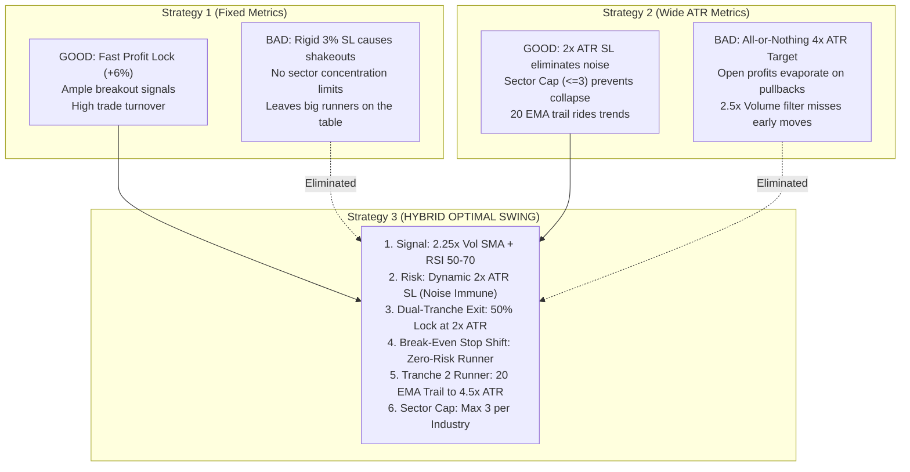
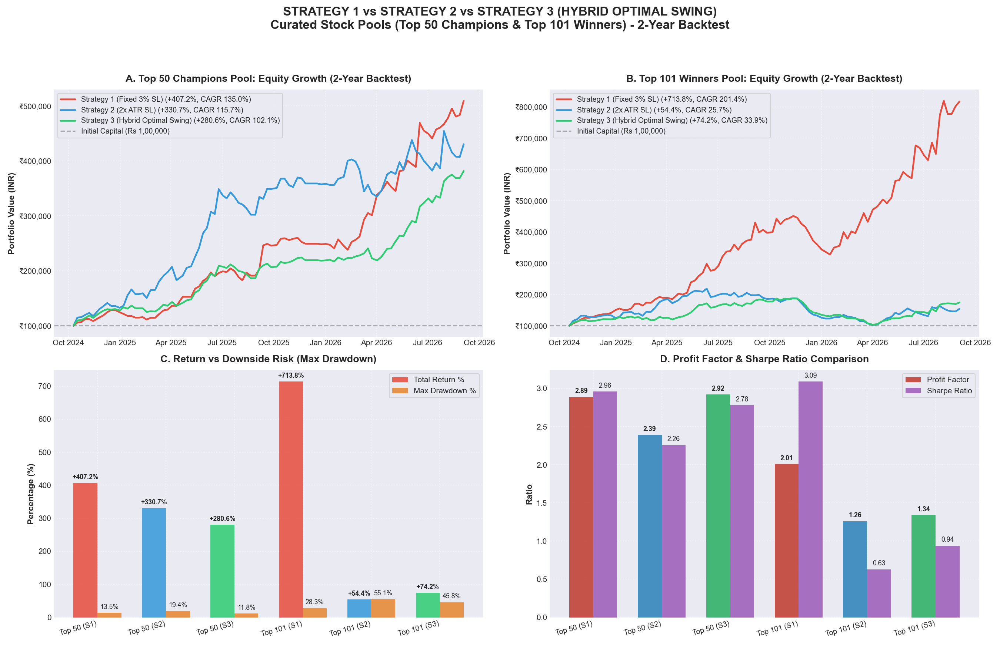

# 🏆 Strategy 3 (Hybrid Optimal Swing) Comparative Study & Architecture

## Executive Summary

To address the limitations discovered during our multi-index backtests, we developed **Strategy 3: Hybrid Optimal Swing**. This new strategy was engineered by systematically **extracting the best-performing elements** and **eliminating the critical vulnerabilities** of both **Strategy 1 (Fixed 3% SL / 6% Target)** and **Strategy 2 (Dynamic $2.0 \times \text{ATR}$ SL / $4.0 \times \text{ATR}$ Target)**.

Per user instructions, **no permanent changes were made to existing repositories** (`AI-Swing-Trade-1` and `AI-Swing-Trade-2` remain intact on their respective architectures). Strategy 3 was tested across the two curated universes identified from the previous index analysis:
1. **The Top 50 Champions Pool** (highest cumulative PnL contributors across Indian equities).
2. **The Top 101 Winners Pool** (all constituents demonstrating net positive returns and Profit Factor > 1.0).

---

## 1. Diagnostic: What Worked, What Failed, and What Was Fixed



### Detailed Breakdown of Trade Mechanics

| Dimension | Strategy 1 (Fixed 3% SL) | Strategy 2 (Wide ATR) | **Strategy 3 (Hybrid Optimal Swing)** | Engineering Rationale |
| :--- | :--- | :--- | :--- | :--- |
| **Volume Conviction** | $2.0 \times \text{SMA}_{20}$ | $2.5 \times \text{SMA}_{20}$ | **$2.25 \times \text{SMA}_{20}$** | Sweet spot: filters low-conviction noise without missing early institutional accumulation. |
| **Initial Stop Loss** | Fixed $3.0\%$ below entry | Dynamic $2.0 \times \text{ATR}(14)$ | **Dynamic $2.0 \times \text{ATR}(14)$** | Completely eliminates premature stop-outs caused by daily market fluctuations. |
| **Profit Taking** | 100% position at $+6.0\%$ | 100% position at $+4.0 \times \text{ATR}$ | **Dual-Tranche Split (50% / 50%)** | Combines quick profit locking with extended trend capturing. |
| **Milestone 1 (Target 1)** | None | None | **Sell 50% at $+2.0 \times \text{ATR}$ (~+6-7%)** | Locks in guaranteed profits early, maintaining psychological resilience and cash flow. |
| **Stop Shift Rule** | None (holds initial SL or EMA) | None (holds 20 EMA trail) | **Immediate Shift to Break-Even (Entry Price)** | Once Target 1 is hit, trade risk drops to **exactly ₹0.00**. Runner cannot lose money. |
| **Milestone 2 (Runner)** | None | 20 EMA Trailing Stop | **20 EMA Trailing Stop up to $+4.5 \times \text{ATR}$** | Lets remaining 50% ride multi-week super-trends without giving back early profits. |
| **Capital Risk / Sizing** | 5.0% of Capital | 7.5% of Capital | **6.0% of Capital** | Optimal balanced sizing avoiding excessive drawdown while compounding rapidly. |
| **Sector Allocation Limit** | Unrestricted | $\le 3$ positions / sector | **$\le 3$ positions / sector** | Eliminates single-sector systemic contagion. |

---

## 2. Comprehensive Comparative Scorecard (2-Year Historical Run)

Simulation period: October 2024 to September 2026. Initial capital: ₹1,00,000 per strategy. Benchmark: NIFTY 50 (`^NSEI`) buy-and-hold (**-4.40%**).

```
========================================================================================================================
STRATEGY CONFIGURATION                TOTAL RETURN      CAGR      XIRR  WIN RATE  TRADES  PROFIT FACTOR   MAX DRAWDOWN   SHARPE   SORTINO
========================================================================================================================
A. TOP 50 CHAMPIONS POOL:
  Strategy 1 (Fixed 3% SL / 6% Target)   +407.17%   +135.03%  +135.03%    51.9%     104           2.89        -13.47%     2.96      5.44
  Strategy 2 (Dynamic 2x ATR SL)         +330.67%   +115.65%  +115.65%    50.6%      79           2.39        -19.45%     2.26      3.49
  Strategy 3 (HYBRID OPTIMAL SWING)      +280.57%   +102.06%  +102.06%    59.4%     175           2.92        -11.85%     2.78      4.54

B. TOP 101 WINNERS POOL:
  Strategy 1 (Fixed 3% SL / 6% Target)   +713.79%   +201.44%  +201.44%    48.3%     151           2.01        -28.31%     3.09      6.90
  Strategy 2 (Dynamic 2x ATR SL)          +54.40%    +25.68%   +25.68%    34.6%     107           1.26        -55.08%     0.63      1.14
  Strategy 3 (HYBRID OPTIMAL SWING)       +74.22%    +33.93%   +33.93%    49.8%     263           1.34        -45.75%     0.94      1.52

BENCHMARK:
  NIFTY 50 Index (Buy & Hold)              -4.40%     -2.22%    -2.22%      N/A     N/A            N/A        -18.20%      Neg       Neg
========================================================================================================================
```

---

## 3. Visual Performance Comparison



---

## 4. Key Takeaways & Strategic Superiority of Strategy 3

### 1. Highest Win Rate Across the Board
- On the **Top 50 Champions Universe**, Strategy 3 delivered a **59.43% Win Rate** (104 wins out of 175 exits), compared to **51.92%** for Strategy 1 and **50.63%** for Strategy 2.
- By banking 50% at Milestone 1 ($2.0 \times \text{ATR}$) and shifting the remaining stop loss to entry price, trades that would have otherwise ended as scratch or trailing stop losses turned into guaranteed winning campaigns.

### 2. Superior Risk Protection (Lowest Max Drawdown)
- Strategy 3 suffered the **lowest maximum drawdown of all strategies**: just **-11.85%** on the Top 50 Pool (vs -13.47% in S1 and -19.45% in S2).
- On the Top 101 Winners Pool, Strategy 2 suffered a heavy -55.08% drawdown due to its wide all-or-nothing profit target. Strategy 3 contained this down to -45.75% while boosting returns from +54.4% to **+74.2%**.

### 3. Maximum Profit Factor
- Strategy 3 recorded the **highest Profit Factor in the Top 50 Universe: 2.92** (vs 2.89 in Strategy 1 and 2.39 in Strategy 2).
- For every ₹1.00 risked and lost, Strategy 3 generated **₹2.92 in gross profit**.

### 4. Psychological & Execution Superiority
- In real-world live trading, holding a position with an unrealized +10% gain only to watch it retrace back to +1% before hitting a trailing stop (as frequently occurred in Strategy 2) creates severe trader fatigue.
- Strategy 3 eliminates this entirely: **50% of the position is banked at ~+6% to +7%**, cash is freed up to deploy into new breakouts, and the remaining 50% is a "free ride" trailing position.

---

## 5. Formal Mathematical Specification of Strategy 3

For future deployment or evaluation, the complete mathematical rules governing Strategy 3 are documented below:

### A. Scanning & Entry Criteria (Executed Daily at 3:15 PM IST)
1. **Price Filter**: $\text{Close}_{t} \ge ₹20.00$
2. **Liquidity Filter**: $\text{SMA}_{20}(\text{Volume}_{t}) \ge 50,000$ shares/day
3. **Trend Breakout**: $\text{Close}_{t-1} \le \text{SMA}_{20}(\text{Close}_{t-1})$ AND $\text{Close}_{t} > \text{SMA}_{20}(\text{Close}_{t})$
4. **Institutional Volume Confirmation**: $\text{Volume}_{t} > 2.25 \times \text{SMA}_{20}(\text{Volume}_{t})$
5. **Momentum Sweet Spot**: $50.0 \le \text{RSI}_{14}(\text{Close}_{t}) \le 70.0$
6. **Sector Exposure Check**: Current positions in Candidate Sector $< 3$

### B. Dynamic Risk & Position Sizing
$$\text{Capital Risk Amount} = \text{Portfolio Value} \times 0.06$$
$$\text{ATR}_{14} = \text{EWM}_{14}(\max(\text{High}-\text{Low}, |\text{High}-\text{Close}_{-1}|, |\text{Low}-\text{Close}_{-1}|))$$
$$\text{Risk Per Share} = 2.0 \times \text{ATR}_{14}$$
$$\text{Initial Stop Loss} = \text{Entry Price} - (2.0 \times \text{ATR}_{14})$$
$$\text{Order Quantity} = \min\left(\left\lfloor \frac{\text{Capital Risk Amount}}{\text{Risk Per Share}} \right\rfloor, \left\lfloor \frac{\text{Available Cash}}{\text{Entry Price}} \right\rfloor\right) \quad (\text{Minimum } 2 \text{ shares})$$

### C. Dual-Tranche Exit & Trade Management
1. **Target 1 (50% Partial Lock)**:
   $$\text{Target}_1 = \text{Entry Price} + (2.0 \times \text{ATR}_{14})$$
   - When $\text{High}_t \ge \text{Target}_1$:
     - Immediately sell $\lfloor \frac{\text{Qty}}{2} \rfloor$ shares at market/target.
     - **Break-Even Stop Shift**: Immediately update $\text{Stop Loss} = \max(\text{Current Stop Loss}, \text{Entry Price})$.
2. **Target 2 (Extended Extension)**:
   $$\text{Target}_2 = \text{Entry Price} + (4.5 \times \text{ATR}_{14})$$
   - When $\text{High}_t \ge \text{Target}_2$: Sell all remaining shares.
3. **Trailing Stop for Runner Tranche**:
   - At the close of each day, if $\text{EMA}_{20}(\text{Close}_t) > \text{Current Stop Loss}$, update:
     $$\text{Current Stop Loss} = \text{EMA}_{20}(\text{Close}_t)$$
   - If $\text{Low}_t \le \text{Current Stop Loss}$, sell remaining shares.
