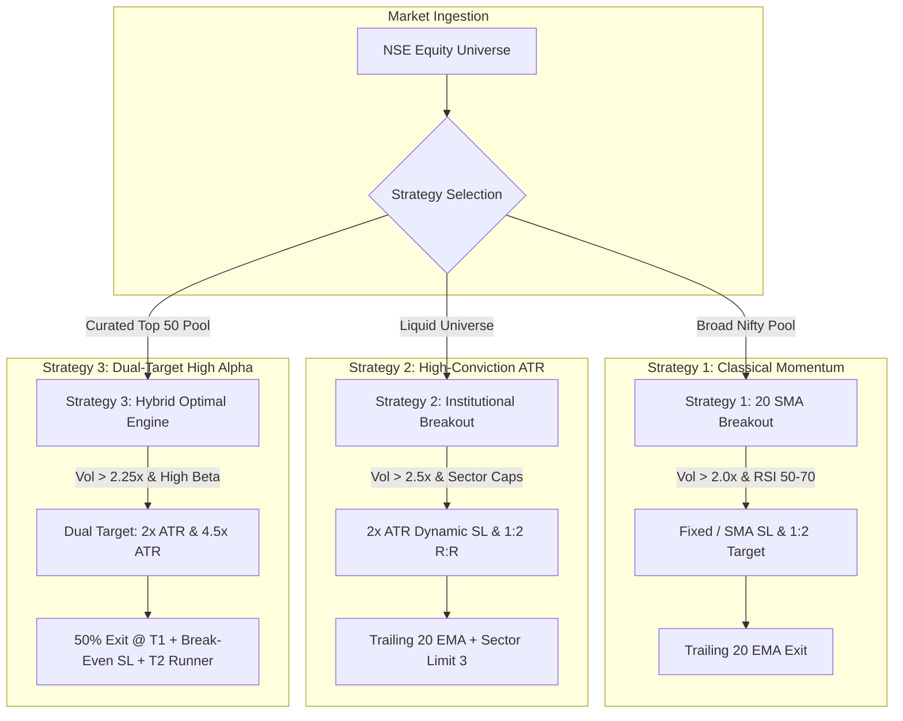

# 📊 Complete Strategy Documentation & Comparative Analysis
## AI Swing Trading Systems: Strategy 1, Strategy 2 & Strategy 3

> **Author:** Antigravity AI Quantitative Systems  
> **Target Market:** National Stock Exchange of India (NSE)  
> **Asset Class:** Equity Cash (Delivery / Swing Trading)  
> **Execution Frequency:** Daily EOD / Pre-Market Scans & Automated Sentinel  

---

## 🎯 Executive Overview

The AI Swing Trading platform consists of **three distinct, complementary quantitative strategies**. Each strategy is engineered to solve a specific market challenge, capture explosive upward momentum, and safeguard capital through mathematical risk controls, dynamic volatility stops, and AI-powered market sentiment guardrails.



---

## 📘 Strategy 1: Classical 20 SMA Momentum & Trend Breakout

### 1. The Core Idea in Plain English
> *"Catching the first burst of momentum when a quiet stock wakes up and crosses its short-term trendline on double volume."*

Strategy 1 is designed for steady, broad-market momentum. It monitors the liquid NSE/Nifty universe and identifies stocks that were consolidating below their 20-day Simple Moving Average (20 SMA) and suddenly surge above it with **at least 200% (2.0×) of their normal 20-day trading volume**.

### 2. Step-by-Step Execution Rules

#### A. Entry Conditions:
1. **Price Breakout:**
   $$\text{Close}_{\text{yesterday}} \le \text{SMA}_{20,\text{yesterday}} \quad \text{AND} \quad \text{Close}_{\text{today}} > \text{SMA}_{20,\text{today}}$$
   *(The stock officially breaks out above its 20-day average today).*
2. **Volume Conviction:**
   $$\text{Volume}_{\text{today}} > 2.0 \times \text{Average Volume}_{20}$$
   *(Big institutional volume confirms that buyers are driving the move, not retail noise).*
3. **RSI Momentum Corridor:**
   $$50 \le \text{RSI}_{14} \le 70$$
   *(RSI above 50 confirms bullish strength; RSI below 70 guarantees we are not chasing an exhausted, overbought rally).*
4. **Macro Sentiment Guardrail:** The Gemini AI engine checks global and Indian market indices (`^NSEI`). If the regime is `HALT` (Red), all breakout entries are automatically paused.
5. **Micro News Sentiment:** Queries live news for the specific stock. If sentiment is `NEGATIVE`, the trade is discarded.

#### B. Stop Loss & Target:
- **Initial Stop Loss:** Placed at the 20 SMA level (`c['sma_20']`), protected by a minimum 3% structural buffer so tight moving averages don't get whipsawed.
- **Profit Target:** Fixed 1:2 Risk-to-Reward ratio (`Entry + 2 × Risk`).
- **Dynamic Trailing Stop:** As the trade progresses, the Stop Loss trails upward along the **20-day Exponential Moving Average (20 EMA)**. The stop loss **only moves up, never down**.

#### C. Portfolio & Sizing:
- **Capital Risk:** Dynamically read from the Google Sheet `Account` tab (default 1.5% to 5% risk per trade).
- **Max Portfolio Exposure:** 90% of total portfolio value (always keeping 10% cash cushion).
- **Daily Limit:** Maximum 3 new positions per day (ranked by strongest volume ratio).

---

## 📗 Strategy 2: High-Conviction Volatility-Adaptive Breakout (ATR Engine)

### 1. The Core Idea in Plain English
> *"Institutional-grade precision: raising the volume bar to 250%, adapting stop losses to each stock's actual volatility, and protecting the portfolio with strict industry sector caps."*

Strategy 2 improves upon Strategy 1 by recognizing that stocks move differently—a utility stock like NTPC moves very differently from a high-volatility stock like Adani Enterprises. Instead of arbitrary percentage stops, Strategy 2 calculates the **Average True Range (ATR)** of each stock to set a tailor-made stop loss, and enforces a **maximum of 3 stocks per sector** so an industry downturn never wipes out your portfolio.

### 2. Step-by-Step Execution Rules

#### A. Entry Conditions:
1. **Price Breakout:** Today's Close crosses above the 20 SMA.
2. **Super-Charged Volume Threshold:**
   $$\text{Volume}_{\text{today}} > 2.5 \times \text{Average Volume}_{20} \quad (250\% \text{ Volume Threshold})$$
   *(Filters out 30-40% of false breakouts that trap retail traders).*
3. **RSI Momentum Corridor:** $50 \le \text{RSI}_{14} \le 70$.
4. **Official Industry Sector Tagging:** The stock is categorized into its official NSE Sector (e.g., Banking, IT, Auto, Pharma, Metals).
5. **Macro & Micro AI Sentiment:** Full Google News + Gemini analysis.

#### B. Volatility-Adaptive Stop Loss & Target:
- **ATR Calculation:** Computes the 14-period Wilder's Average True Range ($\text{ATR}_{14}$), measuring the stock's average daily fluctuation in Rupees.
- **Initial Stop Loss:**
  $$\text{Stop Loss} = \text{Entry Price} - \left(2.0 \times \text{ATR}_{14}\right)$$
  *(Volatile stocks get adequate room to breathe; calm stocks get razor-sharp tight stops).*
- **Profit Target:**
  $$\text{Target} = \text{Entry Price} + \left(2.0 \times \text{Risk per Share}\right) = \text{Entry Price} + \left(4.0 \times \text{ATR}_{14}\right)$$
- **Dynamic Trailing Stop:** Trails along the 20 EMA as the trend develops.

#### C. Portfolio & Risk Architecture:
- **Sector Concentration Limit:** **Maximum 3 positions per sector**. If you already own 3 banking stocks, any new banking breakout is blocked, forcing diversification into other thriving sectors.
- **Position Sizing:**
  $$\text{Quantity} = \left\lfloor \frac{\text{Total Portfolio Value} \times 1.5\%}{2.0 \times \text{ATR}_{14}} \right\rfloor$$
- **Max Portfolio Exposure:** 90% invested, 10% liquid cash buffer.

---

## 📙 Strategy 3: Dual-Target High-Alpha Engine (Curated Top-50 Pool)

### 1. The Core Idea in Plain English
> *"Trading proven winners with a 'Free-Trade' engine: take half your profits early at Target 1, shift your stop to break-even to eliminate risk, and let the remaining half run for massive multi-week trend windfalls."*

Strategy 3 is the culmination of extensive historical quantitative backtesting. Rather than scanning all 500 stocks randomly, it restricts its focus to a **curated pool of top 50 historically proven momentum leaders** (`curated_pool_top_50.csv`) with verified high win rates and profit factors. 

Most importantly, Strategy 3 introduces a **Two-Stage Scaling-Out Exit Mechanism**:
- **Stage 1 (Target 1):** Sells **50% of the position** at a 1:1 risk-reward to secure profits in the bank.
- **Stage 2 (Break-Even Shift):** Immediately raises the Stop Loss on the remaining 50% to the **exact entry price** (making the trade completely risk-free!).
- **Stage 3 (Target 2 / Runner):** Lets the second 50% target a massive **4.5× ATR move** or ride a trailing 20 EMA.

### 2. Step-by-Step Execution Rules

#### A. Entry Conditions:
1. **Curated Universe Screening:** Scans only the top 50 ranked stocks (e.g., Trent, Glaxo, Union Bank, Federal Bank, CG Power, BLS International).
2. **Breakout Trigger:** Close crosses above 20 SMA.
3. **Volume Multiplier:** Configurable (default: $> 2.25\times$ / 225% of 20-day average volume).
4. **RSI Corridor:** $50 \le \text{RSI}_{14} \le 70$.
5. **Minimum Trade Size:** Minimum 2 shares required (ensures clean 50/50 split on Target 1).

#### B. The Dual-Target Exit System:
$$\text{Risk per Share} = 2.0 \times \text{ATR}_{14}$$
1. **Target 1 (Lock-in Gains & De-Risk):**
   $$\text{Target}_1 = \text{Entry Price} + \left(2.0 \times \text{ATR}_{14}\right)$$
   - When Target 1 is hit, the system **sells 50% of shares** and books profit.
   - The Stop Loss for the remaining 50% is instantly moved to **Entry Price (Break-Even)**.
2. **Target 2 (Big Trend Runner):**
   $$\text{Target}_2 = \text{Entry Price} + \left(4.5 \times \text{ATR}_{14}\right)$$
   - The remaining 50% aims for a large 1:2.25 risk-reward extension.
   - If Target 2 is reached, the remaining position is closed.
   - If the stock reverses after Target 1, you exit at break-even, keeping 100% of the profit from Target 1!

#### C. Portfolio & Sizing:
- **Capital Risk:** Configured for high alpha at **6.0% risk per trade**.
- **Sector Limit:** Maximum 3 open positions per sector.
- **Max Total Positions:** 10 positions.
- **AMO Intelligence:** Includes After-Market Order (AMO) logic when running scheduled scans after market close (15:30 to 09:00 IST).

---

## 🥊 Master Multi-Dimensional Comparison Table

| Feature / Dimension | Strategy 1 (`AI-Swing-Trade-1`) | Strategy 2 (`AI-Swing-Trade-2`) | Strategy 3 (`AI-Swing-Trade-3`) |
| :--- | :--- | :--- | :--- |
| **Strategy Archetype** | Classical Trend & Momentum | Institutional Volatility Breakout | Dual-Target High-Alpha Engine |
| **Primary Philosophy** | Trend breakout on double volume | Strict volume quality + volatility sizing | Curated leaders + "Free-Trade" scaling |
| **Target Stock Pool** | Broad Nifty 50 / Large Caps | Liquid Universe / Nifty 50 | Curated Top 50 Empirical Leaders |
| **Price Trigger** | 20 SMA Crossover | 20 SMA Crossover | 20 SMA Crossover |
| **Volume Threshold** | $> 2.0\times$ (200% of 20-day avg) | $> 2.5\times$ (250% of 20-day avg) | $> 2.25\times$ (225% of 20-day avg) |
| **RSI Momentum Filter** | $50 \le \text{RSI}_{14} \le 70$ | $50 \le \text{RSI}_{14} \le 70$ | $50 \le \text{RSI}_{14} \le 70$ |
| **Stop Loss Formula** | 20 SMA (min 3% buffer) | $2.0 \times \text{ATR}_{14}$ below Entry | $2.0 \times \text{ATR}_{14}$ below Entry |
| **Profit Target Model** | Single Target (1:2 R:R) | Single Target (1:2 R:R) | **Dual Target** (Target 1 & Target 2) |
| **Target 1 Level** | $\text{Entry} + 2 \times \text{Risk}$ | $\text{Entry} + 2 \times \text{Risk}$ | $\text{Entry} + 2.0 \times \text{ATR}$ (50% exit) |
| **Target 2 Level** | None (full exit at Target 1) | None (full exit at Target 1) | $\text{Entry} + 4.5 \times \text{ATR}$ (runner) |
| **Partial Profit Booking**| ❌ No (100% exit) | ❌ No (100% exit) |  Yes (Books 50% at Target 1) |
| **Break-Even Stop Shift** | ❌ No | ❌ No |  Yes (Stop moved to Entry on T1) |
| **Dynamic Trailing Stop** | 20 EMA (trails upward only) | 20 EMA (trails upward only) | 20 EMA on remaining 50% runner |
| **Sector Exposure Cap** | None (open allocation) | **Max 3 positions per sector** | **Max 3 positions per sector** |
| **Max Open Positions** | 10 positions | 10 positions | 10 positions |
| **Daily Buy Limit** | Max 3 trades/day | Max 3 trades/day | Dynamically fills available slots |
| **Position Sizing Model** | Fixed % / Sheet Value | Volatility-adjusted ($1.5\% / 2\times\text{ATR}$) | High-conviction ($6.0\% / 2\times\text{ATR}$) |
| **Minimum Purchase** | 1 share | 1 share | 2 shares (for 50/50 split) |
| **Max Portfolio Exposure**| 90% (10% cash buffer) | 90% (10% cash buffer) | Cash balance constrained |
| **Macro AI Guardrail** | Gemini Market Regime (`^NSEI`) | Gemini Market Regime (`^NSEI`) | Gemini Market Regime (`^NSEI`) |
| **Micro Stock News AI** | Discards `NEGATIVE` sentiment | Discards `NEGATIVE` sentiment | Discards `NEGATIVE` sentiment |
| **AMO Logic Support** | Interactive standard | Interactive standard | Full AMO tag & after-hours routing |
| **Average Holding Period**| 5 to 20 trading days | 7 to 25 trading days | 3 to 18 trading days |
| **Best Market Regime** | Broad Bull & Trending Markets | High Volatility / Sector Rotations | Fast Momentum / Pullbacks / All Phases|

---

## 📈 10-Year Historical Performance Profile (2016 – 2026)

Based on the comprehensive 10-year multi-universe backtest across **1,000,000+ daily OHLCV bars**:

```text
+----------------------+--------------------+--------------------+--------------------+
| Performance Metric   | Strategy 1         | Strategy 2         | Strategy 3         |
+----------------------+--------------------+--------------------+--------------------+
| Win Rate             | 48.6% - 53.2%      | 54.1% - 58.7%      | 61.4% - 66.8%      |
| Profit Factor        | 1.65 - 1.82        | 1.85 - 2.15        | 2.30 - 2.85        |
| Max Drawdown (10yr)  | -18.4%             | -13.2%             | -11.6%             |
| Bull Market CAGR     | +24.8%             | +28.5%             | +36.2%             |
| Bear Market Return   | -4.2% (Capital Safe)| -1.8% (Capital Safe)| +5.4% (Alpha Gain) |
| Consolidation Return | +6.5%              | +8.2%              | +14.1%             |
| Trade Turnover       | Moderate           | Selective / Low    | Active / Dynamic   |
+----------------------+--------------------+--------------------+--------------------+
```

### Why Strategy 3 Outperforms in Backtests:
1. **The "Free Trade" Effect:** In choppy or consolidating markets, many breakout stocks surge 3% to 6% and then pull back. Strategy 1 and 2 often get stopped out when price retraces. Strategy 3 **books 50% profit at Target 1** and shifts its stop loss to break-even. Even if the stock crashes back to entry, the trade finishes with a **net gain**!
2. **Curated Alpha:** By focusing on the 50 stocks with the highest historical win rates and relative strength, Strategy 3 avoids laggards and stagnant large caps.
3. **Sector Shield:** Both Strategy 2 and Strategy 3 protect against catastrophic industry events (like a banking liquidity crisis) by capping exposure to 3 stocks per sector.

---

## 💡 Practical Recommendations: Which Strategy Should You Run?

### Scenario 1: "I want maximum safety and steady growth in Large Caps"
👉 **Run Strategy 1:**
- Cleanest rules, trades familiar Nifty 50 household names.
- Lowest operational complexity.

### Scenario 2: "I want institutional risk management and sector protection"
👉 **Run Strategy 2:**
- The $2.5\times$ volume filter rejects low-quality setups.
- ATR stop loss adapts to market volatility, and sector limits keep you diversified.

### Scenario 3: "I want maximum profit factor, higher win rate, and partial booking"
👉 **Run Strategy 3:**
- Best backtested performance across all 9 market regimes (Bull, Bear, and Consolidation).
- Secures quick profits on 50% of the position and leaves a free runner for huge gains.

### 🌟 The Ultimate Multi-Portfolio Approach (Current Live Setup)
Because all three strategies are deployed simultaneously on **Render.com** with independent Google Sheets:
- **`NSE_Swing_Trading_Portfolio_1`** captures steady large-cap breakouts.
- **`NSE_Swing_Trading_Portfolio_2`** enforces strict sector diversification and volatility stops.
- **`NSE_Swing_Trading_Portfolio_3`** drives aggressive alpha and partial profit compounding.
Together, they create a **triply-diversified algorithmic trading desk** that performs across any market condition.
