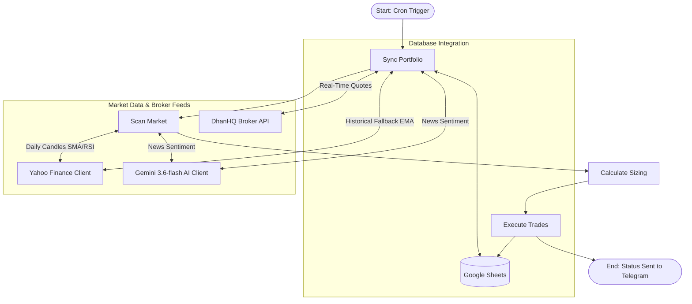

# NSE Swing Trading & Portfolio Management System: Final Blueprint

This blueprint holds the comprehensive developer documentation, step-by-step setup guides, active configurations, credentials catalog, performance metrics calculation models, AI news sentiment filters, system guardrails, DhanHQ broker integration, and the universal Master Prompt. This file acts as the primary master manual to recreate or migrate this system on any other AI coding platform.

---

## 📐 1. Architecture & Workflow Design

The system is designed as a stateful, event-driven workflow using **LangGraph**. It manages tasks across four distinct execution nodes:



### Core Logic Nodes:
1. **`Sync Portfolio` (Live Prices, Exits, & Trailing Stops):**
   * Connects to **DhanHQ API** (`dhan_client.py`) to fetch real-time Last Traded Prices (LTP) for open positions. If Dhan credentials are unset or network issues occur, automatically falls back to **Yahoo Finance**.
   * Compares live prices against targets (1:2 R:R) and stop losses (Current SL). If breached, closes the position, calculates PnL, and updates available cash balance.
   * Checks Google News RSS feed headlines for active holdings and uses **Gemini 3.6-flash** to score news sentiment.
   * If sentiment is **NEGATIVE**, automatically tightens the trailing stop loss to **today's Low** to protect capital.
   * Compares the close against the rising **20 EMA**. If the 20 EMA exceeds the current stop loss, trails the stop loss upward.
   * Computes portfolio performance metrics: **Total Return (%)**, **CAGR (%)**, and **XIRR (%)**.
2. **`Scan Market` (Breakout Screener & News Filter):**
   * Downloads the active Nifty 50 ticker list from NSE.
   * Queries yfinance for daily candles and filters for breakouts.
   * Checks **Nifty 50 Index News Sentiment** via Gemini; disables buys if macro sentiment is NEGATIVE.
   * For candidate breakouts, checks stock-specific news; skips if sentiment is NEGATIVE.
3. **`Calculate Sizing` (Risk Manager & Exposure Guardrails):**
   * Sizes entries so that the maximum loss is exactly **1% of total portfolio value**.
   * Applies the **Max 90% Portfolio Exposure** guardrail (ensuring at least 10% cash is kept).
   * Applies the **Max 3 Daily Purchases** limit, selecting the candidates with the highest volume breakout ratios first.
4. **`Execute Trades` (Execution & Broadcasting):**
   * Commits buy orders to Google Sheets and broadcasts ASCII tables to Telegram.

---

## 🗄️ 2. Google Sheets Database Schema

The system utilizes Google Sheets as a relational database containing three worksheets:

### Worksheet 1: `"Holdings"` (14 Columns)
* **Col 1 (Ticker):** Symbol (e.g. `HDFCBANK.NS`)
* **Col 2 (Entry Date):** YYYY-MM-DD
* **Col 3 (Entry Price):** Close price on entry day
* **Col 4 (Quantity):** Shares purchased
* **Col 5 (Entry Value):** `Quantity * Entry Price`
* **Col 6 (Initial SL):** Breakout 20 SMA value
* **Col 7 (Current SL):** Trailing stop loss (20 EMA)
* **Col 8 (Target):** Profit target (1:2 R:R)
* **Col 9 (Status):** `OPEN` or `CLOSED`
* **Col 10 (Exit Date):** YYYY-MM-DD of exit
* **Col 11 (Exit Price):** Realized exit price
* **Col 12 (Exit Value):** `Quantity * Exit Price`
* **Col 13 (PnL):** Realized profit/loss (`Exit Value - Entry Value`)
* **Col 14 (Exit Reason):** `Target Hit`, `Stop Loss Hit`, or `Manual Exit`

### Worksheet 2: `"Account"` (2 Columns)
* `Total Portfolio Value`: Current value of cash + open holdings.
* `Cash Balance`: Available cash.
* `Risk Percent`: Sizing risk per trade (`0.01` for 1%).
* `Initial Capital`: Setup deposits (defaults to `1000000` / 10 Lacs).

### Worksheet 3: `"TelegramChats"` (1 Column)
* `ChatID`: Stores registered Telegram chat IDs.

---

## 🛡️ 3. System-Wide Guardrails System

| Guardrail Name | Scope | Operational Threshold | Purpose |
| :--- | :--- | :--- | :--- |
| **Dhan Fallback Engine** | Data Feed | Seamless switch to yfinance on timeout/unconfigured | Prevents downtime if broker API expires |
| **Double Buy Blocker** | Portfolio | Block addition of duplicate tickers | Prevents over-exposure to a single stock |
| **Max Portfolio Allocation** | Portfolio | Limits open positions value to **90%** | Guarantees minimum **10% cash** reserves |
| **Max Daily Purchases** | Sizer | Maximum **3 buys** per scan | Prevents capital exhaustion on massive breakout days |
| **SL Tightness Guard** | Sizer | Stop Loss must be **>= 3% below Entry** | Prevents immediate stops due to minor price noise |
| **SL Bloat Guard** | Sizer | Stop Loss must be **<= 15% below Entry** | Discards high-risk, overly bloated breakout trades |
| **API Retry Session** | Connection | HTTPAdapter with exponential backoff | Avoids rate limits and IP bans |
| **Sheet Write Backoff** | Database | 2-second sleep retry on gspread calls | Recovers gracefully from Google API rate limits |
| **Penny Stock Filter** | Screener | Close Price must be **>= Rs 20** | Filters out micro-cap pump-and-dump stocks |
| **Liquidity Filter** | Screener | 20-day Volume SMA must be **>= 50,000** | Protects against low-liquidity slippage traps |

---

## 📋 4. Credentials & Configuration Catalog

| System / Provider | Parameter Name | Description / Token Value |
| :--- | :--- | :--- |
| **Dhan Broker** | `DHAN_CLIENT_ID` | Your 10-digit Dhan Client ID |
| **Dhan Broker** | `DHAN_ACCESS_TOKEN` | Generated from Dhan Web > Profile > DhanHQ APIs |
| **Telegram Bot** | `TELEGRAM_BOT_TOKEN` | Bot API Token |
| **Telegram Bot** | Bot Username | `@nse_swing_123_bot` |
| **Render Cloud** | Service ID | `srv-da86e4ugekts73ccfr20` |
| **Render Cloud** | Service Web URL | `https://nse-swing-trading.onrender.com` |
| **Google Sheets** | Service Account Email | `sheets-editor@swing-trade-system-506815.iam.gserviceaccount.com` |
| **Google Sheets** | Database Sheet Name | `NSE_Swing_Trading_Portfolio` |
| **Gemini AI** | `GEMINI_API_KEY` | Google Gemini API Key |
| **GitHub Repo** | Git Code Repository | `https://github.com/ckbas/Swing-Trading.git` |

---

## 🛠️ 5. Setup & Configuration Guide for DhanHQ

1. **Log in to Dhan Web:** Navigate to [web.dhan.co](https://web.dhan.co).
2. **Generate Access Token:** Go to **Profile** > **DhanHQ Trading APIs** > **Access Token**.
3. **Set Environment Variables on Render:**
   * In your Render dashboard, navigate to **Environment** and add:
     * `DHAN_CLIENT_ID` = `[Your Dhan Client ID]`
     * `DHAN_ACCESS_TOKEN` = `[Your Dhan Access Token]`
4. The system will automatically detect the credentials and switch live price streaming to DhanHQ!

---

## 🔮 6. Universal Master Prompt

```text
Build a complete, production-grade NSE Swing Trading & Portfolio Manager in Python, ready to deploy to Render (Free Tier). The system must run a Streamlit web dashboard and a Telegram bot concurrently inside a single container. The database must be Google Sheets (managed via gspread).

Here are the specifications:

1. FILE STRUCTURE & RESPONSIBILITIES:
- `dhan_client.py`: Integrates DhanHQ API ('dhanhq'). Downloads and caches the Dhan NSE Scrip Master CSV ('https://images.dhan.co/api-data/api-scrip-master.csv') in memory to map symbols (e.g. 'RELIANCE' -> 2885). Provides get_dhan_ltp(tickers) for zero-latency live quotes with graceful fallback to yfinance if unconfigured.
- `sentiment_analyzer.py`: Connects to Google News RSS search feed for a ticker or macro index, parses XML for the top 5 recent headlines, and calls Gemini model "gemini-3.6-flash" to return 'POSITIVE', 'NEUTRAL', or 'NEGATIVE' sentiment.
- `screener.py`: Fetches Nifty 50 symbols from NSE, downloads 60d daily historical data in parallel via yfinance, and filters for breakouts. Checks macro and stock-specific news sentiment before qualifying candidates. Filters out penny stocks (Price < 20) and low-volume stocks (Vol SMA 20 < 50,000).
- `portfolio_manager.py`: Google Sheets database operations. Handles sheets initialization, fetching open/closed positions, registering chat IDs, adding positions, closing positions, calculating performance metrics (Total Return, CAGR, XIRR), and syncing live quotes from DhanHQ (with yfinance fallback). Implements retry_gspread for 429 rate limit backoff. In add_position, blocks duplicates and checks Stop Loss percentage (3% - 15%).
- `trading_graph.py`: Builds a stateful LangGraph workflow representing the trading cycle (Sync Portfolio -> Scan Market -> Position Sizer -> Execute Trades) and formats a text-based ASCII scan report. Sizer enforces max 90% portfolio exposure (10% cash buffer) and max 3 daily purchases.
- `bot.py`: Telegram Bot handler and cron scheduler. Implements command callbacks and background jobs.
- `app.py`: Streamlit frontend dashboard displaying KPI cards for Value, Cash, Unrealized/Realized PnL, Total Return, CAGR, and XIRR.
- `start.sh`: Shell script launching `python -u bot.py &` in the background and `streamlit run` in the foreground.
- `Procfile`: Contains `web: sh start.sh`
- `requirements.txt`: Dependencies (streamlit, python-telegram-bot[all], gspread, google-auth, yfinance, pandas, numpy, langgraph, pytz, plotly, requests, google-generativeai, dhanhq).

2. STRATEGY SPECIFICATIONS:
- Tickers: Nifty 50 Index (fetched from 'https://archives.nseindia.com/content/indices/ind_nifty50list.csv'). Symbol suffix is '.NS'.
- Entry Conditions:
  - Price breakout: Today's Close > Today's 20 SMA AND Yesterday's Close <= Yesterday's 20 SMA.
  - Volume breakout: Today's Volume > 2.0 * 20-day Volume SMA.
  - RSI Filter: Today's 14-period RSI (Wilder's smoothed) must be between 50 and 70 (inclusive).
- Exit Conditions:
  - Target: Entry Price + 2 * (Entry Price - Initial SL) [1:2 Risk-to-Reward Ratio].
  - Trailing Stop: 20 EMA. Move Stop Loss up to 20 EMA if 20 EMA > current SL. Exit trade if live price <= Current SL.

3. GOOGLE SHEETS SCHEMAS:
Create 'NSE_Swing_Trading_Portfolio' with tabs:
- 'Holdings' (14 Columns): Ticker, Entry Date, Entry Price, Quantity, Entry Value, Initial SL, Current SL, Target, Status, Exit Date, Exit Price, Exit Value, PnL, Exit Reason.
- 'Account' (2 Columns): Parameter (Total Portfolio Value, Cash Balance, Risk Percent, Initial Capital) and Value.
- 'TelegramChats' (1 Column): ChatID.

4. RISK MANAGEMENT & SIZING:
- Risk Amount: 1% of 'Total Portfolio Value' from Account sheet.
- Quantity: Risk Amount / (Entry Price - Initial SL).
- Capital Scaling: Ensure max 90% allocation limit; scale down if cash insufficient.
```
