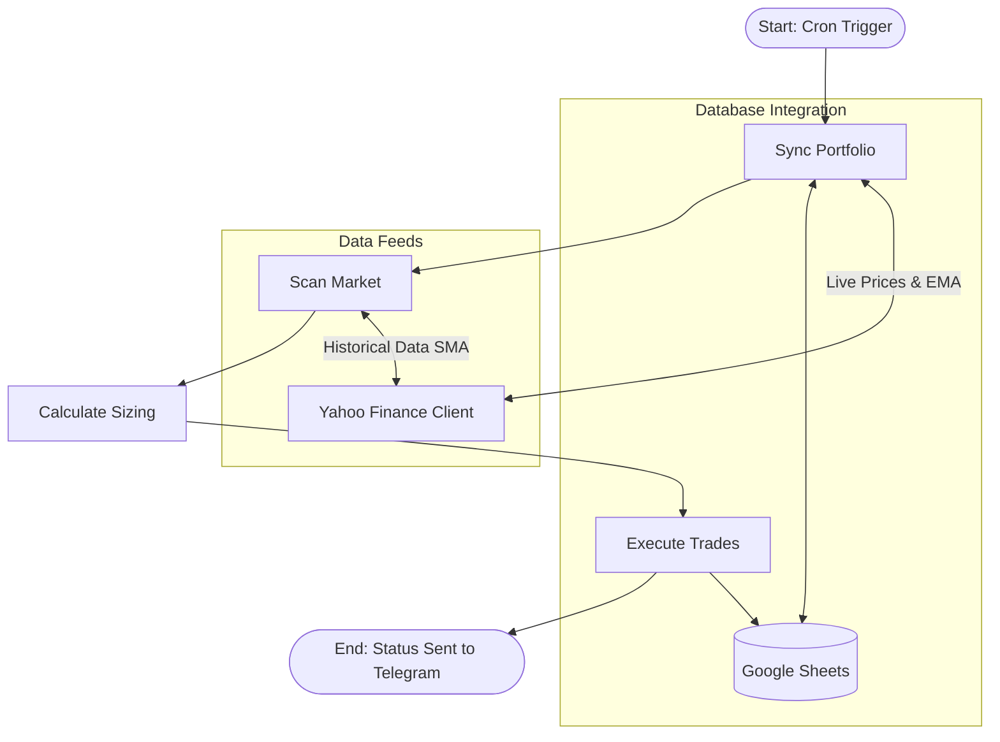

# NSE Swing Trading & Portfolio Management System: Final Blueprint

This blueprint holds the comprehensive developer documentation, step-by-step setup guides, active configurations, credentials catalog, performance analytics logic, and the universal Master Prompt. This file acts as the primary master manual to recreate or migrate this system on any other AI coding platform.

---

## 📐 1. Architecture & Workflow Design

The system is designed as a stateful, event-driven workflow using **LangGraph**. It manages tasks across four distinct execution nodes:



### Core Logic Nodes:
1. **`Sync Portfolio` (Exits, Trailing Stops, & Performance Analytics):**
   * Connects to **Yahoo Finance** to fetch current prices for all open positions.
   * Compares prices against targets (1:2 R:R) and stop losses (Current SL). If breached, it closes the trade, updates available cash, and logs exits.
   * Compares the close against the rising **20 EMA**. If the 20 EMA exceeds the current stop loss, it trails the stop loss upward.
   * Computes portfolio performance analytics: **Total Return (%)**, **CAGR (%)**, and **XIRR (%)** based on the `"Initial Capital"` parameter in sheets and the earliest trade date.
2. **`Scan Market` (Breakout Screener):**
   * Downloads the official active Nifty 50 ticker list from NSE.
   * Queries yfinance for daily historical candles and checks for breakout signals.
3. **`Calculate Sizing` (Risk Manager):**
   * Reads account details. Sizes entries so that the maximum loss is exactly **1% of total portfolio value**.
   * Scales position quantities down if cash is scarce, or skips candidates if cash is exhausted.
4. **`Execute Trades` (Execution & Broadcasting):**
   * Commits buy orders to Google Sheets and broadcasts ASCII tables to Telegram.

---

## 🗄️ 2. Google Sheets Database Schema

The system utilizes Google Sheets as a relational database containing three worksheets:

### Worksheet 1: `"Holdings"` (14 Columns)
Holds every open and closed position ledger:
* **Col 1 (Ticker):** Yahoo Finance Symbol (e.g. `HDFCBANK.NS`)
* **Col 2 (Entry Date):** YYYY-MM-DD
* **Col 3 (Entry Price):** Close price on entry day
* **Col 4 (Quantity):** Shares purchased
* **Col 5 (Entry Value):** `Quantity * Entry Price`
* **Col 6 (Initial SL):** Breakout 20 SMA value
* **Col 7 (Current SL):** Trailing stop loss (20 EMA)
* **Col 8 (Target):** Profit target (1:2 R:R)
* **Col 9 (Status):** `OPEN` or `CLOSED`
* **Col 10 (Exit Date):** YYYY-MM-DD of exit
* **Col 11 (Exit Price):** Realized exit price
* **Col 12 (Exit Value):** `Quantity * Exit Price`
* **Col 13 (PnL):** Realized profit/loss (`Exit Value - Entry Value`)
* **Col 14 (Exit Reason):** `Target Hit`, `Stop Loss Hit`, or `Manual Exit`

### Worksheet 2: `"Account"` (2 Columns)
Stores parameters: 
* `Total Portfolio Value`: Current value of cash + open holdings.
* `Cash Balance`: Available cash.
* `Risk Percent`: Sizing risk per trade (e.g. `0.01` for 1%).
* `Initial Capital`: Setup deposits (defaults to `1000000` / 10 Lacs). **You can change this value in your sheet to customize your CAGR/XIRR baseline.**

### Worksheet 3: `"TelegramChats"` (1 Column)
Stores registered `ChatID` entries to receive daily broadcast scans.

---

## 📈 3. Performance Analytics Logic (CAGR & XIRR)

The system automatically calculates advanced investment performance metrics on the dashboard and `/summary` command:

1. **Total Return (%)**:
   $$\text{Total Return} = \frac{\text{Current Value} - \text{Initial Capital}}{\text{Initial Capital}} \times 100$$
2. **CAGR (%)**:
   * If the system has run for **less than 1 year (365 days)**, CAGR is displayed as the absolute total return (industry standard to prevent misleading annualized short-term returns).
   * If active for **more than 1 year**, CAGR is annualized:
     $$\text{CAGR} = \left( \left( \frac{\text{Current Value}}{\text{Initial Capital}} \right)^{\frac{365}{\text{Days Elapsed}}} - 1 \right) \times 100$$
3. **XIRR (%)**:
   * Evaluates irregular cashflows. Resolved numerically using Newton-Raphson:
     $$\text{NPV} = \sum_{i=1}^{N} \frac{\text{CF}_i}{(1 + r)^{\frac{d_i - d_1}{365}}} = 0$$
   * Cashflows are modeled as a deposit (negative) on the earliest trade entry date, and current liquidation value (positive) today. 

---

## 📋 4. Credentials & Connection Configuration Catalog

| System / Provider | Parameter Name | Credential Value / Token ID |
| :--- | :--- | :--- |
| **Telegram Bot** | Bot Token API Key | *[Telegram Bot Token]* |
| **Telegram Bot** | Bot Username / Link | `@nse_swing_123_bot` (https://t.me/nse_swing_123_bot) |
| **Render Cloud** | REST API Key | *[Render API Key]* |
| **Render Cloud** | Service ID | `srv-da86e4ugekts73ccfr20` |
| **Render Cloud** | Owner ID | `tea-da7jlaajnfac738kogrg` |
| **Render Cloud** | Public Service Web URL | `https://nse-swing-trading.onrender.com` |
| **Google Sheets** | Service Account Email | `sheets-editor@swing-trade-system-506815.iam.gserviceaccount.com` |
| **Google Sheets** | Database Sheet Name | `NSE_Swing_Trading_Portfolio` |
| **Gemini AI** | Gemini Pro API Key | *[Gemini API Key]* |
| **GitHub Repo** | Git Code Repository | `https://github.com/ckbas/Swing-Trading.git` |

---

## 🛠️ 5. Step-by-Step Setup Guide

### Step 1: Google Sheets Setup
1. Create a Google Sheet named **`NSE_Swing_Trading_Portfolio`**.
2. Go to the Google Cloud Console, enable Drive & Sheets APIs, create a Service Account, and download the JSON key.
3. Share the Google Sheet with the Service Account email.

### Step 2: Telegram Bot Creation
1. Message `@BotFather` on Telegram, send `/newbot`, and copy the **Bot Token API Key**.

### Step 3: Render Cloud Deployment
1. Create a Web Service on Render connected to your GitHub repository.
2. Select **Python** as the environment, set the Build Command to `pip install -r requirements.txt`, and set the Start Command to `bash start.sh`.
3. In the **Environment** tab, click **Add Env Variable** and input:
   * `GOOGLE_SERVICE_ACCOUNT_JSON` = *[Paste contents of service_account.json]*
   * `TELEGRAM_BOT_TOKEN` = `[Your Telegram Bot Token]`
4. Save and deploy. Set up a free HTTPS ping monitor on **UptimeRobot** pointing to your Render URL to keep the web service awake 24/7.

---

## 📊 6. Backtest Optimizations Leaderboard
To find the safest and most profitable strategy for high-volatility range-bound markets, 12 backtests were simulated over a 1-year correction/recovery cycle (Aug 2025 - Aug 2026). During this period, the benchmark Nifty 50 Index buy-and-hold return was **-1.93%**.

### Leaderboard Results:

| Rank | Configuration | Stock Universe | Return (%) | Max DD (%) | Trades | Win Rate |
| :---: | :--- | :---: | :---: | :---: | :---: | :---: |
| **🥇 1** | **Tweak 3 (2.0x Vol)** | **Nifty 50** | **+10.51%** | **-6.74%** | **55** | **40.00%** |
| **🥈 2** | Baseline (Existing) | Nifty 50 | **+11.95%** | -10.61% | 103 | 35.92% |
| **🥉 3** | Tweak 4 (Dynamic Size) | Nifty 50 | **+8.55%** | -11.52% | 112 | 35.71% |
| **4** | Tweak 2 (10 EMA Stop) | Nifty 50 | **+6.49%** | -11.55% | 109 | 33.03% |
| **5** | Tweak 2 (10 EMA Stop) | Nifty 250 | **+2.25%** | -19.36% | 359 | 30.08% |
| **6** | Combined (All 4 Tweaks) | Nifty 50 | **+0.52%** | -5.74% | 22 | 31.82% |
| **7** | Baseline (Existing) | Nifty 250 | **-7.66%** | -18.63% | 357 | 30.25% |
| **8** | Tweak 4 (Dynamic Size) | Nifty 250 | **-8.24%** | -23.05% | 409 | 30.07% |
| **9** | Combined (All 4 Tweaks) | Nifty 250 | **-15.64%** | -24.55% | 178 | 28.65% |
| **10** | Tweak 3 (2.0x Vol) | Nifty 250 | **-16.86%** | -26.57% | 294 | 29.59% |
| **11** | Tweak 1 (Index Filter) | Nifty 50 | **-1.58%** | -9.58% | 51 | 31.37% |
| **12** | Tweak 1 (Index Filter) | Nifty 250 | **-17.13%** | -20.30% | 201 | 28.36% |

---

## 🔮 7. Universal Master Prompt (To Recreate This System)

*Copy-paste the prompt below into any coding AI agent to build the exact same codebase from scratch in a single go:*

```text
Build a complete, production-grade NSE Swing Trading & Portfolio Manager in Python, ready to deploy to Render (Free Tier). The system must run a Streamlit web dashboard and a Telegram bot concurrently inside a single container. The database must be Google Sheets (managed via gspread).

Here are the specifications:

1. FILE STRUCTURE & RESPONSIBILITIES:
Create the following files:
- `screener.py`: Fetches Nifty 50 symbols from NSE, downloads 60d daily historical data in parallel via yfinance, and filters for breakouts.
- `portfolio_manager.py`: Google Sheets database operations. Handles sheets initialization, fetching open/closed positions, registering chat IDs, adding positions, closing positions, calculating performance analytics (Total Return, CAGR, XIRR), and syncing live quotes/EMA from yfinance.
- `trading_graph.py`: Builds a stateful LangGraph workflow representing the trading cycle (Sync Portfolio -> Scan Market -> Position Sizer -> Execute Trades) and formats a text-based ASCII scan report.
- `bot.py`: Telegram Bot handler and cron scheduler. Implements command callbacks and background jobs.
- `app.py`: Streamlit frontend dashboard displaying KPI cards for Value, Cash, Unrealized/Realized PnL, Total Return, CAGR, and XIRR.
- `start.sh`: Shell script launching `python -u bot.py &` in the background and `streamlit run` in the foreground.
- `Procfile`: Contains `web: sh start.sh`
- `requirements.txt`: Project dependencies (yfinance, gspread, google-auth, langgraph, streamlit, python-telegram-bot, pytz).

2. STRATEGY SPECIFICATIONS:
- Tickers: Nifty 50 Index (fetched from 'https://archives.nseindia.com/content/indices/ind_nifty50list.csv'). Symbol suffix is '.NS'. Implement fallback tickers.
- Entry Conditions:
  - Price breakout: Today's Close > Today's 20 SMA AND Yesterday's Close <= Yesterday's 20 SMA.
  - Volume breakout: Today's Volume > 2.0 * 20-day Volume SMA.
  - RSI Filter: Today's 14-period RSI (Wilder's smoothed) must be between 50 and 70 (inclusive).
- Exit Conditions:
  - Target: Entry Price + 2 * (Entry Price - Initial SL) [1:2 Risk-to-Reward Ratio].
  - Trailing Stop: 20 EMA (Exponential Moving Average). Move Stop Loss up to 20 EMA if 20 EMA is greater than current SL. SL never moves down. Exit trade if daily close closes <= Current SL.

3. GOOGLE SHEETS SCHEMAS:
Create the sheet 'NSE_Swing_Trading_Portfolio' with the following tabs:
- 'Holdings' (14 Columns): Ticker, Entry Date, Entry Price, Quantity, Entry Value, Initial SL, Current SL, Target, Status, Exit Date, Exit Price, Exit Value, PnL, Exit Reason.
  * Entry Value = Quantity * Entry Price. Exit Value = Quantity * Exit Price.
  * If the sheet exists but has an old layout (like containing 'Traded Value' or 'Buy Value'), write code to delete and recreate it with the correct 14-column layout dynamically.
- 'Account' (2 Columns): Parameter (Total Portfolio Value, Cash Balance, Risk Percent, Initial Capital) and Value.
- 'TelegramChats' (1 Column): ChatID.

4. RISK MANAGEMENT & SIZING:
- Risk Amount: 1% of 'Total Portfolio Value' from the Account sheet.
- Quantity: Risk Amount / (Entry Price - Initial SL).
- Capital Scaling: If the purchase cost (Quantity * Entry Price) exceeds available cash, scale the quantity down to fit the cash. If cash is insufficient to buy even 1 share, skip the trade.

5. BOT COMMANDS & ASCI TABLES:
- `/start`: Registers chat ID.
- `/positions` or `/position`: Fetches holdings, queries live prices from yfinance, and outputs two monospaced ASCII tables inside ``` blocks to prevent mobile wrapping:
  1. Prices & PnL Table: Ticker | Qty | Entry | Current | PnL%
  2. Risk & Targets Table: Ticker | SL | Target | EntryVal
- `/scan`: Triggers a manual scan and sends the formatted ASCII tables.
- `/summary`: Outputs cash balance, open positions count, realized PnL, Total Return, CAGR, and XIRR.

6. CRON SCHEDULES (IST TIMEZONE):
- Intraday Exits Sync: Run a repeating job every 5 minutes (300 seconds) on weekdays between 9:15 AM and 3:30 PM IST. Fetch live prices of open holdings, check for Target/SL breaches, close them in the sheet if hit, and send an instant Telegram alert.
- Daily Buy Scan: Run a daily scan job at 3:25 PM IST (5 minutes before market close) on weekdays. Scan the market, size positions, execute them in the sheet, and broadcast the candidates & purchases report.

7. RATE-LIMIT BYPASSING & SECURITY:
Configure yfinance downloads to use a requests Session with a custom browser headers dictionary. All credentials (Google Service Account JSON, Telegram Bot Token) must be loaded dynamically from environment variables.
```
