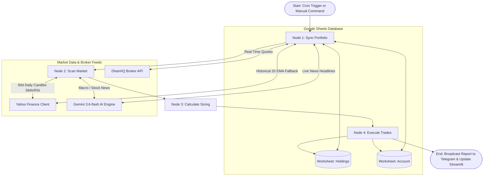

# NSE Swing Trading System: Comprehensive Documentation & Walkthrough

This blueprint is the exhaustive master operations and technical reference manual for the automated NSE Swing Trading and Portfolio Management System. It contains architectural layouts, database schemas, quantitative strategy rules, AI news sentiment guardrails, DhanHQ broker configurations, memory management protocols, credentials catalogs, and the Universal Master Prompt.

---

## 📐 1. System Architecture & Workflow Pipeline

The application is structured as a stateful, event-driven quantitative engine orchestrated via **LangGraph**. It coordinates multi-step decision workflows across four core processing nodes:



### Execution Nodes Breakdown:

1. **`Sync Portfolio Node` (Live Price Stream, Exits & Trailing Stop Trailing):**
   * Connects to **DhanHQ API** (`dhan_client.py`) to query real-time tick prices (LTP) for all open positions. If Dhan credentials are unset or the token expires, automatically falls back to **Yahoo Finance** (`yfinance`).
   * Evaluates exit conditions:
     * **Target Hit:** If `Live Price >= Target` (1:2 Risk-to-Reward Ratio), closes the position, realizes profit/loss, updates cash balance, and logs the exit.
     * **Stop Loss Hit:** If `Live Price <= Current SL`, closes the position, calculates realized loss, updates cash balance, and logs the exit.
   * **AI News Sentiment Guardrail (Micro):** Queries Google News RSS for news headlines on the held stock and invokes **Gemini 3.6-flash**. If news sentiment is **NEGATIVE** (e.g., earnings miss, regulatory penalty), the trailing stop loss is immediately tightened to **today's Low** to protect capital against sudden market dumps.
   * **Dynamic Trailing Stop (20 EMA):** If close price is favorable, calculates the 20-day Exponential Moving Average (20 EMA). If `20 EMA > Current SL`, updates `Current SL` in Google Sheets to `20 EMA` (Stop loss trails upward and never moves downward).
   * **Performance Tracking:** Dynamically solves for **Total Return (%)**, **CAGR (%)**, and **XIRR (%)** across active days.

2. **`Scan Market Node` (Breakout Screener & Macro AI News Filter):**
   * Downloads the active Nifty 50 constituent list directly from NSE Archives.
   * Downloads 60 days of daily historical OHLCV data using session retry adapters.
   * **AI News Sentiment Guardrail (Macro):** Queries news for `"Nifty 50 Index India"` and calls **Gemini 3.6-flash**. If macro sentiment is **NEGATIVE** (e.g., geopolitical crisis, rate hike panic), disables all new breakout entries for the day.
   * Identifies quantitative breakout candidates meeting all 3 criteria:
     1. **Price Breakout:** Today's Close > Today's 20 SMA AND Yesterday's Close <= Yesterday's 20 SMA.
     2. **Volume Confirmation:** Today's Volume > 2.0 * 20-day Volume SMA.
     3. **RSI Filter:** Today's 14-period RSI (Wilder's smoothed) is between 50 and 70 (inclusive).
   * For qualifying breakout candidates, verifies individual stock news sentiment; discards candidates with **NEGATIVE** sentiment.

3. **`Calculate Sizing Node` (Risk Management & Exposure Guardrails):**
   * Enforces strict **1% Risk-per-Trade sizing**:
     $$	ext{Quantity} = \left\lfloor rac{	ext{Total Portfolio Value} 	imes 0.01}{	ext{Entry Price} - 	ext{Initial SL}} 
ight
floor$$
   * **Double Buy Blocker:** Rejects candidates that already exist as active `OPEN` positions in Google Sheets.
   * **Stop Loss Distance Validation:** Verifies that the initial Stop Loss is between **3% and 15%** of the Entry Price (discards noise-prone tight stops and high-risk wide stops).
   * **90% Max Portfolio Allocation (10% Cash Buffer):** Limits total open position value to **90% of total portfolio value**, scaling down purchase quantities or skipping entries if cash is insufficient.
   * **Daily Purchase Limit:** Limits new entries to a **maximum of 3 buys per day**, prioritizing the candidates with the highest volume breakout ratios first.

4. **`Execute Trades Node` (Database Commit & Notifications):**
   * Appends executed trades into the Google Sheets `"Holdings"` worksheet with exponential rate-limit backoffs.
   * Formats ASCII monospaced summary tables and broadcasts real-time reports to registered Telegram chats.

---

## 🗄️ 2. Google Sheets Database Schema

The database is hosted on Google Sheets under the spreadsheet name **`NSE_Swing_Trading_Portfolio`**.

### Worksheet 1: `"Holdings"` (14 Relational Columns)
| Col Index | Header Name | Data Type | Description |
| :---: | :--- | :--- | :--- |
| **1** | `Ticker` | String | NSE symbol with `.NS` suffix (e.g. `HDFCBANK.NS`) |
| **2** | `Entry Date` | Date (YYYY-MM-DD) | Date when position was opened |
| **3** | `Entry Price` | Float | Execution entry price |
| **4** | `Quantity` | Integer | Total shares held |
| **5** | `Entry Value` | Float | `Quantity * Entry Price` |
| **6** | `Initial SL` | Float | Breakout 20 SMA value at entry |
| **7** | `Current SL` | Float | Trailing stop loss (trailed to 20 EMA) |
| **8** | `Target` | Float | Profit target (1:2 Risk-to-Reward Ratio) |
| **9** | `Status` | String | `OPEN` or `CLOSED` |
| **10** | `Exit Date` | Date (YYYY-MM-DD) | Date when position was closed |
| **11** | `Exit Price` | Float | Realized exit execution price |
| **12** | `Exit Value` | Float | `Quantity * Exit Price` |
| **13** | `PnL` | Float | Realized profit/loss (`Exit Value - Entry Value`) |
| **14** | `Exit Reason` | String | `Target Hit`, `Stop Loss Hit`, or `Manual Exit` |

### Worksheet 2: `"Account"` (2 Columns)
| Parameter | Default / Format | Description |
| :--- | :--- | :--- |
| `Total Portfolio Value` | Float (e.g. `1000000.00`) | Cash Balance + Current Value of Open Positions |
| `Cash Balance` | Float (e.g. `1000000.00`) | Liquid unallocated cash available for trading |
| `Risk Percent` | Float (`0.01`) | Risk percentage per trade (1%) |
| `Initial Capital` | Float (`1000000.00`) | Capital baseline for CAGR & XIRR calculations |

### Worksheet 3: `"TelegramChats"` (1 Column)
| Parameter | Description |
| :--- | :--- |
| `ChatID` | Registered Telegram Chat IDs that receive automated daily alerts and exit triggers |

---

## 🛡️ 3. Comprehensive System Guardrails Matrix

| Guardrail Name | Scope | Operational Mechanism | Risk Mitigated |
| :--- | :--- | :--- | :--- |
| **DhanHQ Fallback Engine** | Data Feed | Automatic fallback to `yfinance` if credentials expire or network times out | Prevents service interruption |
| **Double Buy Blocker** | Portfolio | Checks database and rejects duplicate ticker purchases | Prevents single-stock overexposure |
| **Max Portfolio Allocation** | Portfolio | Restricts open holdings to **90% of total portfolio value** | Guarantees **minimum 10% cash buffer** |
| **Daily Purchase Limit** | Sizer | Maximum **3 breakout buys** per scan (highest volume ratio first) | Prevents capital exhaustion on bullish days |
| **SL Tightness Guard** | Sizer | Rejects entries where Stop Loss distance is **< 3%** | Prevents premature stops from daily noise |
| **SL Bloat Guard** | Sizer | Rejects entries where Stop Loss distance is **> 15%** | Discards bloated, high-risk trades |
| **Penny Stock Filter** | Screener | Discards stocks priced **< ₹20** | Filters micro-cap pump-and-dump stocks |
| **Liquidity Filter** | Screener | Discards stocks with 20-day Volume SMA **< 50,000 shares** | Eliminates low-liquidity slippage traps |
| **Google Sheets 429 Retry** | Database | 2-second exponential sleep retry on `429 Too Many Requests` | Prevents quota exhaustion crashes |
| **Memory Leak Guard** | Runtime | Disables multithreading, clears TZ cache, forces `gc.collect()` | Prevents Render Free Tier 512MB RAM restarts |

---

## ⚡ 4. Low-Footprint Container & Memory Optimizations

To run Streamlit and the Telegram Bot concurrently within Render Free Tier's **512 MB RAM limit**:
1. **Single-Threaded Downloads:** `threads=False` on all `yf.download()` calls.
2. **Deactivated Timezone Cache:** `yf.set_tz_cache_location(None)` on startup to stop internal database cache growth.
3. **Explicit Garbage Collection:** `import gc; gc.collect()` called after large batch downloads and sync cycles.
4. **Streamlit Headless Mode:** Started with `--server.fileWatcherType none --server.headless true` to disable file system watching threads.

---

## 🔑 5. Credentials & Environment Variables Catalog

| Provider | Environment Variable | Value / Description | Where to Set |
| :--- | :--- | :--- | :--- |
| **Dhan Broker** | `DHAN_CLIENT_ID` | Your 10-digit Dhan Client ID | Render Environment |
| **Dhan Broker** | `DHAN_ACCESS_TOKEN` | Generated from Dhan Web > Profile > DhanHQ APIs | Render Environment |
| **Telegram Bot** | `TELEGRAM_BOT_TOKEN` | `8723012283:AAFuddRfXL3-VNbeCdRRwKwoZ3438FaV0uo` | Render Environment |
| **Telegram Bot** | Bot Username | `@nse_swing_123_bot` | Telegram App |
| **Render Cloud** | Service ID | `srv-da86e4ugekts73ccfr20` | Render Dashboard |
| **Render Cloud** | Public Web URL | `https://nse-swing-trading.onrender.com` | Browser / UptimeRobot |
| **Google Sheets** | `GOOGLE_SERVICE_ACCOUNT_JSON` | JSON content of `service_account.json` | Render Environment |
| **Google Sheets** | Service Account Email | `sheets-editor@swing-trade-system-506815.iam.gserviceaccount.com` | Google Cloud IAM |
| **Google Sheets** | Sheet Name | `NSE_Swing_Trading_Portfolio` | Google Drive |
| **Gemini AI** | `GEMINI_API_KEY` | `[Your Gemini API Key]` | Render Environment |
| **GitHub Repo** | Code Repository | `https://github.com/ckbas/Swing-Trading.git` | GitHub |

---

## 🛠️ 6. Step-by-Step Setup Guide for Rebuilding

### Step 1: Google Sheets & IAM Service Account
1. Create a Google Sheet named **`NSE_Swing_Trading_Portfolio`**.
2. Go to Google Cloud Console > IAM & Admin > Service Accounts.
3. Create a service account, generate a JSON Key, and share the Google Sheet with the service account email as **Editor**.

### Step 2: Telegram Bot Setup
1. Message `@BotFather` on Telegram, send `/newbot`, and copy the token.

### Step 3: DhanHQ Setup
1. Log in to [web.dhan.co](https://web.dhan.co).
2. Go to **Profile > DhanHQ Trading APIs > Access Token** and generate your token.

### Step 4: Render Cloud Deployment
1. Create a Web Service connected to your GitHub repo.
2. Build Command: `pip install -r requirements.txt` | Start Command: `bash start.sh`.
3. Add all environment variables listed in Section 5.
4. Set up an HTTPS monitor on **UptimeRobot** pinging your Render URL every 5 minutes to prevent sleep.

---

## 🔮 7. Universal Master Prompt (For Recreating System Anywhere)

```text
Build a complete, production-grade NSE Swing Trading & Portfolio Manager in Python, ready to deploy to Render (Free Tier). The system must run a Streamlit web dashboard and a Telegram bot concurrently inside a single container. The database must be Google Sheets (managed via gspread).

Here are the specifications:

1. FILE STRUCTURE & RESPONSIBILITIES:
- `dhan_client.py`: Integrates DhanHQ API ('dhanhq'). Downloads and caches the Dhan NSE Scrip Master CSV ('https://images.dhan.co/api-data/api-scrip-master.csv') in memory to map symbols (e.g. 'RELIANCE' -> 2885). Provides get_dhan_ltp(tickers) for zero-latency live quotes with graceful fallback to yfinance if unconfigured.
- `sentiment_analyzer.py`: Connects to Google News RSS search feed for a ticker or macro index, parses XML for the top 5 recent headlines, and calls Gemini model "gemini-3.6-flash" to return 'POSITIVE', 'NEUTRAL', or 'NEGATIVE' sentiment.
- `screener.py`: Fetches Nifty 50 symbols from NSE, downloads 60d daily historical data in parallel via yfinance, and filters for breakouts. Checks macro and stock-specific news sentiment before qualifying candidates. Filters out penny stocks (Price < 20) and low-volume stocks (Vol SMA 20 < 50,000).
- `portfolio_manager.py`: Google Sheets database operations. Handles sheets initialization, fetching open/closed positions, registering chat IDs, adding positions, closing positions, calculating performance metrics (Total Return, CAGR, XIRR), and syncing live quotes from DhanHQ (with yfinance fallback). Implements retry_gspread for 429 rate limit backoff. In add_position, blocks duplicates and checks Stop Loss percentage (3% - 15%).
- `trading_graph.py`: Builds a stateful LangGraph workflow representing the trading cycle (Sync Portfolio -> Scan Market -> Position Sizer -> Execute Trades) and formats a text-based ASCII scan report. Sizer enforces max 90% portfolio exposure (10% cash buffer) and max 3 daily purchases.
- `bot.py`: Telegram Bot handler and cron scheduler. Implements command callbacks and background jobs. In /scan, /positions, and /summary, displays active Data Engine source (DhanHQ vs Yahoo Finance).
- `app.py`: Streamlit frontend dashboard displaying KPI cards for Value, Cash, Unrealized/Realized PnL, Total Return, CAGR, and XIRR.
- `start.sh`: Shell script launching `python -u bot.py &` in the background and `streamlit run app.py --server.port $PORT --server.address 0.0.0.0 --server.fileWatcherType none --server.headless true` in the foreground.
- `Procfile`: Contains `web: sh start.sh`
- `requirements.txt`: Dependencies (streamlit, python-telegram-bot[all], gspread, google-auth, yfinance, pandas, numpy, langgraph, pytz, plotly, requests, google-generativeai, dhanhq).

2. STRATEGY SPECIFICATIONS:
- Tickers: Nifty 50 Index (fetched from 'https://archives.nseindia.com/content/indices/ind_nifty50list.csv'). Symbol suffix is '.NS'.
- Entry Conditions:
  - Price breakout: Today's Close > Today's 20 SMA AND Yesterday's Close <= Yesterday's 20 SMA.
  - Volume breakout: Today's Volume > 2.0 * 20-day Volume SMA.
  - RSI Filter: Today's 14-period RSI (Wilder's smoothed) must be between 50 and 70 (inclusive).
- Exit Conditions:
  - Target: Entry Price + 2 * (Entry Price - Initial SL) [1:2 Risk-to-Reward Ratio].
  - Trailing Stop: 20 EMA. Move Stop Loss up to 20 EMA if 20 EMA > current SL. Exit trade if live price <= Current SL.

3. GOOGLE SHEETS SCHEMAS:
Create 'NSE_Swing_Trading_Portfolio' with tabs:
- 'Holdings' (14 Columns): Ticker, Entry Date, Entry Price, Quantity, Entry Value, Initial SL, Current SL, Target, Status, Exit Date, Exit Price, Exit Value, PnL, Exit Reason.
- 'Account' (2 Columns): Parameter (Total Portfolio Value, Cash Balance, Risk Percent, Initial Capital) and Value.
- 'TelegramChats' (1 Column): ChatID.

4. RISK MANAGEMENT & SIZING:
- Risk Amount: 1% of 'Total Portfolio Value' from Account sheet.
- Quantity: Risk Amount / (Entry Price - Initial SL).
- Capital Scaling: Ensure max 90% allocation limit; scale down if cash insufficient. Max 3 buys per day.
```
