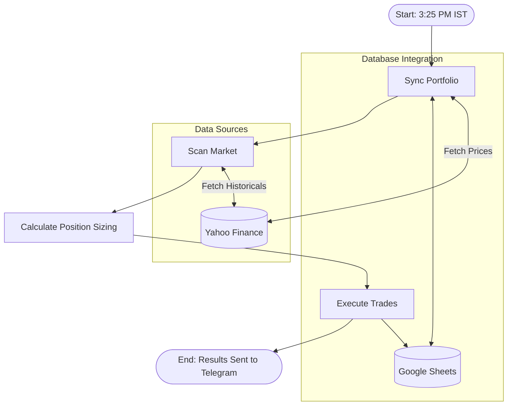

# NSE Swing Trading System: Comprehensive Documentation

Welcome to the documentation for your **NSE Swing Trading System**. This system is an automated, cloud-deployed paper-trading and portfolio tracking setup designed to scan the **Nifty 50** stock universe, execute trades based on momentum breakouts, manage risk dynamically, and sync status to a **Google Sheets database**, a **Streamlit Web Dashboard**, and a **Telegram Bot**.

---

## 📐 Architecture & Workflow

The system is orchestrating its logic using **LangGraph** (a stateful multi-agent workflow framework). The workflow acts as a State Machine containing four core execution nodes:



### 1. The Workflow Nodes:
1. **`Sync Portfolio` (Exits & Trailing Stops):**
   * Downloads live daily data for all open positions from Yahoo Finance.
   * Compares the close price against the **Target** (1:2 R:R) and **Current Stop Loss (SL)**.
   * If a target or SL is breached, it closes the trade, credits the cash back, and writes exits to Google Sheets.
   * If the trade is still active, it recalculates the **20 EMA** (Exponential Moving Average). If the 20 EMA has risen above the `Current SL`, it shifts the stop loss up to lock in trailing profits.
2. **`Scan Market` (Breakout Screener):**
   * Fetches the active list of Nifty 50 symbols from the NSE archive.
   * Downloads 60 days of historical daily data for all 50 tickers in parallel.
   * Identifies stocks that meet the breakout criteria.
3. **`Calculate Position Sizing` (Risk Manager):**
   * Queries your active capital and cash balance from the Google Sheet.
   * Calculates the capital risk per trade: **1% of total portfolio value**.
   * Sizes each trade: \(\text{Quantity} = \frac{\text{1\% Risk Amount}}{\text{Entry Price} - \text{Initial SL}}\).
   * Scales down position sizes if they exceed the remaining available cash, or skips candidates if cash is exhausted.
4. **`Execute Trades` (Database Writer):**
   * Appends the finalized trades to the Google Sheet under the new column schema.
   * Deducts the entry costs from the available cash.
   * Compiles the results into a formatted ASCII table report and sends it to Telegram.

---

## 📈 Trading Strategy Specifications

The system runs a classic **Momentum Breakout & Trend Following** system:

| Parameter | Rule / Calculation | Rationale |
| :--- | :--- | :--- |
| **Screener Universe** | Nifty 50 Index | Focuses on high-liquidity, stable large-cap stocks. Optimized for consolidative and volatile markets. |
| **Trend Definition** | 20 SMA (Simple Moving Average) | Evaluates short-to-medium-term momentum. |
| **Price Breakout** | Today's Close > 20 SMA **AND** Yesterday's Close \(\le\) 20 SMA | Catches the exact transition day from bearish/sideways to bullish momentum. |
| **Volume Confirmation** | Today's Volume > \(2.0 \times\) 20-day Average Volume | Confirms institutional backing; excludes low-volume false breakouts. |
| **RSI Filter** | **\(50 \le \text{RSI(14)} \le 70\)** | Confirms positive bullish momentum (\(\ge 50\)) but filters out overextended/overbought stocks (\(> 70\)). |
| **Initial Stop Loss** | Today's 20 SMA value | Protects capital. The close price is guaranteed to be above this line on day 1. |
| **Trailing Stop Loss** | **20 EMA** (Exponential Moving Average) | Follows the rising trend. Rises automatically but never shifts downwards. |
| **Profit Target** | Entry Price + \(2 \times\) (Entry Price - Initial SL) | Locks in gains at a healthy **1:2 Risk-to-Reward Ratio**. |

---

## 🗄️ Google Sheets Database Schema

Your Google Sheet **`NSE_Swing_Trading_Portfolio`** holds three worksheets which act as your system's relational database. 

### 1. `"Holdings"` Worksheet (14 Columns)
This sheet records every transaction. It holds the following columns in exact order:

| Col | Name | Type | Description |
| :--- | :--- | :--- | :--- |
| **1** | **Ticker** | String | Yahoo Finance symbol (e.g., `ADANIPOWER.NS`). |
| **2** | **Entry Date** | Date | YYYY-MM-DD when the breakout occurred. |
| **3** | **Entry Price** | Float | Final closing price on entry day. |
| **4** | **Quantity** | Integer | Number of shares bought. |
| **5** | **Entry Value** | Float | **`Quantity * Entry Price`** (Initial cost basis). |
| **6** | **Initial SL** | Float | Stop Loss set on entry (breakout 20 SMA). |
| **7** | **Current SL** | Float | Trailing Stop Loss (updated to 20 EMA as price rises). |
| **8** | **Target** | Float | Take profit price target (1:2 R:R). |
| **9** | **Status** | String | `OPEN` or `CLOSED`. |
| **10** | **Exit Date** | Date | YYYY-MM-DD of exit (blank for open positions). |
| **11** | **Exit Price** | Float | Closing price when target/SL was hit. |
| **12** | **Exit Value** | Float | **`Quantity * Exit Price`** (Total capital received at exit). |
| **13** | **PnL** | Float | Realized Profit/Loss (\(\text{Exit Value} - \text{Entry Value}\)). |
| **14** | **Exit Reason** | String | `Target Hit`, `Stop Loss Hit`, or `Manual Exit`. |

### 2. `"Account"` Worksheet
Stores account metrics to calculate sizing:
* **Total Portfolio Value:** Sum of Cash + Current Market Value of holdings.
* **Cash Balance:** Available cash to purchase new assets.
* **Risk Percent:** Hardcoded sizing risk parameter (default: `0.01` for 1%).

### 3. `"TelegramChats"` Worksheet
Stores the list of registered Telegram Chat IDs of users who sent `/start` to the bot. Every ID in this sheet receives the automated daily scans.

---

## 🚀 Telegram Command Reference

The Telegram Bot (**`@nse_swing_123_bot`**) communicates in clean, monospace **ASCII tables** so data does not warp on phone screens:

### 1. `/start`
* Registers your Telegram Chat ID in the Google Sheet.
* Welcomes you and lists available commands.

### 2. `/positions` (or `/position`)
Fetches active positions, requests live prices from Yahoo Finance, and prints two structured tables:
```text
📊 Prices & PnL:
Ticker   Qty  Entry  Current  PnL%
-----------------------------------
ADANIPOW 136  215.0  216.5    +0.7%
CGPOWER   49  897.9  899.0    +0.1%

🛡️ Risk & Targets:
Ticker   SL     Target  EntryVal
------------------------------------
ADANIPOW 207.7  229.6   29240.0 
CGPOWER  877.9  938.0   43997.1 

💰 Total Unrealized PnL: 🟢 ₹305.10
```

### 3. `/scan`
Manually runs a live scan of Nifty 50 and updates your portfolio. Returns results in clean tables:
```text
📊 NSE Swing Trading Scan Report
📅 Date: 2026-08-28

💰 Portfolio Summary:
• Total Value: ₹1,000,000.00
• Cash Balance: ₹1,000,000.00

🔍 Breakout Candidates Found (2):
Ticker     Price    VolRatio RSI  
----------------------------------
HDFCBANK   1650.00  3.12x    58.4 
INFY       1820.00  2.85x    61.2 

🚀 Trades Executed:
Ticker     Qty   Entry    SL       Target  
-------------------------------------------
HDFCBANK   120   1650.00  1566.67  1816.67
INFY        85   1820.00  1702.50  2055.00
```

### 4. `/summary`
Fetches a high-level overview of portfolio statistics (Available Cash, Holdings Value, Realized PnL).

---

## 📅 Scheduled Jobs (Live Market Timing)
To align virtual paper trading with your real-life executions, the bot runs two separate schedules:

1. **Intraday Exit Sync (Every 5 Minutes):**
   * Runs Monday through Friday, **9:15 AM to 3:30 PM IST** (during active market hours).
   * Checks live prices of open positions. If any stock triggers a target or stop loss, it immediately updates the Google Sheet and pings you a Telegram alert so you can mirror the exit in your real broker app.
2. **Daily Buy Scan (3:25 PM IST):**
   * Runs daily at **3:25 PM IST** (5 minutes before the market close).
   * Identifies breakout stocks, sizes them, records them in the sheet, and alerts you. 
   * This gives you a 5-minute window to execute the identical trades in your broker app before the bell rings.

---

## 📊 Strategic Optimization & Backtest Summary

To select the most robust strategy for high-volatility and consolidative markets, 12 distinct configurations were backtested over a 1-year correction and recovery cycle (August 2025 – August 2026). During this period, the benchmark Nifty 50 Index (Buy & Hold) returned **-1.93%**.

### 1. Nifty 50 (Large-Cap) Performance Matrix:
* **Baseline (Existing):** +11.95% Return | -10.61% Drawdown | 103 Trades
* **Tweak 2 (10 EMA Stop):** +6.49% Return | -11.55% Drawdown | 109 Trades
* **Tweak 3 (2.0x Volume):** **+10.51% Return** | **-6.74% Drawdown** | **55 Trades (40% Win Rate)**
* **Combined (All 4 Tweaks):** +0.52% Return | -5.74% Drawdown | 22 Trades

### 2. Nifty 250 (Large & Mid-Cap) Performance Matrix:
* **Baseline (Existing):** -7.66% Return | -18.63% Drawdown | 357 Trades
* **Tweak 2 (10 EMA Stop):** +2.25% Return | -19.36% Drawdown | 359 Trades
* **Combined (All 4 Tweaks):** -15.64% Return | -24.55% Drawdown | 178 Trades

### 💡 Conclusions & Implemented Production Setup:
* **Universe Selection:** Nifty 50 (Large-Caps) was significantly more stable and profitable during market correction phases than Nifty 250.
* **Volume Spike Optimization:** Raising the volume breakout multiple to **2.0x** (Tweak 3) successfully filtered out 48 false breakouts, **reducing the maximum drawdown by 40%** (from -10.6% to **-6.74%**) and raising the win rate to a robust **40.00%**.
* **Current Production Settings:** The bot has been deployed with the **Nifty 50 stock universe** and **2.0x Volume Confirmation**.

---

## 🛠️ Deployments & Process Management (Render)

Because Render’s Free Tier provides a single container process, both the web server (Streamlit) and background service (Telegram Bot + Cron Scheduler) are executed concurrently in the same container using a shell script wrapper:

### 1. Launcher Script (`start.sh`)
```bash
# Start Telegram Bot in the background (using python -u to prevent log buffering)
python -u bot.py &

# Start Streamlit Frontend in the foreground (binds to Render's port)
streamlit run app.py --server.port $PORT --server.address 0.0.0.0
```

### 2. Process Files
* **`Procfile`**: Binds the launch command: `web: sh start.sh`
* **`requirements.txt`**: Manages exact library versions, including `yfinance`, `gspread`, `langgraph`, and `python-telegram-bot`.
* **Outbound IP Rate Limits**: The Yahoo Finance downloader is configured with a custom requests session and browser `User-Agent` headers to prevent HTTP 429 rate limit bans on Render servers.

---

# 🔮 MASTER PROMPT (To Recreate This System From Scratch)

*Copy-paste the prompt below into any capable coding AI agent to build the exact same codebase from scratch in a single go:*

```text
Build a complete, production-grade NSE Swing Trading & Portfolio Manager in Python, ready to deploy to Render (Free Tier). The system must run a Streamlit web dashboard and a Telegram bot concurrently inside a single container. The database must be Google Sheets (managed via gspread).

Here are the specifications:

1. FILE STRUCTURE & RESPONSIBILITIES:
Create the following files:
- `screener.py`: Fetches Nifty 50 symbols from NSE, downloads 60d daily historical data in parallel via yfinance, and filters for breakouts.
- `portfolio_manager.py`: Google Sheets database operations. Handles sheets initialization, fetching open/closed positions, registering chat IDs, adding positions, and closing positions.
- `trading_graph.py`: Builds a stateful LangGraph workflow representing the trading cycle (Sync Portfolio -> Scan Market -> Position Sizer -> Execute Trades) and formats a text-based ASCII scan report.
- `bot.py`: Telegram Bot handler and cron scheduler. Implements command callbacks and background jobs.
- `app.py`: Streamlit frontend dashboard.
- `start.sh`: Shell script launching `python -u bot.py &` in the background and `streamlit run` in the foreground.
- `Procfile`: Contains `web: sh start.sh`
- `requirements.txt`: Project dependencies (yfinance, gspread, google-auth, langgraph, streamlit, python-telegram-bot, pytz).

2. STRATEGY SPECIFICATIONS:
- Tickers: Nifty 50 Index (fetched from 'https://archives.nseindia.com/content/indices/ind_nifty50list.csv'). Symbol suffix is '.NS'. Implement fallback tickers.
- Entry Conditions:
  - Price breakout: Today's Close > Today's 20 SMA AND Yesterday's Close <= Yesterday's 20 SMA.
  - Volume breakout: Today's Volume > 2.0 * 20-day Volume SMA.
  - RSI Filter: Today's 14-period RSI (Wilder's smoothed) must be between 50 and 70 (inclusive).
- Exit Conditions:
  - Target: Entry Price + 2 * (Entry Price - Initial SL) [1:2 Risk-to-Reward Ratio].
  - Trailing Stop: 20 EMA (Exponential Moving Average). Move Stop Loss up to 20 EMA if 20 EMA is greater than current SL. SL never moves down. Exit trade if daily close closes <= Current SL.

3. GOOGLE SHEETS SCHEMAS:
Create the sheet 'NSE_Swing_Trading_Portfolio' with the following tabs:
- 'Holdings' (14 Columns): Ticker, Entry Date, Entry Price, Quantity, Entry Value, Initial SL, Current SL, Target, Status, Exit Date, Exit Price, Exit Value, PnL, Exit Reason.
  * Entry Value = Quantity * Entry Price. Exit Value = Quantity * Exit Price.
  * If the sheet exists but has an old layout (like containing 'Traded Value' or 'Buy Value'), write code to delete and recreate it with the correct 14-column layout dynamically.
- 'Account' (2 Columns): Parameter (Total Portfolio Value, Cash Balance, Risk Percent) and Value.
- 'TelegramChats' (1 Column): ChatID.

4. RISK MANAGEMENT & SIZING:
- Risk Amount: 1% of 'Total Portfolio Value' from the Account sheet.
- Quantity: Risk Amount / (Entry Price - Initial SL).
- Capital Scaling: If the purchase cost (Quantity * Entry Price) exceeds available cash, scale the quantity down to fit the cash. If cash is insufficient to buy even 1 share, skip the trade.

5. BOT COMMANDS & ASCI TABLES:
- `/start`: Registers chat ID.
- `/positions` or `/position`: Fetches holdings, queries live prices from yfinance, and outputs two monospaced ASCII tables inside ``` blocks to prevent mobile wrapping:
  1. Prices & PnL Table: Ticker | Qty | Entry | Current | PnL%
  2. Risk & Targets Table: Ticker | SL | Target | EntryVal
- `/scan`: Triggers a manual scan and sends the formatted ASCII tables.
- `/summary`: Outputs cash balance, open positions count, realized PnL.

6. CRON SCHEDULES (IST TIMEZONE):
- Intraday Exits Sync: Run a repeating job every 5 minutes (300 seconds) on weekdays between 9:15 AM and 3:30 PM IST. Fetch live prices of open holdings, check for Target/SL breaches, close them in the sheet if hit, and send an instant Telegram alert.
- Daily Buy Scan: Run a daily scan job at 3:25 PM IST (5 minutes before market close) on weekdays. Scan the market, size positions, execute them in the sheet, and broadcast the candidates & purchases report.

7. RATE-LIMIT BYPASSING:
Configure yfinance downloads to use a requests Session with a custom headers dictionary:
`"User-Agent": "Mozilla/5.0 (Windows NT 10.0; Win64; x64) AppleWebKit/537.36 (KHTML, like Gecko) Chrome/115.0.0.0 Safari/537.36"` and a `timeout=15` parameter to avoid HTTP 429 blocks on Render.
```
